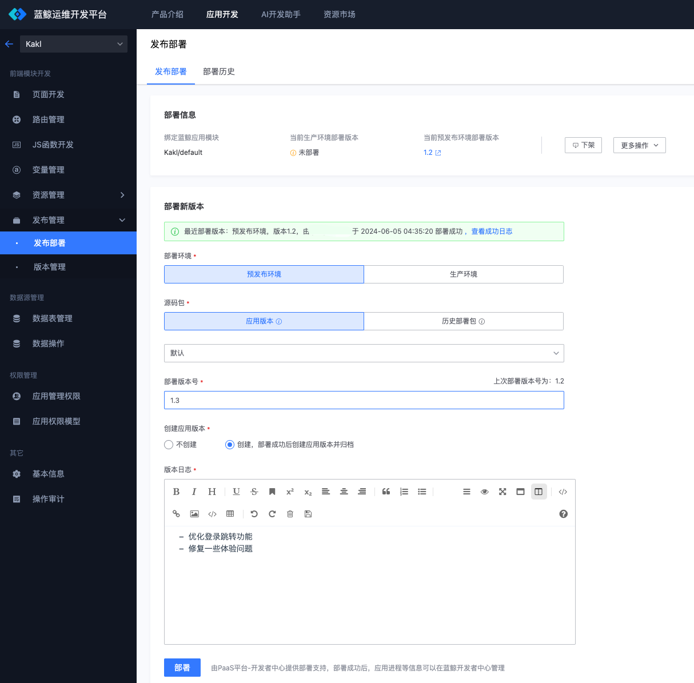
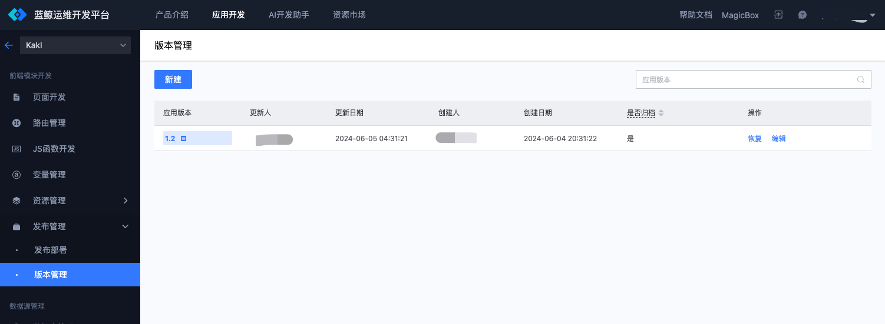
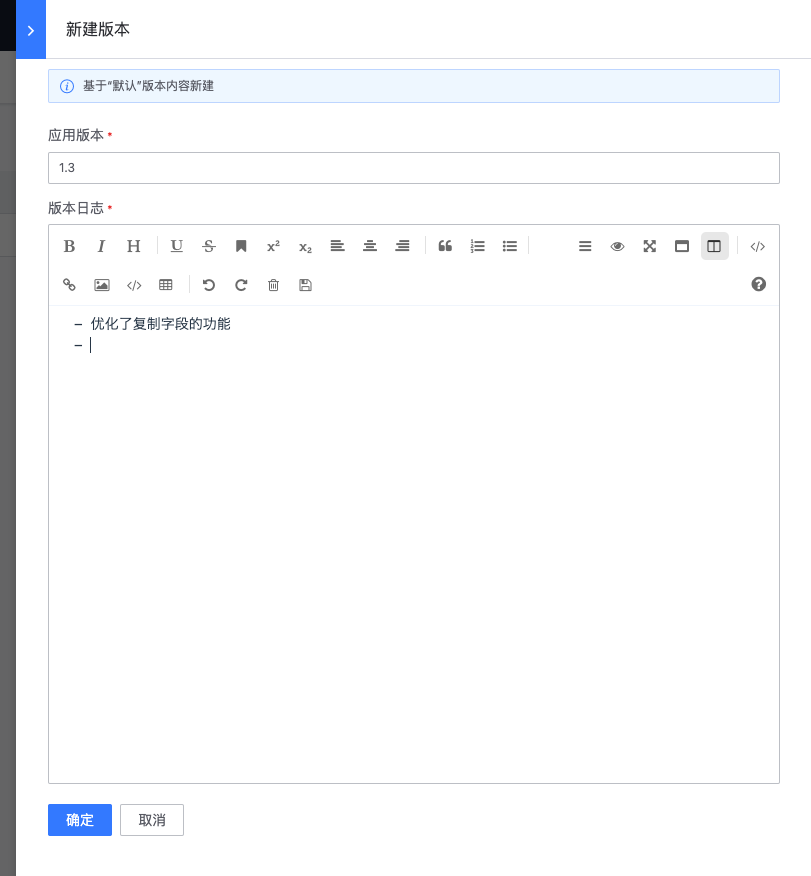
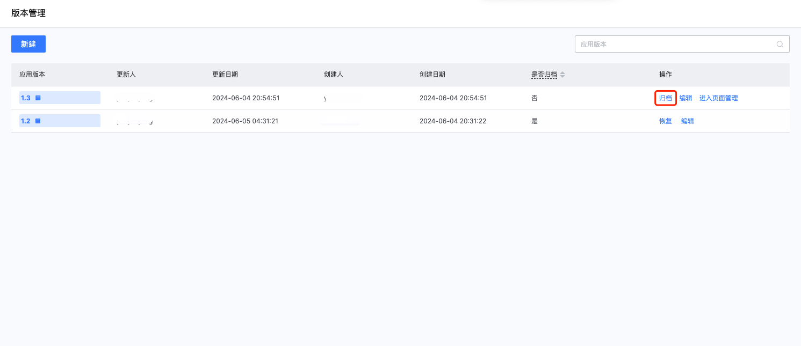
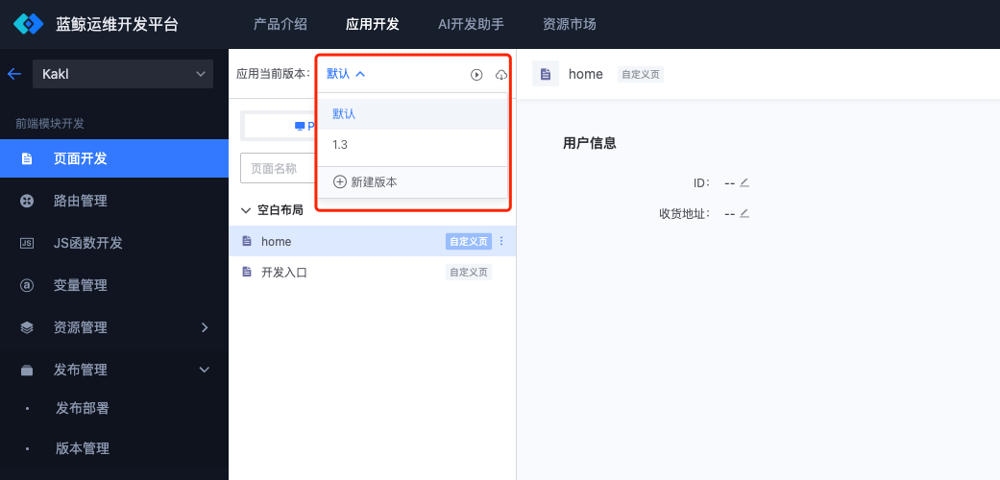
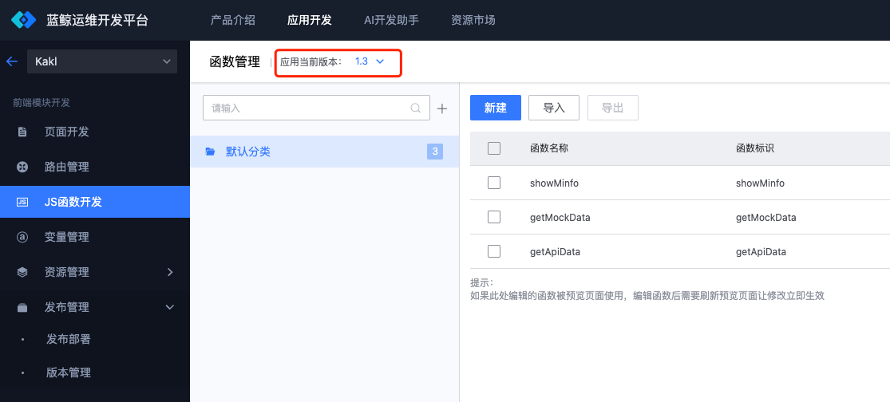
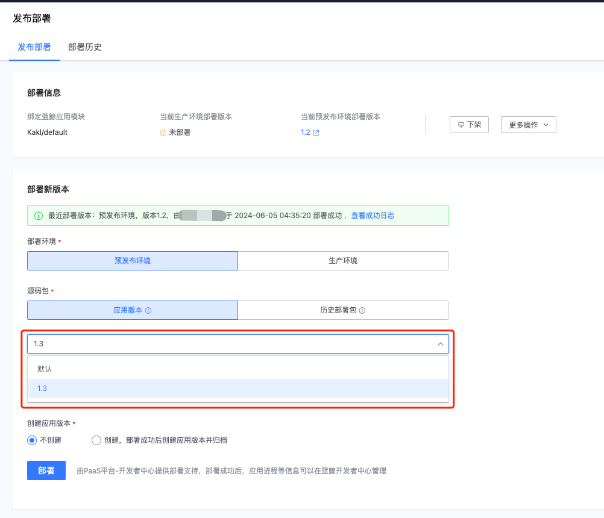

# 版本管理的使用指引

版本管理基于应用的当前内容（默认版本）打标签（tag），可以通过“发布部署”创建版本，也可以在“版本管理”功能页面中主动创建版本。

## 通过“发布部署”创建版本

进入到“发布管理-发布部署”页面，输入“部署版本号”后，选择“创建，部署成功后创建应用版本并归档”，并填写相应的“版本日志”，点击“部署”。

部署成功后，则会创建与“部署版本号”一致的版本内容，版本默认是归档的。可以进入到“版本管理”中查看所有创建的版本。

## 通过“版本管理”创建版本

点击“新建”按钮，弹出新建版本功能，填写“应用版本”与“版本日志”，点击“确定”。

此时，创建的版本属于“未归档”状态，可以基于未归档的版本，进行发布部署或者切换到版本进行开发。

## 基于“版本”内容开发与部署

在页面的左上角，可以看到“应用当前版本”的切换入口，则表示该模块的数据是纳入版本管理的。如图，列表中“1.3”版本则为刚才在版本管理中创建的。

当切换到“1.3”版本后，即进入到此版本的内容，此时所有的操作只在当前版本生效，进入到其它功能模块可以发现，应用当前版本都指向到了“1.3”。

基于版本内容开发完成后，进入到“发布部署”，可以选择指定的版本内容进行发布。

