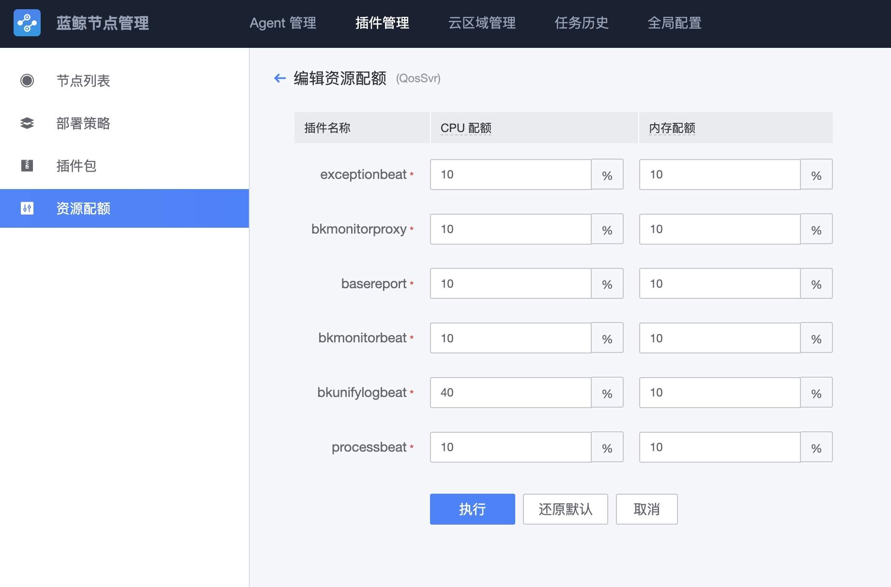

# 日志采集器安装


## 安装方法

  插件安装、托管，是通过节点管理进行统一操作的
  
  日志采集器名称是 bkunifylogbeat


选择最新版，点击下一步安装

 


## FAQ


### 1.采集器问题排查

日志采集器程序相关

日志采集器的二进制文件

`/usr/local/gse_bkte/plugins/bin/bkunifylogbeat`

日志采集器的主配置文件

`/usr/local/gse_bkte/plugins/etc/bkunifylogbeat.conf`

日志采集器的子配置文件

`/usr/local/gse_bkte/plugins/etc/bkunifylogbeat/ `

查看进程是否启动

`ps -ef|grep bkunifylogbeat`

日志采集器的主配置文件

```
logging.level: error
max_procs: 1
output.bkpipe:
  endpoint: /usr/local/gse_bkte/agent/data/ipc.state.report
path.logs: /var/log/gse_bkte  #日志路径
path.data: /var/lib/gse_bkte  #采集进度相关数据记录的文件
path.pid: /var/run/gse_bkte   #pid路径

queue:
  mem:
    events: 1024
    flush.min_events: 0
    flush.timeout: "1s"

xpack.monitoring.enabled: true
xpack.monitoring.bkpipe:
  bk_biz_id: 100147
  dataid: 1100006
  task_dataid: 1100007
  period: "30s"

processors:
  - drop_event:
      when:
        not:
          has_fields: ["dataid"]

bkunifylogbeat.eventdataid: -1
bkunifylogbeat.multi_config:
  - path: /usr/local/gse_bkte/plugins/etc/bkunifylogbeat   #子配置文件路径
    file_pattern: "*.conf"
```

日志调试模式

如需要调试查看当前日志是否正常采集，可以将采集器日志修改为debug模式查看

```
vim /usr/local/gse_bkte/plugins/etc/bkunifylogbeat.conf

logging.level: debug  #将日志级别修改为debug模式
cd  /usr/local/gse_bkte/plugins/bin

./restart.sh bkunifylogbeat

#查看日志，debug日志会记录当前所采集的文件和内容

tail /var/log/gse_bkte/bkunifylogbeat

#调整完毕，再将日志级别修改为error
```

### GSE资源保护

采集器是否超过资源限制被kill：确认是否有重启情况

```
# 确认是否有重启情况

grep -nr "logbeat" /tmp/bkc.log | tail
 
5375:[]20201123-120449 INFO|113|log-main start bkunifylogbeat ...[-]20201123-120459 INFO|120|log-main stop bkunifylogbeat ...
5376:[]20201123-120535 INFO|113|log-main start bkunifylogbeat ...[-]20201123-120545 INFO|120|log-main stop bkunifylogbeat ...
5377:[]20201123-120621 INFO|113|log-main start bkunifylogbeat ...[-]20201123-120632 INFO|120|log-main stop bkunifylogbeat ...
```

确认gse是否有kill记录

```
# 确认gse kill
grep -nr "bkunifylogbeat" ./agent-*.log | tail
 
./agent-20201123-00507.log:5043:[2020-11-23 12:01:55.530] <40149-260040448>[ERROR][processmanage:558] : Process[bkunifylogbeat] cpu[45.360824584960938] or mem[0.122222900390625] usage is too high! Cross line 3 times, Process restarted!
./agent-20201123-00507.log:5048:[2020-11-23 12:02:41.576] <40149-260040448>[ERROR][processmanage:558] : Process[bkunifylogbeat] cpu[46.315788269042969] or mem[0.12119293212890625] usage is too high! Cross line 3 times, Process restarted!
```

手动调整采集器资源占比

```
# 确认CPU核数
cat /proc/cpuinfo| grep "cpu cores"| uniq
 
# 调整bkunifylogbeat资源占比
vim /usr/local/gse_bkte/agent/etc/procinfo.json


"cpulmt" : 30,
"memlmt" : 20,

根据需求调整bkunifylogbeat的cpulimit到一定比例
如：4核机器跑满单核需要设置为30%
 
# reload gse agent
# - reload会等所有任务结束后才重启
# -restart会直接重启，执行中的任务会被丢失

cd /usr/local/gse_bkte/agent/bin 
./gse_agent --reload
```


### 采集器无法启动

```
如出现如下日志，则代表agent存在问题

2021-08-05T15:36:49.117+0800	ERROR	instance/beat.go:807	Exiting: error initializing publisher: get agent info timeout
需要重启agent，采集器才能正常启动

cd /usr/local/gse_bkte/agent/bin 
./gse_agent --reload
```


### windows多IP不上报采集处理方法

```
#windows多IP配置调整，解决采集器无法上报数据情况
IP=$(ipconfig|grep "IPv4 Address"|grep -v "169.254.68.1"|awk '{print $NF}'|grep -E "(^9.|^11.)"|sed "s/\r//g")  #如果IP不是9和11开头的请自行调整
echo $IP
grep "\"agentip\":\"$IP\","  /cygdrive/c/gse/gseagentw/conf/gse.conf || sed -i "/{/a\"agentip\":\"$IP\","  /cygdrive/c/gse/gseagentw/conf/gse.conf 
cat /cygdrive/c/gse/gseagentw/conf/gse.conf || exit 1
sc stop gseDaemon
sc start gseDaemon
```

cgroup调整配额

先调整CPU配额，在节点管理调整





增加个性配置

```
mkdir -p /etc/sysconfig/gse_plugins/
echo "CPU_CGROUP_LIMIT=400000"  > /etc/sysconfig/gse_plugins/bkunifylogbeat  #使用4核

cd  /usr/local/gse_bkte/plugins/bin || exit 1
./restart.sh bkunifylogbeat
```

