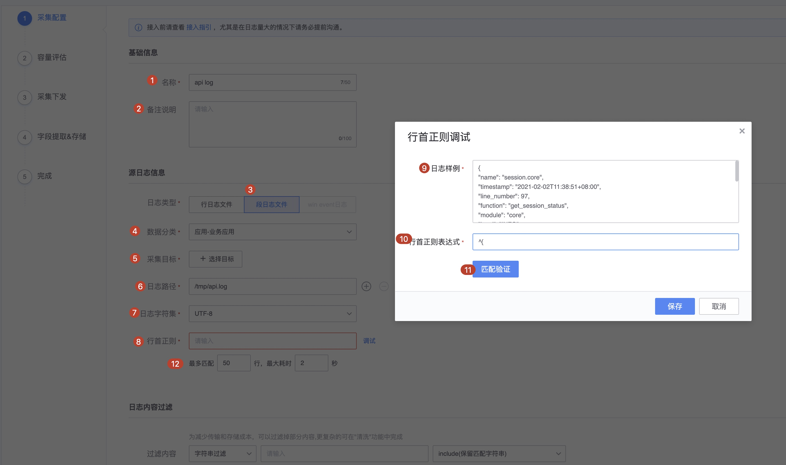

# 段日志采集

日志采集，我们希望日志都是规则的，可是在实际情况中，我们的日志格式可能是千奇百怪的，如一行是字符，一行是json,而且json是分行的，不是存储到一行的，如下所示

```
Nov  6 12:06:34 VM_193_66_centos systemd: Starting Cleanup of Temporary Directories...
Nov  6 12:06:34 VM_193_66_centos systemd: Started Cleanup of Temporary Directories.
Nov  6 12:06:34 VM_193_66_centos systemd: Started Cleanup of Temporary Directories.
Nov  6 12:06:34 VM_193_66_centos systemd: Started Cleanup of Temporary Directories.
Nov  6 12:06:34 VM_193_66_centos systemd: Started Cleanup of Temporary Directories.
Nov  6 12:06:34 VM_193_66_centos systemd: Started Cleanup of Temporary Directories.
Nov  6 12:06:34 VM_193_66_centos systemd: Started Cleanup of Temporary Directories.
Nov  6 12:06:34 VM_193_66_centos systemd: Started Cleanup of Temporary Directories.
Nov  6 12:06:34 VM_193_66_centos systemd: Started Cleanup of Temporary Directories.
{
"name": "session.core",
"timestamp": "2021-02-02T11:38:51+08:00",
"line_number": 97,
"function": "get_session_status",
"module": "core",
"level": "INFO",
"path": "/data/app/1.py",
"thread_id": "140620576319232",
"process_id": "28818",
"thread_name": "Thread-188",
"process_name": "Process-8",
"task_logging_status": "None",
"username": "",
"object_id": "",
"object_type": "",
"msg": "active和exit时间为2021-02-02T01:28:40.980000+00:00/2021-02-02T03:33:40.852000+00:00。"
}
{
"name": "close_outdated_sessions",
"timestamp": "2021-02-02T11:38:51+08:00",
"line_number": 148,
"function": "__call__",
"module": "actor",
"level": "DEBUG",
"path": "/data/app/1.py",
"thread_id": "140620576319232",
"process_id": "28818",
"thread_name": "Thread-188",
"process_name": "Process-8",
"task_logging_status": "None",
"username": "",
"object_id": "",
"object_type": "",
"msg": "Completed after 1200.50ms."
}
```

## 段日志配置




