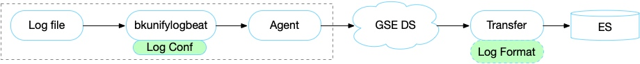
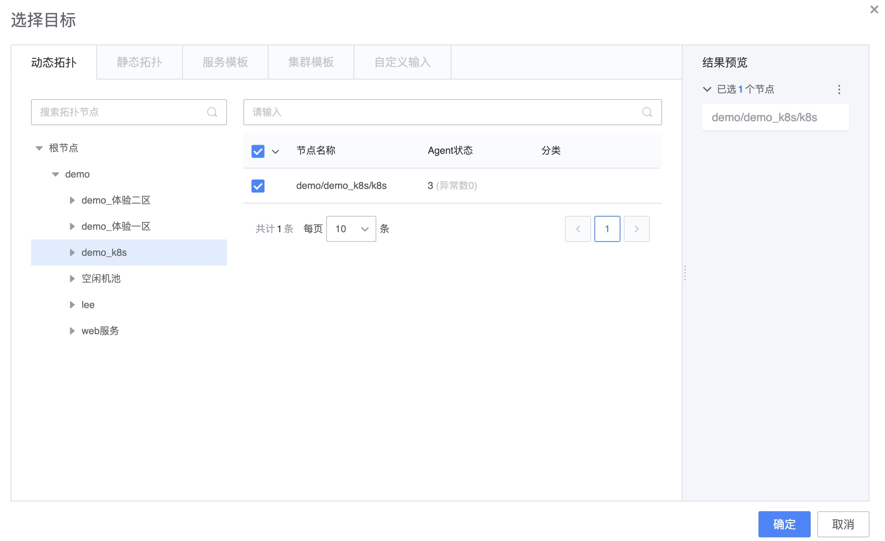

# 采集接入

日志采集是通过日志服务的自有链路，通过实时流的方式将日志采集到服务端，并且还可以在采集过程中运行 Agent 端的过滤和服务端的字段提取功能，可以快速的实现日志的格式化需求。

## 采集工作流程

## 新建采集

**功能位置**：导航 →  管理 → 数据接入 →  采集接入 →  新建

**操作步骤**：

* (1) 采集配置
* (2) 采集下发
* (3) 字段提取&存储
* (4) 完成

### 采集配置

日志类型说明

* 物理环境
    * Linux
        * 行日志：适合采集单行日志
        * 段日志：适合采集多行日志，如堆栈报错等
    * Windows
        * win event日志：采集windows的系统日志
        * 行日志：适合采集单行日志
        * 段日志：适合采集多行日志，如堆栈报错等
* 容器环境
    * 基于Pod采集
    * 基于标准输出采集
    * 基于Container采集

    
选择目标说明

* 动态拓扑：拓扑下IP变化，自动更新采集目标
* 静态拓扑：只保持第一次的采集目标，拓扑下IP变化，不更新采集目标
* 服务模板：从CMDB的服务模板进行采集
* 集群模板：从CMDB的集群模板进行采集
* 自定义输入：可以输入IP
     
> 注意:只可以同时使用一种类型，不能混用
     

日志路径：

* 日志是绝对路径和日志轮转
* 可以支持通配符方式，具体查看[常见通配符](./wildcard.md)
* 可以支持多日志文件

日志内容过滤：

* 支持 include 方式
* 支持字符串和分割符等方式过滤

日志链路：

* 就近传输日志和存储，具体查看[链路管理](../resource-management/data_link_management.md)

### 采集下发

> 注意：在当前离开采集还是在继续异步执行的，但没有完成存储设置，所以在 24 小后没有完成第三步的存储，采集任务会被强制停用。

### 字段提取

非必需项，适用场景需要对日志进行格式化的时候，适用于需要对日志进行汇聚和维度的监控需求时。

具体使用查看[字段提取](./log_simple_format.md)

### 存储

采集的数据存储的索引名，在索引集中会使用到。

