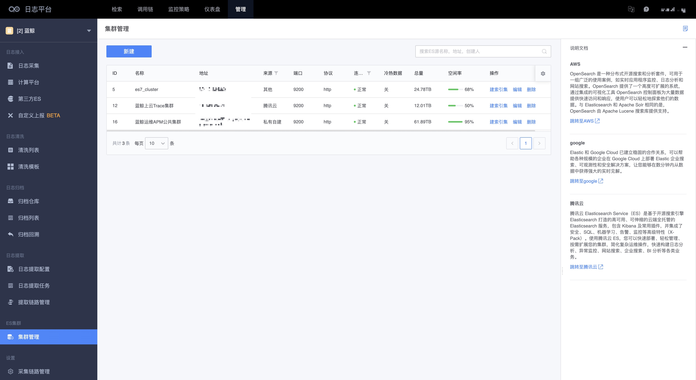
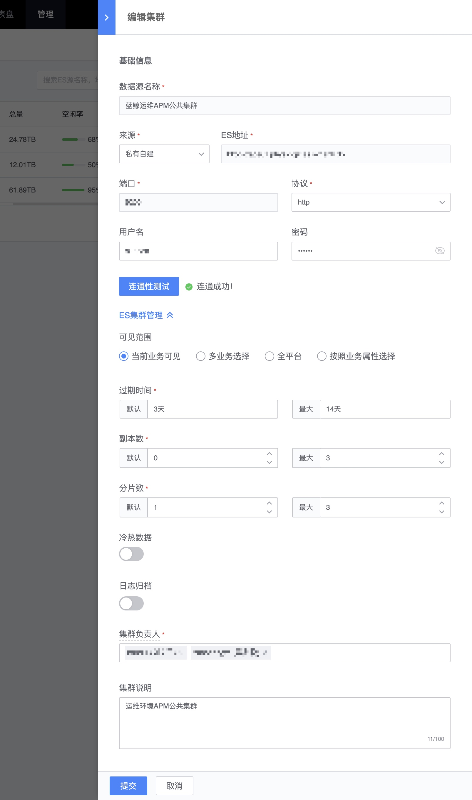
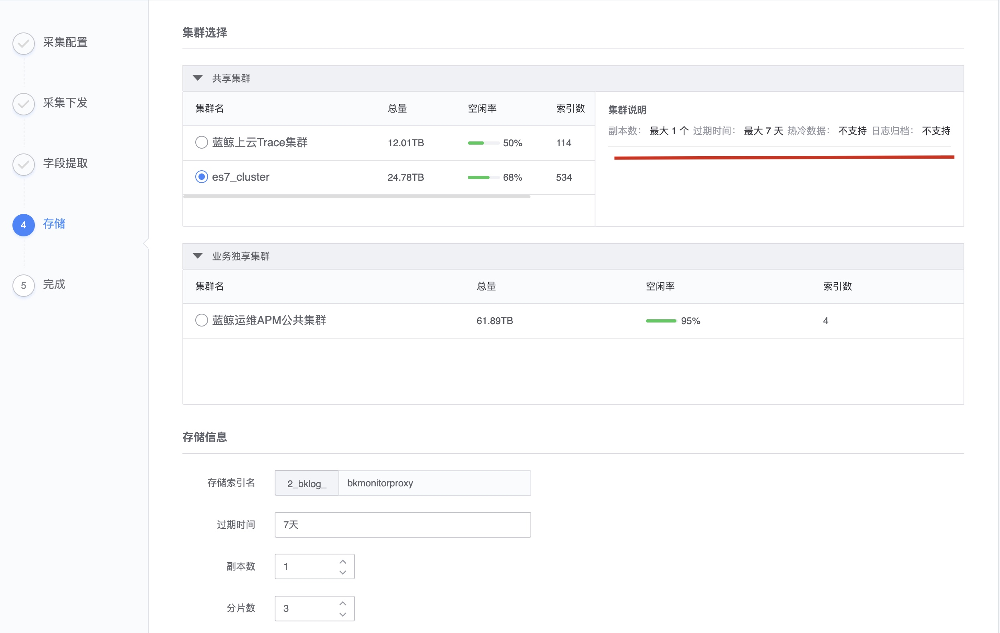

# 集群管理

集群指的是Elasticsearch存储集群的管理，通过对接ES存储可以满足不同的采集和存储需求。

只要是符合ES原生协议的就可以进行对接。支持V5，V6，V7

## 新建和管理集群

连通性测试成功后，可以进行ES集群管理的设置

1. 可见范围，支持
    * 当前业务可见
    * 多业务选择
    * 全平台
    * 按照业务属性选择： 按CMDB业务的属性进行过滤

2. 过期时间、副本数、分片数、冷热数据、日志归档 设置后在采集使用的时候就会有相应的效果

* 冷热数据：通过冷热数据的设置可以设置不同的机器资源来达到资源成本节约的目的。
* 日志归档：为了长期存储，需要不定期的进行回溯，更好的为了节省机器资源，可以使用日志归档 。具体日志归档的配置查看[日志归档使用文档](../tools/log_archive.md)

