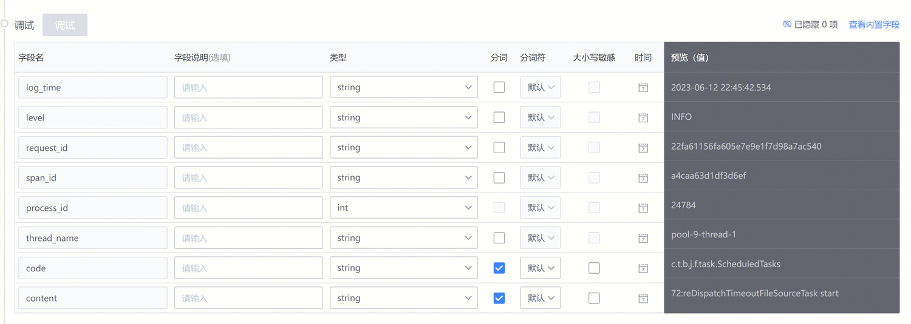
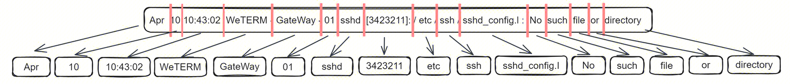
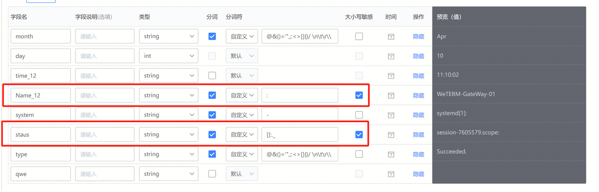

### 介绍
Lucene 语法默认为自然语言分词，会以英文的自然语法习惯进行分词。在很多日志场景下，自然语言分词会导致日志分词不符合预期。如：172,10 ， log_level 等，英文语法中这类形式会视为同一单词而不进行分词操作。
自定义分词器提供自行配置分词符的能力，解决各种场景下的分词需求。

### 定义与说明
##### 大小写敏感
支持区分大小写进行查询，保证匹配结果更符合目标。
!!#6fa8dc 勾选大小写敏感：查询会区分大小写。搜索：ERROR ，必须输入 ERROR
不勾选大小写敏感：查询不区分大小写。搜索：ERROR ，可输入 error 或 ERROR !!

##### 分词
分词器会将日志内容按照规定好的规则切分为多个片段，每个片段称之为一个“词”，而这个过程称之为“分词”。该设置会影响日志搜索、查询的效果。
例如：按默认规则对示例日志进行切分，得到如下词。其中，sshd_config.I 没有被分词切割。无法通过 config 直接搜索。配置分词符中，增加 _ . 后，按照规则进一步分割，成功匹配。

##### 原始日志
平台提供保留原始日志的能力，默认为 log 字段。该字段内将包含上报日志的全量内容。!!#e06666 若您不想保留原始日志，则需对日志清洗输出保留字段。!!

### 功能说明
可通过管理 - 日志采集 - 清洗 进行编辑。日志平台提供默认、自定义两种模式。默认模式下将按照自然语言分词执行。自定义模式下，用户可定义所需分词符。
若保留原始日志（log 字段），可设置原始日志的分词、大小写敏感。

若不保留原始日志，则需清洗字段后，按字段做单独配置。

字段类型为 **string** 时，允许将字段设置为分词字段。勾选分词为选中状态后，点击切换分词符。默认获取当前页面其他已设置的分词符，支持不同字段独立配置。默认分词符为：@&()='",;:<>[]{}/ \n\t\r\\ ，用户可自行修改分词配置；分词后可按照分词结果进行查询搜索。【编辑时请注意空格，一般情况下，分词需要按照空格执行】

若该字段内日志查询过程中需区分大小写，可勾选“大小写敏感”。勾选后，查询将严格区分大小写。

### 效果展示
按照默认的分词进行展示，log 字段分词效果如下：

不同字段支持不同的独立设置，我们将"name_12"分词符设置为 : ，将字段"staus"分词符设置为[]:._  ，可观察到“name_12”和“staus”的分词效果与原来不同。

字段“name_12”的分词效果：WeTERM-GateWay-01 已作为整个单词，单独搜索 WeTERM ，无法输出结果

字段“staus”的分词效果：拆分为 /etc/ssh/sshd config I 三个单词，搜索 sshd_config.I 或 ssh ，无法输出结果

