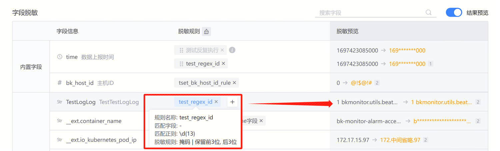

日志平台针对用户接入日志提供脱敏能力，用户可根据清洗字段、正则进行对应日志内容的匹配，满足不同场景下脱敏的需求。

### 配置模式
#### 正则表达式+字段名
提供正则表达式+字段名（Key）的精准匹配方式，解决重复格式内容正则匹配范围过大的问题。
**日志样例**

time（13 位数字）：1697422130000

dtEventTimeStamp（13 位数字）：1697422130004

期望：屏蔽固定数字的中间位数，但不影响其他部分

效果：精准匹配，time 字段不生效该规则

**最终效果：**

#### 仅字段名
该能力针对日志内容规范、标准、字段含义清晰不重复的日志。提供针对字段名称的快速脱敏，无需编辑正则，即可完成脱敏配置。支持多字段名同时配置，如手机号（phone、iphone、Tel 等）
**日志样例**
期望：屏蔽内容同质化，可以批量配置的字段
效果：快速屏蔽，输出目标结果（图例为单日志情况下模拟，实际多应用于多日志场景下）

**最终效果**

#### 仅正则表达式
通过正则匹配能力，提供基于正则规则的匹配脱敏。适用于大范围特征性的日志关键字场景，如：超长位数的数字、固定格式生成的 ID 等；
**日志样例**
期望：在日志中匹配命中 13 位数字
效果：针对 13 位数字保留前 3 后 3 进行脱敏

**最终效果**

#### 脱敏算子
脱敏算子用于用户针对脱敏进行结果处理。目前支持替换、掩码两种形式。
替换：将匹配命中内容替换为目标内容，支持正则格式部分替换；

掩码：将匹配内容的部分进行掩码处理，消除其特征；

**实现效果**
支持查询脱敏、导出脱敏。脱敏后，对应匹配的脱敏内容将会以已配置脱敏结果样式进行展示。

### 处理结果展示
一次配置，满足各种脱敏需求。
平台侧：页面内容（语法推荐、仪表盘、监控平台等）均进行脱敏处理；
下载：满足用户下载、外发脱敏后数据的需求；
海外：通过权限组隔离，实现不同用户同一平台不同结果展示；

### 亮点功能
#### 分级管理
日志平台基于脱敏场景，提供分层的脱敏规则管理能力。满足不同管理诉求下的脱敏要求下发。提供全局、业务下两级管理层级，满足集团通用、业务自用的不同规则分级管理场景。
#### 自动匹配
提供一键匹配脱敏规则能力，自动应用目标内容匹配对应规则，同时根据内容提供规则推荐。去除复杂的配置工作，降低配置复杂度。

#### 实时预览
配置过程可视化，实时预览脱敏结果，拒绝反复调试；

