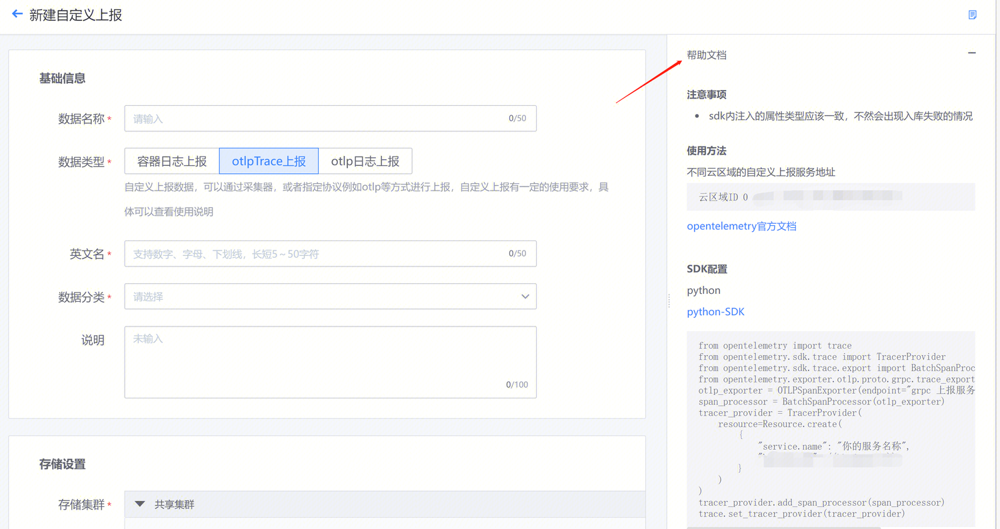
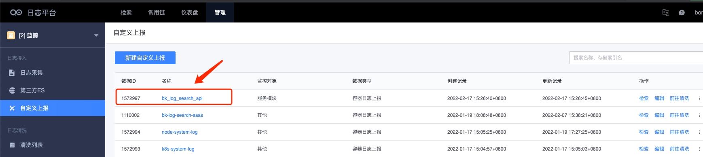
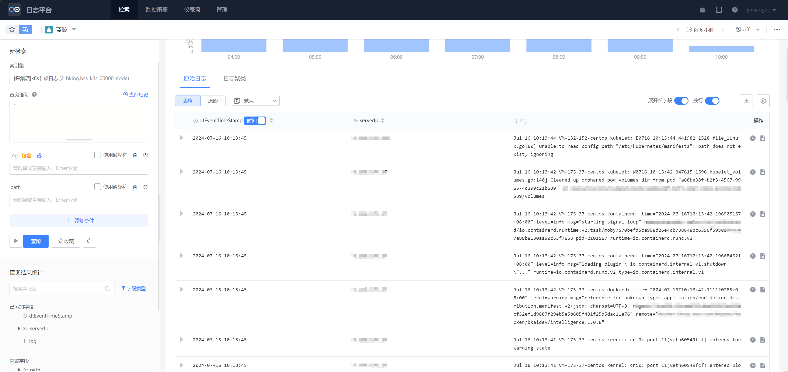

# 自定义上报方式

通过自定义上报的方式，接入日志平台。自定义上报数据，可以通过采集器，或者指定协议例如 otlp 等方式进行上报，自定义上报有一定的使用要求，需按照要求接入。

自定义上报支持三种数据类型：容器日志上报、otlp Trace 上报、otlp 日志上报（API 频率限制 5w/s）。上报要求可查看页面右侧帮助文档；




**接入流程**

基础信息：配置数据名称、数据类型、英文名、数据分类、说明；

存储设置：

存储集群：支持选择共享集群；如有业务独享集群，可选择独享集群进行设置；

数据链路：选择已有数据链路进行日志上报；

输入日志过期时间、副本数、分片数后完成配置；


## 容器日志上报

### **使用方式** 
#### **1. 前置条件**
部署侧需要提前将集群的日志采集开启，开启后会在集群应用上如下的配置

* 安装 daemonset，节点至少需要预留 0.1 核，内存 200M 资源

* 注册上 BkLogConfig 的 CRD 资源

请参阅安装文档：  容器日志采集器安装
#### **2. 页面申请数据 ID**
在页面上申请日志上报 dataid


提交后，dataid 会展示在列表页面，如下图所示


#### **3.走 yaml 形式下发**
比如：采集 default 集群中 bk-log-search-api 的 pod 的标准输出

```go
apiVersion: bk.tencent.com/v1alpha1
kind: BkLogConfig
metadata:
  name: bk-log-search-api
spec:
  dataId: 1572997
  logConfigType: std_log_config
  namespace: default
  labelSelector:
    matchLabels:
      app.kubernetes.io/name: bk-log-search-api
      app.kubernetes.io/instance: bk-log-search-api
```

#### **4. 页面查看** 
可从管理-采集列表页面，点击检索跳转过去查看


可直接去检索页面查看，选择对应的索引集


## **yaml 字段说明**
采集类型分为三种，标准输出、容器文件、节点文件 

数据源匹配方式有：所有容器、指定工作负载、指定 PodLabels 

|字段|类型|说明|
|--|--|--|
|dataId|int64|对应数据上报管道|
logConfigType|string|采集类型(std_log_config/container_log_config/node_log_config)
namespac|string|指定命名空间
allContainer|bool|采集指定命名空间下所有容器日志
containerNameMatch|[]string|指定容器名，可指定多个
workloadType|string|指定工作负载类型，支持 deployment、daemonset、statefulset、job、cronjob 等
workloadName|string|指定工作负载名称
labelSelector|metav1.LabelSelector|指定 label 匹配到的 Pod，参照示列，和 k8s 的 selector 使用一致
path|[]string|参照底下示列，支持通配符匹配路径
encoding|string|日志文件编码，默认 utf-8
multiline|MultilineConfig|多行日志采集
extMeta|map[string][string]|额外上报信息，注意**key 不要使用带点的符号**

```json
# Container Log
apiVersion: bk.tencent.com/v1alpha1
kind: BkLogConfig
metadata:
  name: bkiam-saas  # 模块名称，建议app_code + module_name, 比如bklog_web，bklog_api
spec:
  dataId: 1   # 对应数据上报管道

  logConfigType: container_log_config   # 采集类型，枚举值：container_log_config、node_log_config、std_log_config
  namespace: default      # 匹配命名空间
  containerNameMatch:  # 非必填，用来精确匹配到某个容器
    - controller
  labelSelector:   # 非必填，但一般都会写上这个，用来定位匹配到自己的pod。比如下面的示例，匹配到environment=production,app=nginx的pod
    matchLabels:  
      environment: production
      app: nginx

  path:   # 非必填，容器文件采集 和 节点文件采集的时候才需要填写。支持通配符匹配路径，可以配置多个路径
    - /your/container/path/iam.log
    - /your/container/path/*.log
  encoding: 'utf-8'  # 非必填, 默认 utf-8，如果有特殊需求可以修改这里的编码
  multiline: # 非必填，如果需要采集段日志才需要填写，默认采集行日志，不需要写这个
    pattern: '^\\['   # 首行匹配规则，正则模式
    maxLines: 20   # 段日志最大行数
    timeout: '5s'  # 最大等待时间，当匹配到首行后，最多等待指定的时间，超过则直接上报

---
# Node Log
apiVersion: bk.tencent.com/v1alpha1
kind: BkLogConfig
metadata:
  name: bkiam-saas
spec:
  dataId: 1

  logConfigType: node_log_config
  namespace: default
  containerNameMatch:
    - controller
  labelSelector:
    matchLabels:
      environment: production
      app: nginx

  path:
    - /your/node/path/iam.log
    - /your/node/path/*.log
  encoding: 'utf-8'
  multiline:
    pattern: '^\\['
    maxLines: 20
    timeout: '5s'

---
# Stdout
apiVersion: bk.tencent.com/v1alpha1
kind: BkLogConfig
metadata:
  name: bkiam-saas
spec:
  dataId: 1

  logConfigType: std_log_config
  namespace: default
  containerNameMatch:
    - controller
  labelSelector:
    matchLabels:
      environment: production
      app: nginx
```

## **采集原理**
目前选用的方案是走 DaemonSet 的方式，也是业界比较主流的容器采集方式。运维比较简单，支持标准输出和容器文件、节点文件。后续如果某个业务有大的日志采集需求，可以将采集器绑定到业务容器下，走 Sidercar 的方式，做到隔离。
