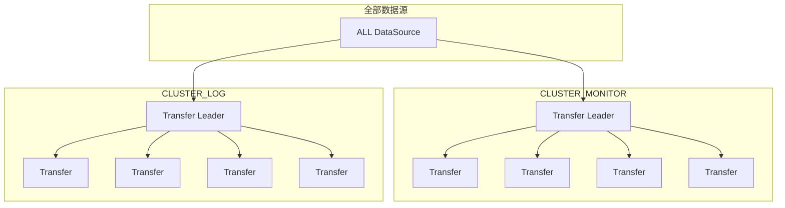

# Transfer运维手册

## Transfer架构说明
Transfer主要负责将GSE DataServer转发至Kafka中的数据进行格式转换，并入库到influxdb或ES存储当中。各个Transfer之间将会形成集群，不同的Transfer集群可以组合形成一个联邦，共同处理环境下的各个数据源数据。而集群中的Transfer，将会均衡分配data_id数据量。


## 主要配置说明说明
- 主要环境变量
    |配置名|用途|默认值|
    |--|--|--|
    | TRANSFER_CLUSTER | 指明transfer实例加入的集群名 | default |
    | TRANSFER_SCHEDULER_PLUGIN_CC_CACHE | 是否启动CC缓存动作 | true | 
- 缓存配置样例
    ```yaml
    # 使用本地bbolt缓存
    storage:
      type: "bbolt"
      path: "__BK_HOME__/public/bkmonitorv3/transfer"
    ```
    ```yaml
    # 使用redis缓存，该方案可以降低ESB请求压力
    # redis 单例模式
    storage:
      type: "redis"
      redis:
        type: "standalone"  # 单例模式
        host: "redis.service.consul"
        port: 6379
        password: "redis_password"
        cc_cache_key: "bkmonitorv3.transfer.cmdb.cache"
        database: 11
        mem_check_period: 15m  # 内存数据维护周期
        wait_time: 0  # cmdb默认等待时间，默认无限等待
        clean_data_period: 1h  # redis中数据清理周期
    # redis哨兵模式
    storage:
      type: "redis"
      redis:
        type: "sentinel"  # 哨兵模式
        host: "redis-sentinel.service.consul"
        port: 6379
        master_name: "mymaster"
        password: "redis_password"
        database: 11
        cc_cache_key: "bkmonitorv3.transfer.cmdb.cache"
        mem_check_period: 15m  # 内存数据维护周期
        wait_time: 0  # cmdb默认等待时间，默认无限等待
        clean_data_period: 1h  # redis中数据清理周期
    ```
    > 关于bbolt到redis的切换，可以查看`transfer迁移redis缓存操作方案`说明


## 日常维护

1. 扩容操作
    扩容Transfer实例相当方便，只需要在扩容机器上部署Transfer实例及修改对应配置信息后，启动Transfer实例即可。
    集群中的Transfer leader将会通过consul服务注册感知到新增Transfer实例，并将会分配数据任务到该实例上。
2. 负载调整
    目前Transfer还未能感知各个数据源的负载情况，因此有可能会导致部分Transfer过热的情况。此时，可以考虑通过手动分配的方式，调整单个Transfer承载数据源
    具体操作，请参考[`Transfer手动分配data_id维护说明`](./transferManualDataID.md)
3. 集群划分
    在环境负载较大的情况下，我们可能会遇到数据隔离的需求：希望默认的数据源不会被用户自定义的数据影响。此时，我们需要将数据源切换到不同的Transfer集群中，隔离数据源之间的相互影响。操作主要分为两部分：
    - 启动新Transfer集群，注意调整配置对应的集群ID
    - 将数据源ID切换到新集群下
    ```bash
    # 登录到监控后台
    workon bkmonitor-bkmonitorv3
    # 将批量的数据源切换到新的集群中
    bin/manage.sh switch_transfer_for_dataid ${cluster_id} --data_id ${data_id} ${data_id} ...
    # 如果有曾部署过蓝鲸监控2.5企业版 或 蓝鲸监控3.2版本，可选执行以下命令
    bin/manage.sh clean_old_consul_config
    ```
4. 主要指标值
    | 名称                                 | 描述                        | 模块         | 类型   |
    | ------------------------------------ | --------------------------- | ------------ | ------ |
    | **consul_write_failed_total**        | 写 consul 失败次数          | 动态字段上报 | 计数器 |
    | consul_write_success_total           | 写 consul 成功次数          | 动态字段上报 | 计数器 |
    | **esb_request_fails_total**          | 请求 esb 失败次数           | CC 缓存      | 计数器 |
    | esb_request_successes_total          | 请求 esb 成功次数           | CC 缓存      | 计数器 |
    | esb_request_handle_seconds*          | 请求 esb 耗时分布           | CC 缓存      | 直方图 |
    | redis_command_successes_total | 缓存操作redis成功次数 | CC缓存 | 计数器 | 
    | redis_command_fails_total | 缓存操作redis成功次数 | CC缓存 | 计数器 | 
    | transfer_store_operation_fails_total | 缓存不能命中缓存次数 | CC缓存 | 计数器 | 
    | transfer_store_operation_sucesses_total | 缓存命中缓存次数 | CC缓存 | 计数器 | 
    | go_gc_duration_seconds*              | gc 暂停耗时统计             | 系统         | 统计   |
    | go_goroutines                        | goroutine 数量              | 系统         | 度量   |
    | go_threads                           | 系统线程数量                | 系统         | 度量   |
    | influx_backend_buffer_remains*       | influxdb 缓冲区饱和度分布   | influxdb     | 直方图 |
    | **pipeline_backend_dropped_total**   | 流水线后端丢弃消息数        | 流水线       | 计数器 |
    | pipeline_backend_handled_total       | 流水线后端处理消息总数      | 流水线       | 计数器 |
    | kafka_frontend_rebalanced_total      | kafka 重均衡次数            | kafka        | 计数器 |
    | **pipeline_frontend_dropped_total**  | 流水线前端丢弃消息数        | 流水线       | 计数器 |
    | transfer_kafka_frontend_commit_total | 流水线前端消费消息数 | 流水线 | 计数器 | 
    | pipeline_frontend_handled_total      | 流水线前端处理消息总数      | 流水线       | 计数器 |
    | **pipeline_processor_dropped_total** | 流水线处理器丢弃消息数      | 流水线       | 计数器 |
    | pipeline_processor_handled_total     | 流水线处理器处理消息总数    | 流水线       | 计数器 |
    | pipeline_processor_handle_seconds*   | 流水线处理耗时分布          | 流水线       | 直方图 |
    | **scheduler_panic_pipeline_total**   | 调度器捕获流水线 panic 次数 | 调度器       | 计数器 |
    | **scheduler_pending_pipelines**      | 调度器挂起流水线数量        | 调度器       | 度量   |
    | scheduler_running_pipelines          | 调度器运行流水线数量        | 调度器       | 度量   |
    | **kafka_backend_dropped_total**      | 写 kafka 失败次数          | kafka      | 计数器 |
    | kafka_backend_handled_total          | 写 kafka 成功次数          | kafka      | 计数器 |
    | **redis_backend_dropped_total**      | 写 redis 失败次数          | redis      | 计数器 |
    | redis_backend_handled_total          | 写 redis 成功次数          | redis      | 计数器 |
    | redis_command_successes_total | 缓存操作redis成功次数 | 

## 常见问题
1. 如何查询某个data_id的归属？
   对于内置的数据源，请参照`数据源ID分配记录`说明；对于用户自定义数据，可以访问`https://${PASS_HOST}/o/bk_monitorv3/admin/metadata/datasourceresulttable/`查看。结果表命名规则如下：

   | 结果表开头 | 来源 | 
   | --| --|
   |`script_` | 自定义脚本采集 |
   |`pushgateway_` | 自定义BK-PULL采集 |
   |`exporter_` | 自定义exporter采集 | 
   | `jmx` | 自定义jmx采集 | 
   | `${biz_id}_bkmonitor_event_` | 自定义事件上报 或 日志关键字 |
   | `${biz_id}_bkmonitor_time_series_` | 自定义时序上报 |
   | `${biz_id}_bklog` | 日志采集 | 

2. 如何判断Transfer的消费是否有延迟？
   需要结合kafka的监控及Transfer的`transfer_kafka_frontend_commit_total`指标和[kafka监控指标](https://docs.confluent.io/platform/current/kafka/monitoring.html#per-topic-metrics)判断
