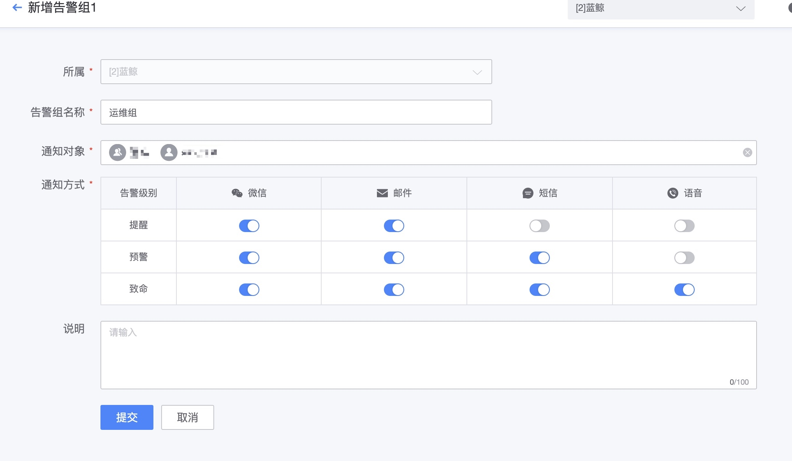
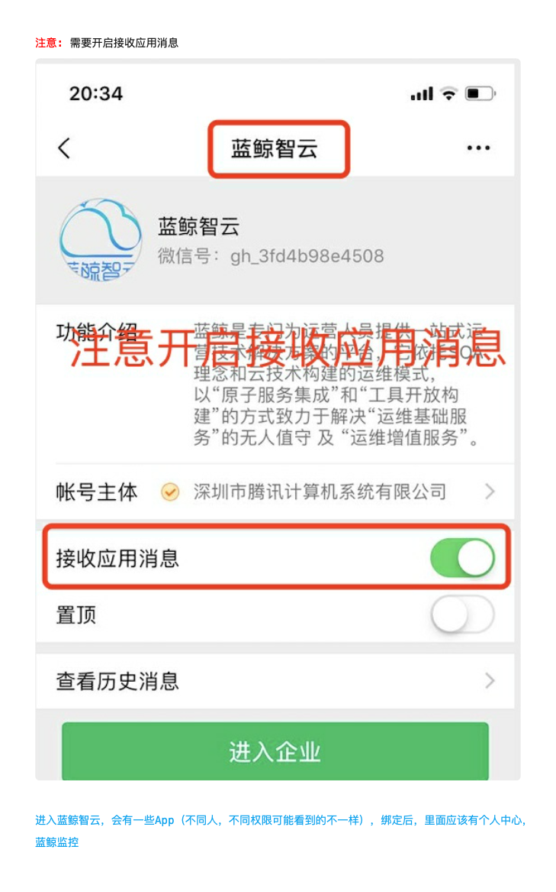

# 如何添加新的通知渠道

通知渠道使用 PaaS 的通知 ESB 组件，在蓝鲸的独立部署版本（企业版、社区版）需要在开发者中心后台设置。

## 在通知 ESB 组件中配置通知渠道

蓝鲸集成平台（PaaS）的消息管理通知设置

详细设置请访问蓝鲸 PaaS 提供的设置文档

- [如何配置通知渠道，如邮件、微信、短信等?](../../../../PaaS/2.12/%E4%BA%A7%E5%93%81%E7%99%BD%E7%9A%AE%E4%B9%A6/%E5%9C%BA%E6%99%AF%E6%A1%88%E4%BE%8B/noticeWay.md)
- [经验分享-测试邮件服务是否正常](http://bk.tencent.com/s-mart/community/question/95#/)

## 在全局配置中确定通知方法

在监控中确认消息通知的渠道。

## 告警通知设置入口

全局配置影响通知方式的选择这块。通过告警组的配置可以满足策略的告警。

## 微信注意开通事项

当微信没有接受到告警的时候，注意查看是否已经开启。

