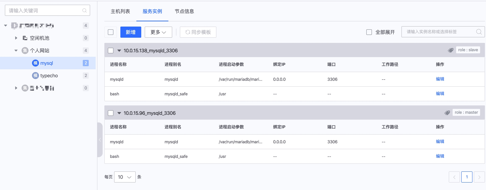
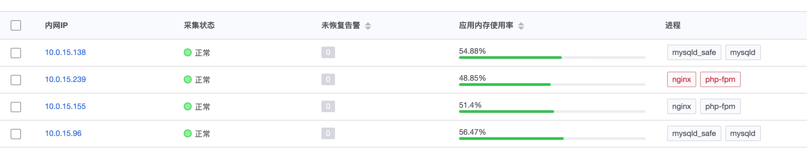
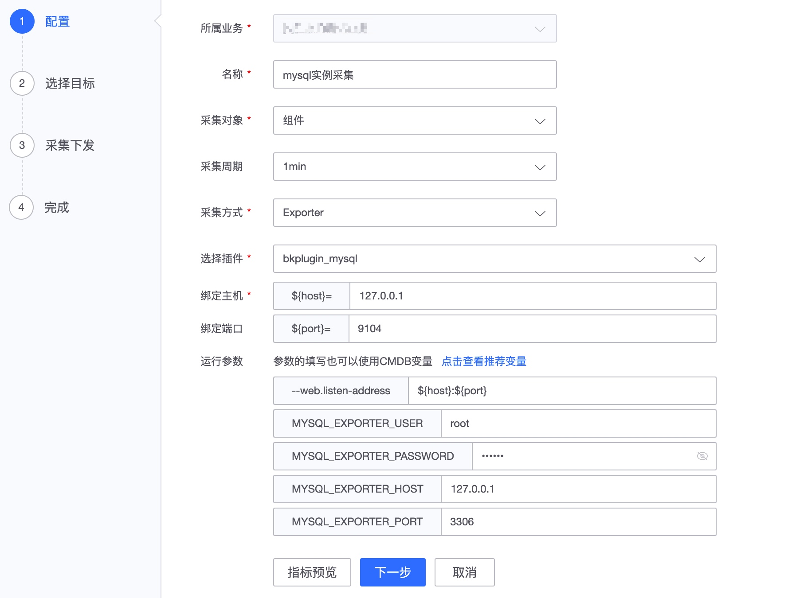
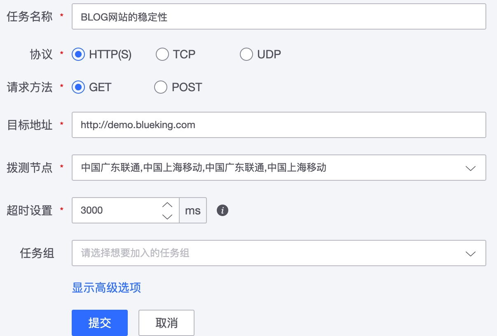

# 快速接入

快速接入以一个简单的网站做为参考例子，演示如何实现监控的全面覆盖。借此对监控平台的使用也会有一个基本的认识。

大致的步骤：

* step 1 了解网站架构及确定监控点
* step 2 CMDB 配置和准备工作
* step 3 配置主机-操作系统和主机-进程监控
* step 4 配置服务-组件监控
* step 5 配置服务-服务模块的日志监控
* step 6 配置应用-服务拨测监控
* step 7 通过自定义上报补充业务监控
* step 8 分享配置

## step 1 了解网站架构及确定监控点

| 用途         | IP          | 进程              | 说明              |
| ------------ | ----------- | ----------------- | ----------------- |
| web1         | 10.0.15.239 | nginx php-fpm     | typecho blog 程序 |
| web2         | 10.0.15.155 | nginx php-fpm     | typecho blog 程序 |
| mysql master | 10.0.15.96  | mysql mysqld_safe | 数据库主          |
| mysql slave  | 10.0.15.138 | mysql mysqld_safe | 数据库从          |

为了保证该 BLOG 网站的稳定性，进行一个全方位的监控至少需要满足如下的监控需求：

1. 4 台主机的操作系统数据 -- 监控主机的稳定性
2. 4 台主机上的进程数据 -- 监控进程的运行数据和存活性
3. nginx，php-fpm，mysql 的组件运行数据 -- 监控组件的运行数据
4. blog 程序的日志数据  -- 采集日志定位和日志关键字告警
5. 网站的拨测数据 -- 远程监控网站可用率

> blog 程序选择了[typecho](http://typecho.org/)这个轻量的程序做为示例。

## step 2 CMDB 配置和准备工作

* [创建业务](../../../../CMDB/3.9/%E4%BA%A7%E5%93%81%E7%99%BD%E7%9A%AE%E4%B9%A6/%E4%BA%A7%E5%93%81%E5%8A%9F%E8%83%BD/BusinessManagement.md)
* [创建集群](../../../../CMDB/3.9/%E4%BA%A7%E5%93%81%E7%99%BD%E7%9A%AE%E4%B9%A6/%E4%BA%A7%E5%93%81%E5%8A%9F%E8%83%BD/SetTemp.md)
* [创建模块](../../../../CMDB/3.9/%E4%BA%A7%E5%93%81%E7%99%BD%E7%9A%AE%E4%B9%A6/%E4%BA%A7%E5%93%81%E5%8A%9F%E8%83%BD/Model.md)

    > 如果进程配置在每台上面是一样的，是建议使用集群模版和服务模版的功能
    > 如果进程配置在每台上面不一样的，建议查看 [如何实现多实例监控](../guide/multi_instance_monitor.md)

更多请查看 [准备工作](./prepare.md)

web 配置

mysql 配置

更多进程配置方法查看[进程配置种类](../guide/process_cases.md)

## step 3 配置主机-操作系统和主机-进程监控

当配置好了进程信息后，在“主机监控”将看到相应采集的数据。

平台自带默认的策略详细查看[内置策略](../functions/addenda/builtin-rules.md)，当内置策略不满足需求的时候可以增加监控策略。

配置进程端口监控：导航  →  监控配置  →  策略  →  新建

在事件中心查看告警信息：导航  →  事件中心

更多请查看场景案例：

* [主机监控](../functions/scene/host-monitor.md)
* [如何对进程进行监控](../guide/process_monitor.md)
* [如何对操作系统进行监控](../guide/os_monitor.md)

## step 4 配置服务-组件监控

对于 MySQL、Nginx 使用监控平台官方内置的组件就可以快速的实现组件监控的需求。 更多内置组件查看“导航  →  监控配置  →  插件”

* [内置插件](../functions/addenda/builtin-plugins.md)
* [插件管理](../functions/conf/plugins.md)

使用的时候直接在“导航  →  监控配置  →  采集”中直接使用插件能力即可。按插件的配置方法进行设置。

采集的数据可在“检查视图”和“仪表盘”中查看，更多的使用方法查看 [采集配置](../functions/conf/collect-tasks.md)

策略配置具体查看 [策略配置](../functions/conf/rules.md)

像 PHP-FPM 没有内置的官方插件可以直接使用，可以查看 [如何对开源组件进行监控](../guide/component_monitor.md)。

## step 5 配置服务-服务模块的日志监控

采集程序的访问日志

日志采集： 导航  →  监控配置  →  采集  →  日志采集  →  新建

- 字段提取-格式化数据

数据检索-查看日志采集的数据，更多的使用方法查看 [数据检索](../functions/analyze/data-search.md)。

配置日志告警-日志关键字包含 login.php 每分钟超过 10 进行告警。

更多日志监控配置查看 [如何通过日志数据进行监控](../guide/log_monitor.md)

## step 6 配置应用-服务拨测监控

增加远程的首页检测，通过服务拨测判断网站的稳定性。

- 新建拨测任务

- 查看拨测结果

还可以设置可用率，响应时长的监控策略，更多请查看。

* [服务拨测](../functions/scene/dial.md)

## step 7 通过自定义上报补充业务监控

业务代码里面想直接将监控数据上报，有 SDK，命令行工具，HTTP 等方式。

具体查看[自定义上报功能](../functions/conf/custom-report.md)

## step 8 分享配置

如果每个业务的网站架构都是差不多，每次都配置一遍 step3-step6 是不是很繁琐。 那么将他们做成一个模版直接导出和导入吧。

导航 →  监控配置 →  导入导出

更多请查看[导入和导出功能介绍](../functions/conf/import-export.md)

