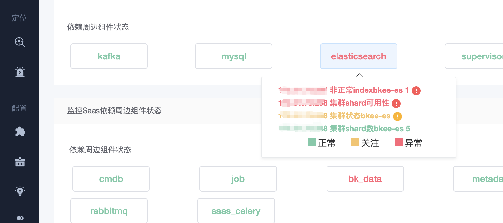

# 自监控相关的 FAQ

## 常见问题一 

xx.x.x.xxx 非正常 indexbkee-es 1

xx.x.x.xxx 集群 shard 可用性

xx.x.x.xxx 集群状态 bkee-es

xx.x.x.xxx 集群 shard 数 bkee-es 86

##### 解决方案 : [https://bk.tencent.com/s-mart/community/question/2039](https://bk.tencent.com/s-mart/community/question/2039)

## 常见问题二 

saas_celery 状态异常

##### 解决方案一 : [https://bk.tencent.com/s-mart/community/question/3862?type=article](https://bk.tencent.com/s-mart/community/question/3862?type=article)

##### 解决方案二 : [https://bk.tencent.com/s-mart/community/question/3565](https://bk.tencent.com/s-mart/community/question/3565)

