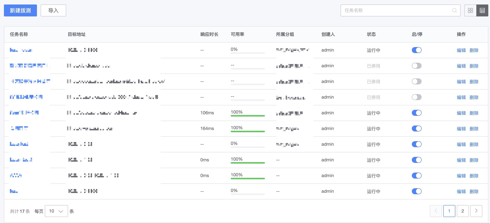

# 服务拨测

服务拨测是探测服务（应用）可用性的监控方式，通过拨测节点对目标服务进行周期性探测，主要通过可用性和响应时间来度量服务（应用）的状态。

服务拨测通过模拟用户的登录/查询，实现从被动投诉到主动发现的运维方式转变，当前支持的拨测协议有 HTTP(包含 HTTPS，GET 和 POST 方法）、TCP、UDP。

## 前置步骤

**工作原理**：

* **Remote Object 远程监控对象**： 可以是 HTTP(s)，TCP，UDP，ICMP
* **拨测节点**： 也就是 bkmonitorbeat 部署的位置， 就是要设置探测的源头，多个不同的位置节点检测同一个目标更能体现服务在地域上面的可用性。

**配置主流程**：

* (1) 配置拨测节点
* (2) 新建拨测任务
* (3) 选择协议
* (4) 填写目标地址
* (5) 设置策略
* (6) 查看拨测任务

## 主功能一览

* 拨测节点和拨测任务管理
* 批量拨测任务导入
* 支持的协议：TCP、UDP、HTTP(s)，ICMP
* 支持目标：CMDB 的主机、 外网 IP 、域名
* 衡量服务的指标：可用率、响应时间、期望响应码、期望响应内容
    * 可用率：一个拨测周期内，正常的节点数/总拨测节点数 * 100% (正常判断条件： 预期返回状态码，预期返回内容，超时时间)
    * 响应时间：请求耗时，超时设置
    * 期望响应码：200 3xx 4xx 5xx
    * 期望响应内容：响应的内容是否匹配
* 支持的图表类型：趋势图、地图
* 其他：支持导入、任务分组

## 功能说明

### 新建拨测节点

当没有现成可用的拨测节点时，需要先进行拨测节点的创建才可以添加拨测任务。

**功能位置**：导航  →  服务拨测  →  节点  →  新建拨测节点

* 【1】管理员可以设置为公共的节点，其他业务都可以查看，默认是只有本业务可以使用。
* 【2】默认是自建节点，未来可支持云拨测节点。
* 【3】如果是自建节点，选择的 IP 信息会同步配置平台的地区和运营商。

> 注意：当然在配置平台没有配置也是可以自定义的，但建议这类信息可以在 CMDB 维护好有利于其他 SaaS 的使用。

### 拨测任务查看模式

**功能位置**：导航  →  服务拨测  →  任务

* 默认为卡片模式和分组的管理方式

* 切换成列表模式

* 批量导入

### 新建拨测任务

**功能位置**：导航  →  服务拨测  →  任务 →  新建拨测任务

* TCP、UDP、ICMP 支持五种目标 IP 的填写方式：
    * 动态拓扑：从 CMDB 拓扑中自动获取 IP，有新增 IP 会自动配置监控目标
    * 静态拓扑：只有已选择的拓扑才会生效，如子节点新增，则不会自动覆盖监控目标
    * 服务模板：按服务模板进行配置
    * 集群模板：按集群模板进行配置
    * 自定义输入：支持手动输入内网 IP，外网 IP，其中外网 IP 地址，只要符合 IP 格式就可以不会进行 CMDB 的检验

### 查看拨测详情

* 【1】关联编辑操作和关联策略配置
* 【2】可以在曲线和地图视图之间切换

