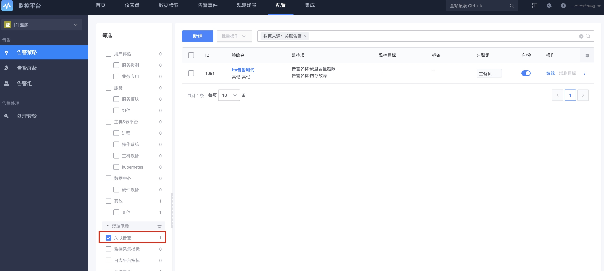

# 关联告警策略

从产生的告警中进行关联判断是否要进行新的告警产生并进行处理。 比如 当两个告警同时产生时才进行打电话。

## 策略列表

查看策略列表

## 新建策略

选择关联的告警策略，可以一次关联多个告警

添加关联策略，如下图所示

## 关联告警可支持的数据源

可用于配置关联告警的数据源有两种

1. 监控平台创建的告警策略

    * 当前业务配置的所有 非关联告警策略 

2. 接入的第三方告警

    * 事件插件配置的内置告警名称
    * 事件插件接入的，最近7天生成的告警。该类型只有在实际生成后才能用于配置关联告警策略 (存在5分钟同步延迟)

## 维度

每个告警可以分别选择不同的维度，但每个告警的维度必须是其他所有告警的维度的子集或超集。

在进行告警匹配时，将根据公共维度的取值组合分别进行计算。

比如，告警 a 配置了维度 [ip, device_name]，那么告警 b 配置了维度 [ip]。在进行表达式计算时，a && b 将根据不同的 ip 取值分别进行计算，即 `a[ip=10.0.0.1] && b[ip=10.0.0.1]` 和 `a[ip=10.0.0.2] && b[ip=10.0.0.2]`

## 目标维度标准化

不同的告警策略或者第三方告警，它们目标字段名称可能会存在差异。为了让告警之间能够更有效的进行关联，在告警匹配时，监控会对目标维度进行标准化转换。转换规则如下

目标类型|	原字段名	|标准化字段名
---|---|---
主机IP	| bk_target_ip, ip	|ip
云区域	| bk_target_cloud_id, bk_cloud_id | bk_cloud_id
服务实例|	bk_service_instance_id, bk_target_service_instance_id | bk_service_instance_id
拓扑节点 | bk_obj_id, bk_inst_id	| bk_topo_node

## 表达式

表达式用于描述告警之间的关联关系，它由两部分组成

告警别名：每个告警添加之后，都会被分配一个小写英文字母，如 a, b c，便于在表达式中引用具体的告警（表达式对大小写不敏感，即 a && b 与 A && B是等效的）

布尔运算符：支持 与&& ，或|| ，非!

## 告警别名的取值

在表达式中，告警别名的取值取决于告警的当前状态。告警的状态及取值对应关系如下

告警状态|	取值
---|---
未恢复 (ABNORMAL) | 	true
已恢复 (RECOVERED) | false
已关闭 (CLOSED)	| false
未知 (UNKNOWN)	| false

示例及说明

表达式	| 触发条件
---|---
a && b | 	a 和 b 在当前时刻都处于 未恢复 状态
a || b	 | a 和 b 在当前时刻有任意一个处于 未恢复 状态
a && !b | 	a 处于 未恢复 状态，且 b 不处于 未恢复 状态
a && (b || c)	| a 处于 未恢复 状态，且 b 和 c 有任意一个处于 未恢复 状态

## 检测触发机制

目前有两种触发机制

1. 策略所关联的告警名称/策略，存在告警状态变更，包括以下情况

有新的告警产生
告警状态从 未恢复 变为 已恢复
告警状态从 未恢复 变为 已关闭

2. 周期巡检

每分钟会检查当前系统内所有 未恢复 状态的告警，找出其对应的关联策略，进行全量计算

注意：如果关联的告警策略配置了无数据告警，无数据告警将不参与关联检测

## 告警的生命周期

关联告警只有两种状态：未恢复 和 已关闭

关联告警策略首次满足表达式，将会产生一条关联告警记录，状态为 未恢复。并会触发对应的处理动作，可在事件中心进行查看

关联告警策略不满足表达式时，将当前 未恢复 的告警状态置为 已关闭

