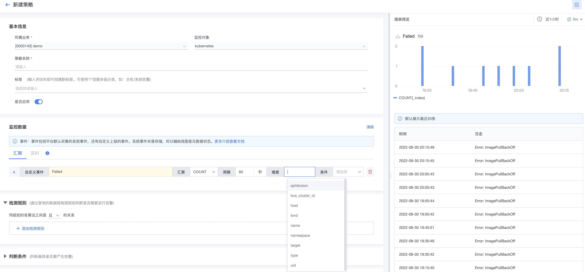

# 事件告警策略

事件数据是重要的信息来源之一，是监控中不可缺少的一种数据种类。

具体事件种类查看[数据模型-事件数据](../../../UserGuide/Architecture/datamodule.md)

## 事件数据与其他数据的区别

* 与指标的区别：只有一个事件数量的指标，其他都是维度，还有Cotent字段可以放采样的明细数据。
* 与日志的区别：事件是格式化的数据，没有所有的明细内容
* 与告警事件的区别： 告警事件是通过告警策略产生的内容，或者来自于其他监控工具的告警事件。

## 事件数据的来源

1. 通过[自定义事件上报](../integrations-events/custom_events_http.md)
2. 内置的事件插件：日志关键字事件插件、SNMP Trap插件  可以通过[数据采集](../integrations-metrics/collect-tasks.md)
3. 系统事件：由bkmonitorbeat默认采集。
4. K8s事件：由bkmonitorbeat-operator进行采集。

## 告警配置

带格式化的事件数据

* 汇聚方法只有COUNT

系统事件数据

* 只支持实时
* 系统事件没有存储

