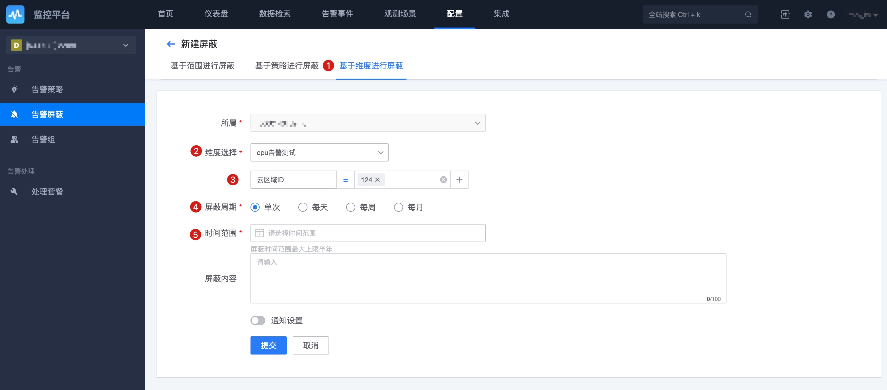

# 告警屏蔽

告警发生后的一种常见的处理动作，一个事故的产生可能要持续很长时间，对于一个已知的问题不停的通知显然会影响正常的工作，而且会湮没更多新的告警通知。

所以屏蔽是非常有效的减少干扰的手段，尤其是在明知要做一些操作会影响线上服务产生告警的时候。

## 前置步骤

**导航路径**：导航  →  监控配置  →  屏蔽

## 主功能一览

* 基于范围屏蔽： 按目标范围进行屏蔽不会包含相应的指标和维度
    * 实例
    * IP
    * 节点
    * 业务
* 基于策略屏蔽：是按策略设置的条件和维度进行屏蔽
* 基于告警事件屏蔽：是按告警的事件内容条件，事件内容包括维度和相应的值进行屏蔽
* 基于维度屏蔽： 对某个维度进行屏蔽，告警里面相关的维度都会被屏蔽到。 
* 单次屏蔽，周期性屏蔽(每天，每周，每月)
* 屏蔽通知：屏蔽前后进行通知

## 功能说明

### 基于范围屏蔽设置

基于范围屏蔽是只要是该范围内的监控都将不再进行告警通知，如屏蔽的是某个 IP，那么该 IP 的进程，OS，服务实例都不再进行告警。如屏蔽的是某个集群，那个集群下的所有的 IP，服务实例都将不再进行告警。

### 基于策略屏蔽设置

之所以能进行告警正是因为进行了策略的配置，那么基于策略的配置也可以非常准确的定位告警的数据。

> 注意：与策略停用的区别是，屏蔽只是屏蔽的通知，策略生效的情况下还是会进行事件的产生，而策略的停用是不再产生事件，自然也就没有告警的通知了。

### 基于维度屏蔽设置

   可以针对某个告警策略的某个维度值，针对满足这个维度的主机，进行告警屏蔽。

### 基于告警事件屏蔽设置

告警事件是策略里面特定的一个维度条件，所以要想能够进行事件的屏蔽，可以直接在事件详情中操作。

### 屏蔽周期设置

默认是常用的单次时间范围，但如果业务的特点是有周期性特点的，如每天的凌晨会进行离线的计算占用大量的资源不进行告警，或者每周一都有那么一次数据的统计，每个月都有一次对帐，导致的所监控的对象周期性产生告警，那么就可以使用每天，每周，每月这种周期性设置。

### 屏蔽通知设置

屏蔽通知设置是起到一定的提示作用。

* 通知对象：可以是角色可以是单个的人
* 通知方式：和告警组的通知方式一样
* 通知时间：在屏蔽告警前和屏蔽失效后进行通知。 周期性的是在每次周期通知前和后进行通知

## 其他相关屏蔽

* **告警确认**： 基于当前事件屏蔽，是按当前告警的事件进行屏蔽，一旦该事件恢复就失效。具体查看事件中心-事件详情-告警确认
* **快捷屏蔽**：
    * 策略列表页-快捷屏蔽，快速基于策略进行屏蔽
    * 事件详情-快捷屏蔽，快速基于事件的条件进行快速屏蔽
* **主机运营状态**：
    * CMDB 的主机运营状态字段，一旦启用了，那么会基于主机运营字段确定是否要进行屏蔽
    * 主机运营状态开关：导航  →  系统管理  →  全局配置  →  主机运营状态开关

### 标准维度-告警屏蔽

标准运维支持对告警的屏蔽，可以用于流程编排中，支持的原子功能如下

该插件的配置如下

