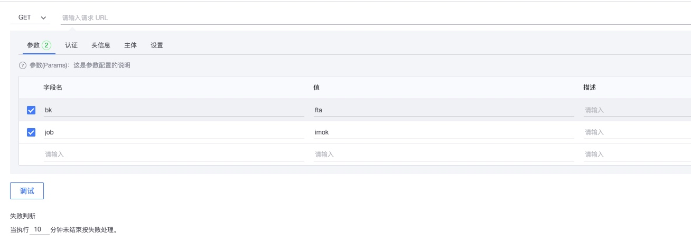
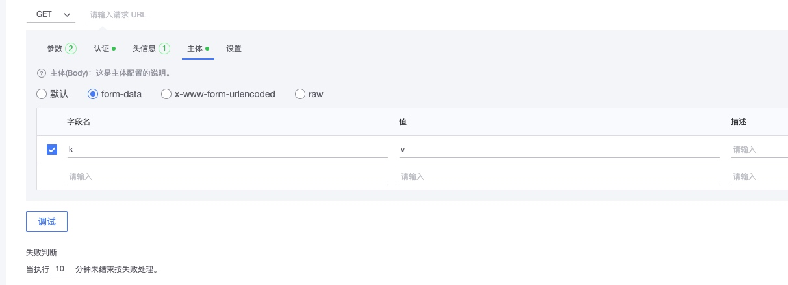

# 如何设置告警回调

告警回调是经常使用的一种与其他系统联动和进行二次处理的方式， 一般回调的服务都是同一个平台，业界大部分的策略都会在通知的时候自带告警回调， 这样就需要在每个告警策略上进行配置，如果哪一天回调的服务发生变化就需要批量的进行更改，造成的维护成本会比较高。而处理套餐的HTTP回调就可以非常简单的进行复用 。

## 处理套餐-HTTP回调 功能说明

### 参数 

参数(Params): 编写请求所需的参数，比如添加了username就会生成URL+?username=jack的请求。值的部分可以使用变量。

请求方法GET：默认

请求方法POST

* 认证: 无认证
* 头信息: Content-type:application/json
* 主体: 格式是 JSON 内容变量，完整的告警数据可通过变量 `` 进行引用
* 设置: 超时10s、重试间隔2s、重试2次

### 认证

认证(Authorization): 请求的目标地址需要认证时可以进行设置。

* No Auth 无需认证:默认情况下，“No Auth” ，是不需要认证。
* Bearer Token: Bearer Token是安全令牌。任何带有Bearer Token的用户都可以使用它来访问数据资源，而无需使用加密密钥
* Basic Auth:填写用户名和密码

### 头信息

头信息(Headers): 请求的头信息，可以根据目标地址的要求进行设置，也可以补充和主体信息也是有一定的联动。

content-type与body的对应关系

POST参数格式|	Content-Type	|参数示例
---|---|---
表单提交	| application/x-www-form-urlencoded | 	username=jack&password=123
JSON提交 | 	application/json	| {"username":"jack","password":"123"}
XML提交	| text/xml|	<?xml version="1.0" encoding="utf-8"?><book>< title>xxxx</title></book>

### 主体

主体(Body): 请求的主体信息，一般在POST中才会使用到。 主体的格式与Content-Type有对应的关系，会自动进行设置。内容部分可以使用变量。更多查看文档。

### 设置

设置(Setting): 请求动作的相关设置。

## 使用案例-微信群自定义机器人

具体查看文档[案例：微信群自定义机器人](./solutions_http_callback_case1.md)

