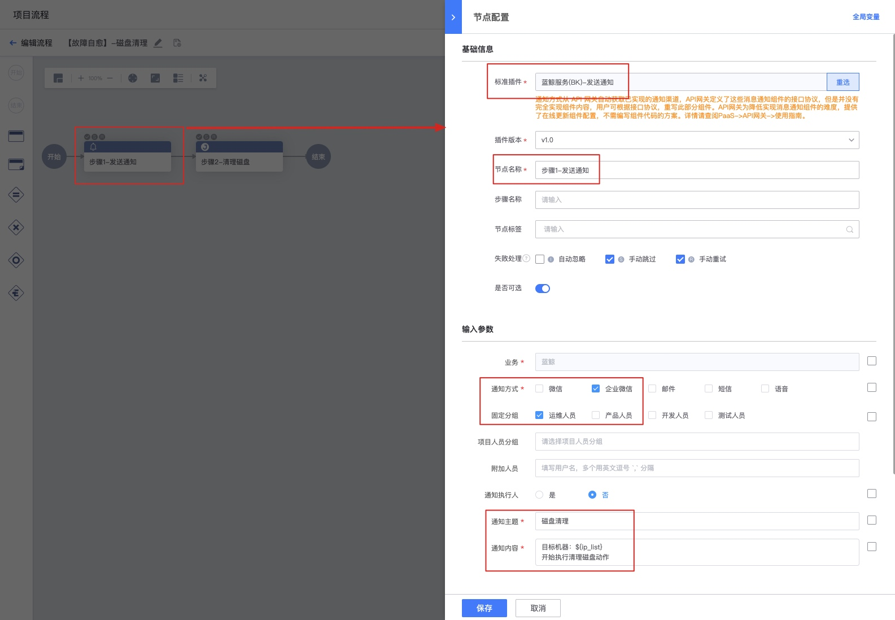
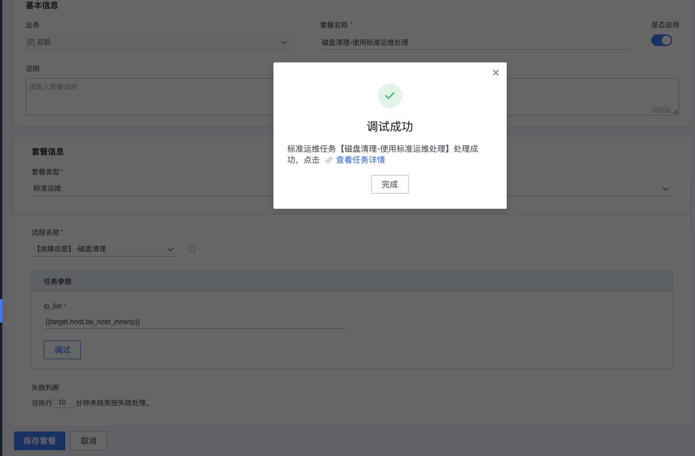

# 处理套餐-标准运维

通过标准运行，执行复杂的调度编排。标准运维相关的使用文档请参考快速了解标准运维（SOPS）

## 权限说明

使用此功能，需要有标准运维的执行权限，默认权限如下所示。

人员分类|	标准运维的权限
---|---
运维人员 |	默认有
开发人员	|  默认无
产品人员	|  默认无

如您不具有权限，则可以请运维人员编写标准运行流程，然后到处理套餐中调用。

## 创建标准运维流程

### 新建全局变量

注意，IP变量请配置输入框类型。

### 添加步骤1

注意：通知人可以按需填写，也可以直接使用CMDB业务中的分组

### 添加步骤2

## 新建处理套餐

新建处理套餐

配置全局变量

调试

调试进行中

调试完毕

点击查看任务详情，跳转到标准运维

## 配置策略

在策略中配置告警处理套餐

