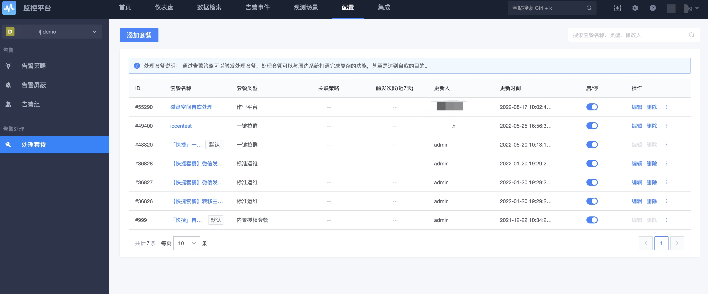
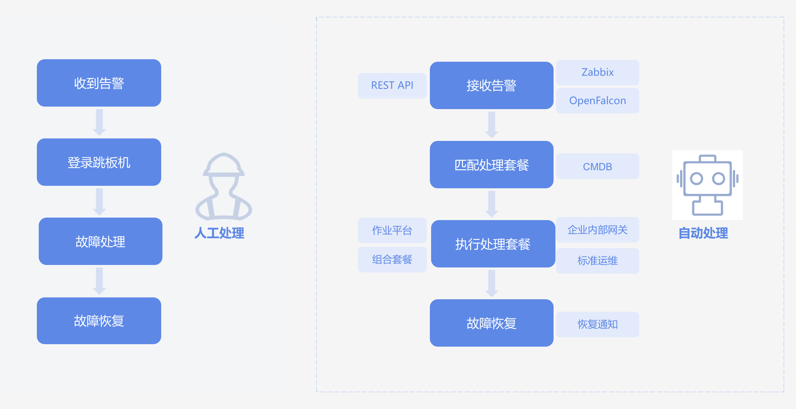
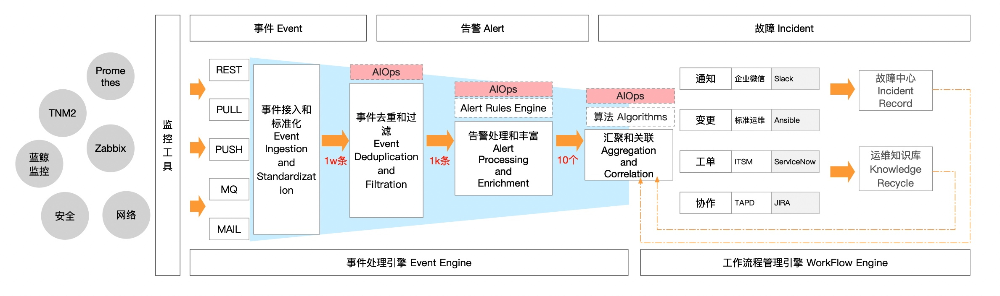
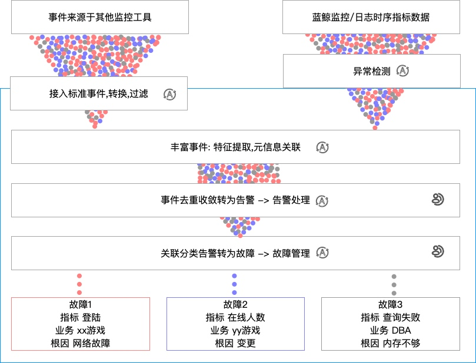

# 告警处理之处理套餐

在告警策略中，有告警的通知发送功能，同时也具有告警的处理功能。告警处理是由具体的处理套餐去执行动作的，通过HTTP回调，作业平台，标准运维，流程服务等系统，实现在产生告警后，对告警进行自动处理的能力。

使用告警处理功能，有2个步骤：

1. 定义处理套餐，表示具体的任务执行逻辑。
2. 在告警策略中使用套餐。

处理套餐的功能如下所示。

告警策略中使用处理套餐。

# 故障自愈产品功能简介

故障自愈是故障生成和故障自动化处理的解决方案，提升企业的服务可用性和降低故障处理的人力投入，实现故障从“人工处理”到“无人值守”达到服务自愈的目的。

通过自动化处理节省人力投入，通过预定的恢复流程让恢复过程更可靠，通过并行分析达到更快的故障定位和恢复。

故障自愈是在解决运维中期的过程，目的是消除人为环节，降低MTTA和MTTR的过程。 

## 特点及优势

1. **集成主流监控产品**：告警源集成蓝鲸监控、4 款主流开源监控产品 Zabbix、Open-Falcon、Nagios、Icinga，及 AWS、邮件的告警接入，更能通过 REST API 拉取、推送告警。
2. **丰富的处理套餐**：除支持作业平台、标准运维外、ITSM；还支持快捷套餐类(磁盘清理、汇总、检测 CPU 使用率 TOP10 等)；还支持自定义系统。
3. **告警生成**：可以丰富告警事件，可以对告警事件进行识别进行去重生成最终告警，减少重复事件的干扰。
5. **灵活的事件中心**： 事件中心有告警，告警关联的事件，还有处理记录，可以帮助用户快速的回溯问题，协助发现定位问题。
7. **处理记录**：记录每次执行动作，并且可以通过对处理记录进行分析。

## 引领行业故障处理新潮流

**故障自愈重新定义故障处理流程**，在运维领域系较早提出故障自动化理念并落地为产品。

## 事件处理流程引擎，实现无人值守自愈

获取监控告警发现异常，预诊断分析，调用预定义的处理流程，实现 **故障无干预自动处理**。

## 为企业节省人力及降低 MTTR

故障自愈通过自动化的故障处理流程，**节省运维处理故障的人力成本**。让运维把工作专注到企业服务的用户体验优化、数据分析，而不只是基础运维服务。

自动化的故障处理流程，减少人工处理环节耗费的时间，降低故障处理时长。实现故障的无人值守，让故障处理不再依赖于人，**提升企业 IT 服务的可用性**。

# 故障自愈产品架构图

故障的工作过程：

1. 事件接入： 能够接收不同种类的告警事件，提供PUSH PULL等方式，支持主流的告警系统，也可以支持用户自定义接入扩展事件插件。
2. 事件处理引擎： 接收到的事件会进行事件的标准化，丰富，去重等形成告警，通过对告警进行关联分析形成最后的故障，并且对故障进行根因分析进一步智能提供信息帮助运维决策。
3. 工作流管理引擎： 对告警和故障可以通过工作流管理，联动周边的系统，可进行通知、JOB执行、标准运维流程、服务工单、告警回调等方式（还可以自定义服务）触发更多系统协作最终达到减少人为介入，甚至是服务自愈的目的。

## 蓝鲸监控与故障自愈的关系

故障自愈的能力是蓝鲸监控的能力的一部分，来自蓝鲸监控的数据对于分析和处理更有利，但并不需要指标数据和日志数据的处理时，只需要对接第三方告警系统，故障自愈也完全可以独立存在。

1. 部分功能模块是共用的，事件中心、处理套餐、告警组、屏蔽、告警策略（事件告警，关联告警）
2. 监控平台包含故障自愈的所有能力，故障自愈是监控平台的一个子系统
3. 权限是共用的，权限使用的是监控平台的权限。

