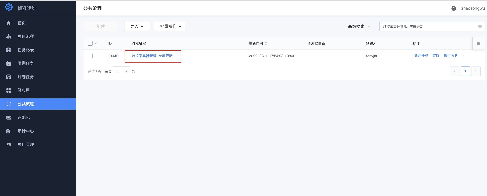
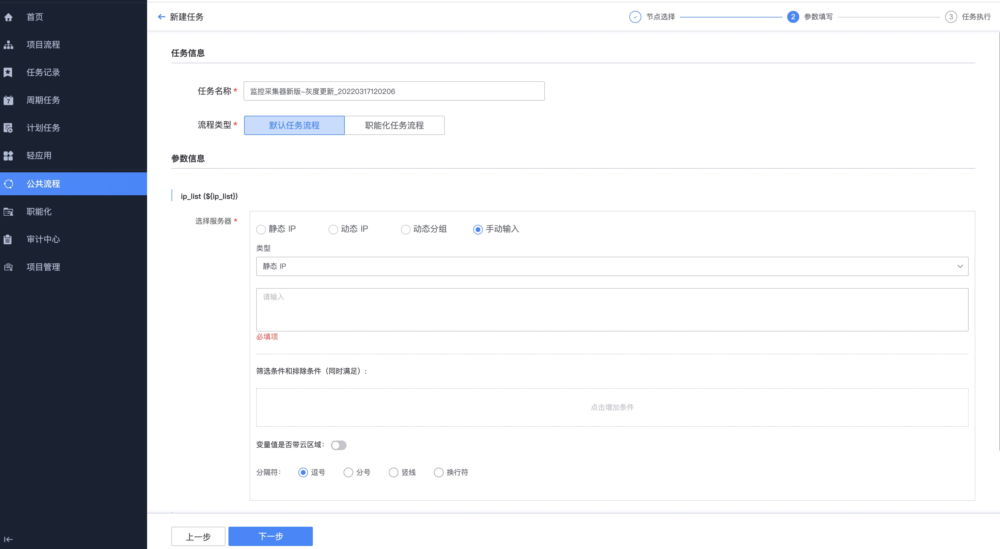
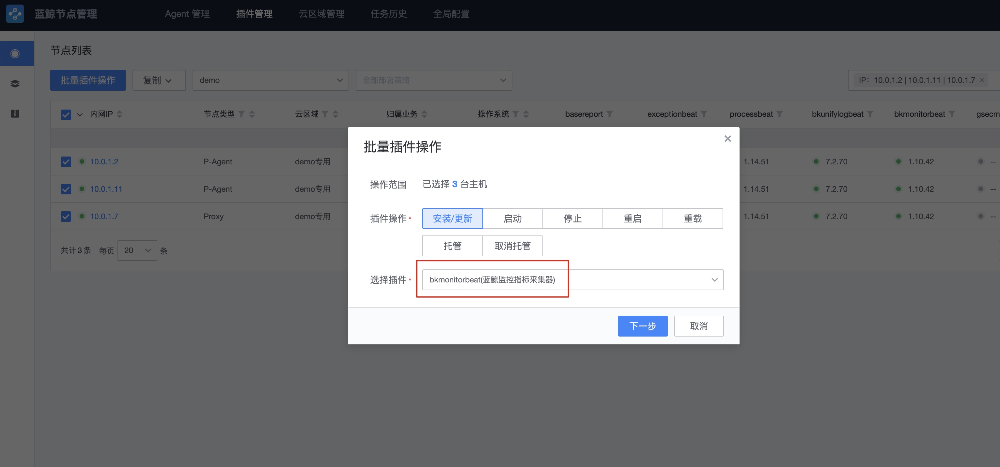

# bkmonitorbeat 4合1升级

## 背景

当前监控采集器有basereport、exceptionbeat、processbeat、bkmonitorbeat共4个采集器，安装部署采集器比较麻烦，现已合并采集器，业务只需部署bkmonitorbeat即可。

依赖bkmonitorbeat版本：0.24.0.189以上版本  

## 操作步骤

在节点管理操作

1. 停止旧版采集器basereport、exceptionbeat、processbeat    #停止的过程中，数据上报中断

2. 重装新版采集器bkmonitorbeat    #新采集器上报之前basereport、exceptionbeat、processbeat的数据

### 方法一、通过标准运维公共作业安装(推荐使用)

在标准运维中找到 监控采集器新版-灰度更新

点击新建任务

点击下一步

选择目标节点，或者手动输入IP

点击右上角执行按钮

流程执行中

如果已使用标准运维安装，下面的方法请忽略

## 方法二、节点管理(通过标准运维无法操作时，用此方法)

节点管理地址  

### 步骤一、确定切换的IP

先确定需要切换的IP列表

### 步骤二、停止旧版采集器

复制IP列表到，依次停止basereport、exceptionbeat、processbeat

### 步骤三、更新bkmonitorbeat

更新bkmonitorbeat，选择版本 0.24.0.189

### 步骤四、验证数据

验证主机监控数据

验证插件采集数据

