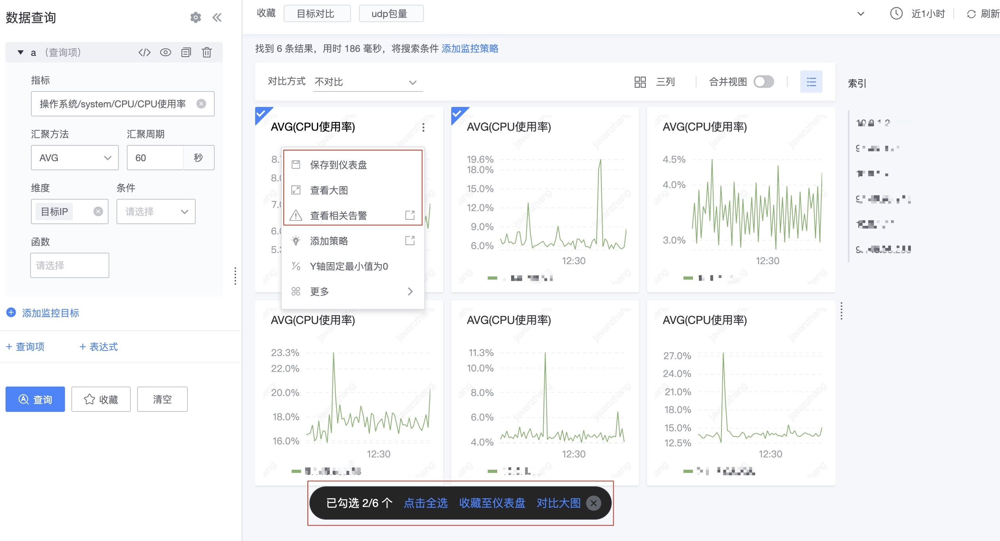

# 数据可视化介绍 

数据可视化是基于监控数据消费的重要用途之一，数据可视化基本可以分为四类：

1. 数据检索
2. 仪表盘
3. 场景视图
4. 视图报表

数据的种类有：

1. 指标 Metrics
2. 事件 Events
3. 日志 Logs
4. Traces
5. 告警 Alerts 

## 可视化之间的转换关系

每种可视化能力都要能满足5类数据的使用，并且各种可视化能力之间可以实现相互的转换。

### 仪表盘 

1. 直接跳转到数据检索，不同的数据种类有不同的检索
2. 相关告警可以直接查看告警事件
3. 仪表盘可以通过邮件订阅来定期发送报表

[更多查看](./dashboard.md)

### 数据检索

1. 可以快速保存到仪表盘
2. 可以查看相关告警
3. 可以查看大图

[更多查看](./explore_metrics.md)

### 场景视图

1. 可以快速保存到仪表盘
2. 可以查看相关告警
3. 可以查看大图
4. 可以跳转检索
5. 可以下钻

[更多查看](./data_quick_view.md)

### 视图报表

1. 可以订阅仪表盘中的单个视图
2. 可以订阅仪表盘的整个仪表盘

[更多查看](./report_email.md)

