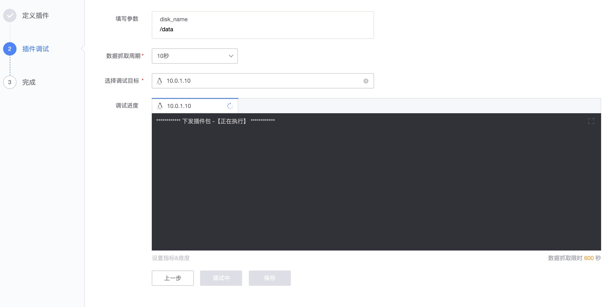
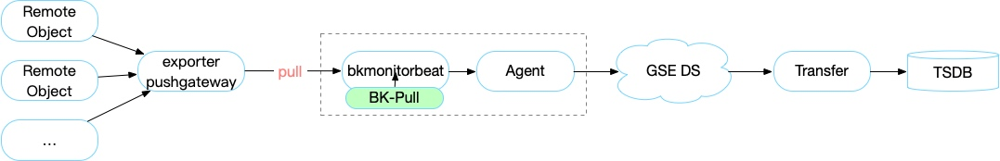

# 插件制作

所有的采集配置都需要先定义插件(除了内置插件，如日志)，插件包含内置插件和自定义插件， 业务私有插件和公共插件，插件的本地采集和远程采集模式，支持不同的操作系统。

## 前置步骤

> 注意：对于 Linux 和 Windows 都默认只支持 64 位的操作系统。如果需要支持 32 位的操作系统，需要进行订制。

插件输出格式说明：
详细查看 [数据模型](../../Architecture//datamodule.md)之 『监控平台支持 Promtheus 的数据结构』。

**工作原理**：


**术语解释**：

* **采集器**： Monitor Collector 监控内置的采集器，像  bkmonitorbeat 管理采集插件。
* **采集插件**： 用户自定义的采集插件，可以基于标准要求进行无限扩展。

> 两者的区别，更多请查看[术语解释](../../Term/glossary.md)

## 主功能一览

* 支持的操作系统：Linux、Windows、AIX6、AIX7
* 支持的插件类型：Exporter、DataDog、Script(Linux：Shell、Python、Perl、自定义，Windows：PowerShell、VBS、Python、自定义)、BK-Pull、JMX
* 支持的运作方式：公共插件、远程插件、官方插件
* 参数定义：命令行参数、环境变量、位置参数
* 插件导入导出
* 插件调试
* 插件定义：LOGO，描述，指标维度单位等

## 功能说明


插件的制作分为几种情况：

1. 在线定义，直接在 web 界面定义，比如：[如何使用开源的 Exporter](../integrations-metric-plugins/import_exporter.md)
2. 线下定义，线下将插件包制作好，直接导入，比如：[如何线下定义 DataDog 插件](../dev/import_datadog_offline.md)
3. 采集程序本身的开发，比如：
    * [Exporter 插件开发](../../Dev/plugin_exporter_dev.md)
    * [DataDog 插件开发](../../Dev/plugin_datadog_dev.md)

### 插件导入和导出

插件导入支持单个自定义插件的导入和导出

认证的插件可以批量导入

> **注意**：
> 1) 官方插件因为默认是公共插件，只有管理员权限的才可以导入
> 2) 在菜单的配置导入导出也可以导出相关联的插件

### 在线制作插件

**插件定义基本流程**：

* **第一步： 插件定义**
    * 插件的基本信息：ID，别名，分类，是否为公共插件，是否支持远程
    * 插件主体内容：
        * 脚本/二进制程序/配置内容
        * 参数定义
    * 插件的辅助信息：描述，LOGO


> 注意：公共插件只有平台权限才可以进行设置。设置完就是全平台全业务可用。

* **第二步： 插件调试**

   插件调试是为了确保插件的制作返回的数据是正常的。

   * 步骤：
        * 参数填写
        * 选择调试机器
        * 调试过程
        * 设置指标和维度
        * 保存




#### 参数定义说明

参数定义提供了三种方式：命令行参数、位置参数、环境变量。

##### 命令行参数

最常见的参数定义方式。

如 redis_exporter 的启动参数

| Name           | Environment Variable Name | Description                                                          |
| -------------- | ------------------------- | -------------------------------------------------------------------- |
| redis.addr     | REDIS_ADDR                | Address of the Redis instance, defaults to `redis://localhost:6379`. |
| redis.password | REDIS_PASSWORD            | Password of the Redis instance, defaults to `""` (no password).      |

如定义 `--redis.addr  redis://localhost:6379`

可以这样设置：选择命令行参数

* 参数名称： `--redis.addr`
* 默认值：文本  `redis://localhost:6379`
* 参数说明：Address of the Redis instance, defaults to `redis://localhost:6379`

更多完整的 redis_exporter 的插件制作查看 [制作Exporter插件(复用Prometheus插件)](../integrations-metric-plugins/import_exporter.md)
   

##### 位置参数

在 shell 脚本里面经常使用到，如`$1,$2`这类方式。

比如脚本执行 `./script1.sh  localhost 6379`

那么在脚本里面肯定有接收的位置

```bash
#!/bin/bash
redis-cli -h $1 -p $2
```

那么就可以这样设置(以$1 为例）：选择位置参数

* 参数名称： `redis地址`      # 参数名称在位置参数里面就是一个显示名，在插件使用的时候参数填写部分会显示这个。
* 默认值：文本  `localhost`   # 可以设置默认值，也可以不设置
* 参数说明： `redis地址填写，默认为localhost`

> 注意：`$1 $2`以设置的顺序来决定。

##### 环境变量

在程序里面使用的是环境变量来获取的内容。就使用环境变量参数定义。

比如在程序中直接获取环境变量中的变量，想让这个变量可以由插件的使用者来设置 `os.getenv('PYTHONPATH')`

那么可以这样设置：选择环境变量

* 参数名称：`PYTHONPATH`
* 默认值：文本 `/usr/bin/python`
* 参数说明：`Python 的路径 默认为/usr/bin/python`

#### Script 插件定义

Script 就是由用户自定义脚本进行 Metrics 采集。只要符合监控的标准格式就可以把数据采集上来。 支持的脚本有：

* Linux：Shell，Python，自定义

* Windows：Shell，Python，VBS，PowerShell，自定义

> INFO：自定义是直接执行，不用解释器进行执行。 如 ./script


* [制作Script插件(多种插件类型)](../integrations-metric-plugins/script_collect.md)

 
       
#### Exporter 插件定义

Exporter 是用于暴露第三方服务的 metrics 给 Prometheus。是 Prometheus 中重要的一个组件。

按监控平台插件的规范就可以将开源的 Exporter 插件变成监控平台的采集能力。

运行的 Exporter 是 go 的二进制程序，需要定义启动进程和占用端口。


* [制作Exporter插件(复用Prometheus插件)](../integrations-metric-plugins/import_exporter.md)

#### DataDog 插件定义


* [制作DataDog插件](../integrations-metric-plugins/import_datadog_online.md)

#### JMX 插件定义

JMX 可以采集任何开启了 JMX 服务端口的 java 进程的服务状态，通过 JMX 采集 java 进程的 jvm 信息，

包括 gc 耗时、gc 次数、gc 吞吐、老年代使用率、新生代晋升大小、活跃线程数等信息。


* [制作JMX插件](../integrations-metric-plugins/plugin_jmx.md)

#### BK-Pull 插件定义

BK-Pull 主要是解决那些只暴露了端口服务的数据源。通过 pull 拉取目标的数据。



* [如何直接获取 Prometheus 的数据](../integrations-metric-plugins/howto_bk-pull.md)

#### 远程插件定义


 * [如何在不安装蓝鲸 Agent 情况下实现监控](../integrations-metrics/noagent_monitor.md)


#### 公共插件定义

公共插件只有管理员可以设置，设置为公共插件之后监控平台的用户都可以使用该插件。


> 注意：一旦设为公共插件并且有采集配置之后就不能取消，除非没有一个采集依赖。

### 线下制作插件

插件完全也可以通过线下制作直接进入导入，线下插件制作主要清楚各种插件的配置内容及关系。

* [如何线下制作 DataDog 插件](../../Dev/import_datadog_offline.md)
* [插件包配置文件说明](../../Dev/plugins_explain.md)

### 升级插件

每次修改插件都会进行版本的记录，版本记录分为两类。如：x.y。升级插件的动作在编辑完插件完后在采集配置中会有相应的升级提醒。

> 注意：x 和 y 都是各自变化，不受影响。

大版本 x

- 二进制/脚本修改
- 配置模板修改
- 参数修改
- 是否为远程采集

小版本 y

- 插件指标
- 插件描述
- 插件别名
- LOG

