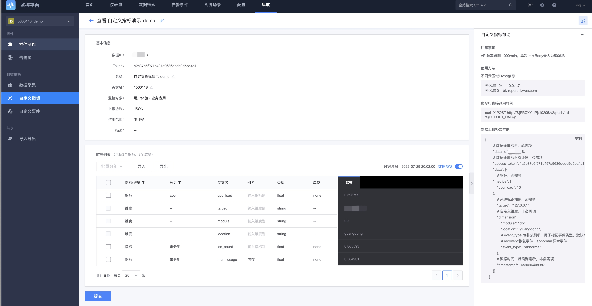

# 自定义上报 HTTP JSON数据格式

自定义上报是支持用户不安装 Agent 的情况下，直接通过 HTTP 上报的方式，常见的就是是在程序里面进行打点打报。

自定义上报主要是注册自定义上报，只有先注册了才可以进行打点上报，分为自定义事件和自定义指标数据。

## 前置步骤

**自定义指标数据上报工作原理**：


## 功能说明

导航： 集成 -> 自定义指标 -> 新建


新建完并有数据收报后进行指标管理


通过检查视图进行数据查看


### 上报格式说明

```
{
        # 数据通道标识，必需项
        "data_id": 21212,
        # 数据通道标识验证码，必需项
        "access_token": "cf0ee24141234132413wefwerqera9af3a",
        "data": [{
            # 指标，必需项
        "metrics": {
            "cpu_load": 10
        },
            # 来源标识如IP，必需项
            "target": "127.0.0.1",
            # 自定义维度，非必需项
            "dimension": {
                "module": "db",
                "location": "guangdong",
                # event_type 为非必须项，用于标记事件类型，默认为异常事件
                # recovery:恢复事件，abnormal:异常事件
                "event_type": "abnormal"
            },
            # 数据时间，精确到毫秒，非必需项
            "timestamp": 1661320521493
        }]
    }
```

### 使用样例-自定义指标上报

使用 Python 语言 requests 库上报指标样例

```python
# -*- coding: utf-8 -*-
import datetime
import time
import requests
import json
import random
 
timestamp=int(time.time() * 1000)
 
#PROXY_IP
PROXY_IP='X.X.X.X'  #直连区域可填此IP
PROXY_URL='http://%s:10205/v2/push/'%(PROXY_IP)
 
#data_id
DATA_ID=1500101  #修改为自己的data_id
#access_token
ACCESS_TOKEN="XXXX" #修改为自己的access_token
 
result = requests.post(PROXY_URL, data=json.dumps({
    "data_id": DATA_ID,
    "access_token": ACCESS_TOKEN,
    "data": [{
        "metrics": {                      #指标数据类型
            "cpu_load": random.random(),  #指标值必须为数值类型
            "mem_usage":random.random()   #指标值必须为数值类型
        },
        "target": "0:192.168.0.1", #修改为自己的设备IP
        "dimension": {
            "module": "db",          #维度必须为字符串
            "location": "guangdong"  #维度必须为字符串
        },
        "timestamp": timestamp
    }]
}))
print(result.text)
```

返回内容:

```python
{"code":"200","message":"success","request_id":"a75ad22e-3c4f-4481-9096-c4947bf47187","result":"true"}
```

### 自定义命令行工具

具体查看[自定义命令行工具介绍](../integrations-events/custom_report_tools.md)

### 注意事项

- API 频率限制 1000/min，单次上报 Body 最大为 500KB；如果有更大量级数据的上报需求，请考虑使用插件方式上报数据.
- bkmonitorproxy 部署说明
  - 直连区域
    直连区域的部署依赖环境管理员通过监控后台提供的命令进行部署。需要注意，部署的直连区域机器 10205 端口应该保持可用，并确保直连区域机器到该机器间的网络可用。部署操作命令如下：

```bash
# 登录到中控机
source /data/install/utils.fc
ssh $BKMONITORV3_MONITOR_IP
workon bkmonitorv3-monitor
# 执行部署bkmonitorproxy
./bin/manage.sh deploy_official_plugin --plugin_name bkmonitorproxy --target_hosts ${target_ip},${target_ip}
```

> 其中填写的 target_ip 将会在页面上显示为云区域 0(直连区域)的上报 IP

- 非直连云区域
  - 只要是创建了自定义上报，非直连的云区域会自动创建并下发配置。需要等待 5 分钟左右。默认是部署在和 GSE Proxy 相同的服务器上。


