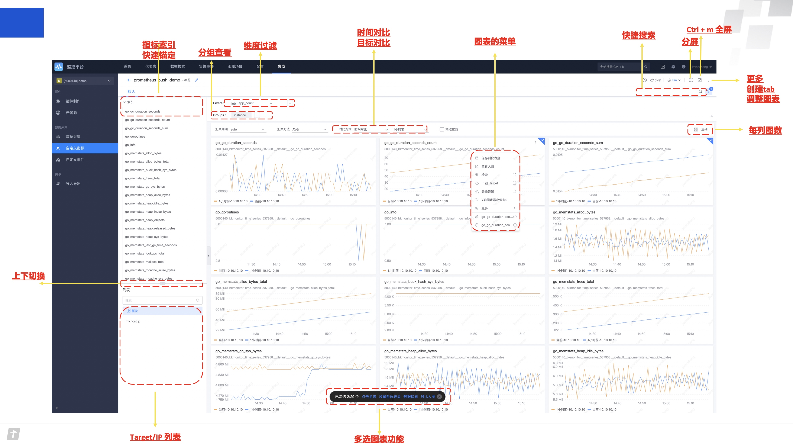
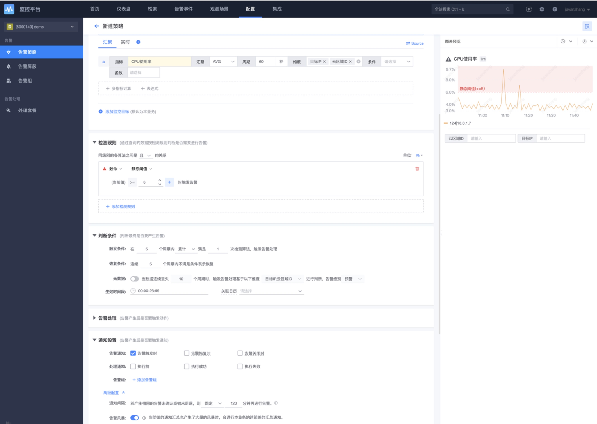

# 自定义指标-SDK PUSH上报

自定义指标上报，通过Prometheus SDK进行PUSH，类似Pushgateway的方式，只需要两步就可以完成

## 接入步骤

* 第一步：创建Token保证安全。 在监控平台上 ， 集成→ 自定义指标→选择Prometheus ，提交后就会创建好token 并且附带相应的文档说明。

* 第二步：加载SDK 应用Token。 将Token放到Header头或者URL参数中完成鉴权即可。

强烈建议token或者dataid这类配置的加载尽量使用配置化不要硬编码。

## 查看数据

上报数据后，通过检查视图确认数据和进行简单的可视化使用

生成丰富的仪表盘 数据查询及可视化

## 配置告警及管理

## 各类SDK接入

[SDK接入说明](../../QuickStart/sdk_list.md)

