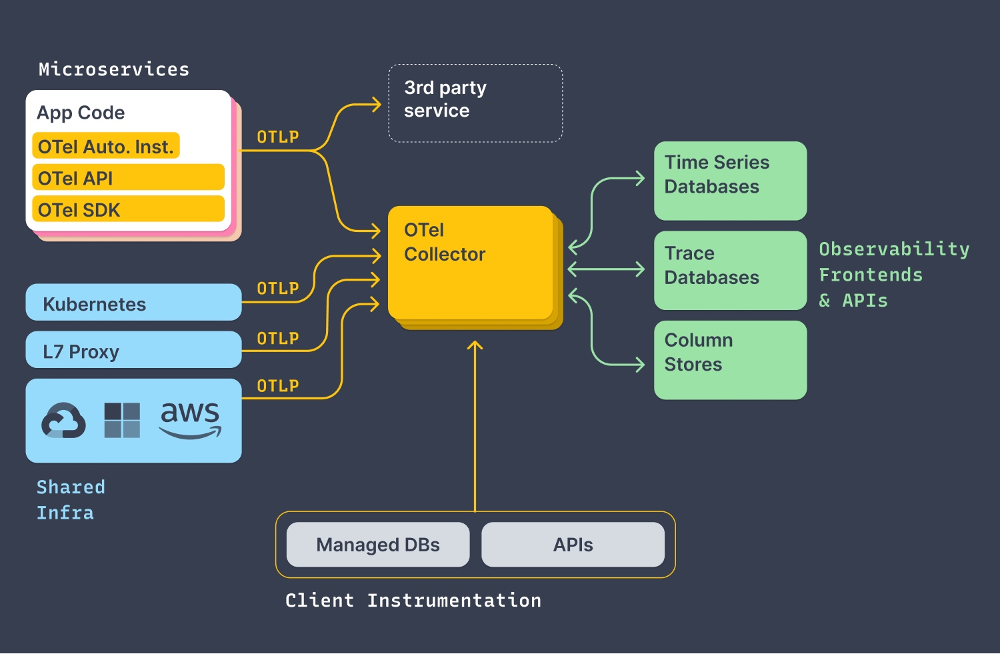

# Opentelemetry 介绍 

|标准 |概述 |Traces |Metrics |Logs |状态 |
|---|---|---|---|---|---|
|OpenTracing |2015年底发起，2016年被批准为CNCF第三个项目 |✓ | | |停止更新 |
|OpenCensus |2017年起源于Google项目负责人来自Google，Microsoft |✓ |✓ | |停止更新 |
|OpenMetrics |2017年起源于Prometheus社区项目负责人来自Grafana，Gitlab | |✓ | |持续更新 |
|OpenTelemetry |2019年由OpenTracing和OpenCensus合并而来。 |✓ |✓ |✓ |蓬勃发展 |

从OpenTelemetry的发展历程和目标来看，其实OTel是想解决metric-trace-log的数据联动问题，数据联动的想法在2010年就有提出来，并且也发展了Opentracing，但一直都只是在trace数据层面，相关的联动也是在不同企业里面私有协议规范情况下落地，直到OTel在19年的出现，主要是规范了SDK工具和架构，到此未来是真的有可能达到统一的目的。 

> https://peter.bourgon.org/blog/2017/02/21/metrics-tracing-and-logging.html
> https://static.googleusercontent.com/media/research.google.com/zh-CN//archive/papers/dapper-2010-1.pdf

Opentelemetry 架构

> https://opentelemetry.io/docs/

蓝鲸监控完全兼容了OTel的协议，也使用直接使用OTel的SDK进行数据的上报，基于蓝鲸监控的架构自研了Collector满足APM的产品能力需求。

