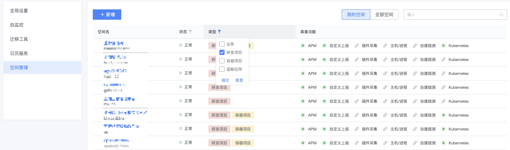

# 监控空间

从V3.8版本后引入了监控的空间能力，目的是为了支持不同平台的命名空间能力，比如CMDB的业务、容器管理平台的项目、PaaS开发者的SaaaS应用、CI构建的项目等等。

## 空间选择器

## 空间管理

## 能力和关系

在空间在具备什么功能是与所具备的资源有关系的。

* 业务空间有主机资源，具备所有功能，主机不能跨业务
* 1个业务包含多个容器项目，所以容器项目可以看到本身的所有k8s资源和Node资源，业务下可以所有相关的容器项目的所有k8s资源
* 研发项目和PaaS应用都是没有主机和容器资源依赖，所以只具备有主动PUSH上报的功能，如自定义指标、事件、日志、Trace等功能

