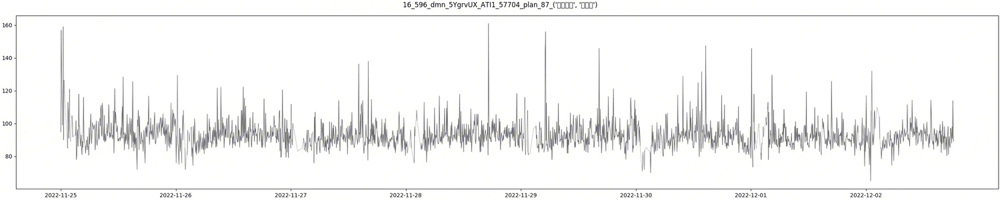
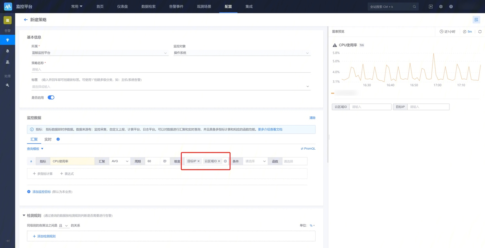
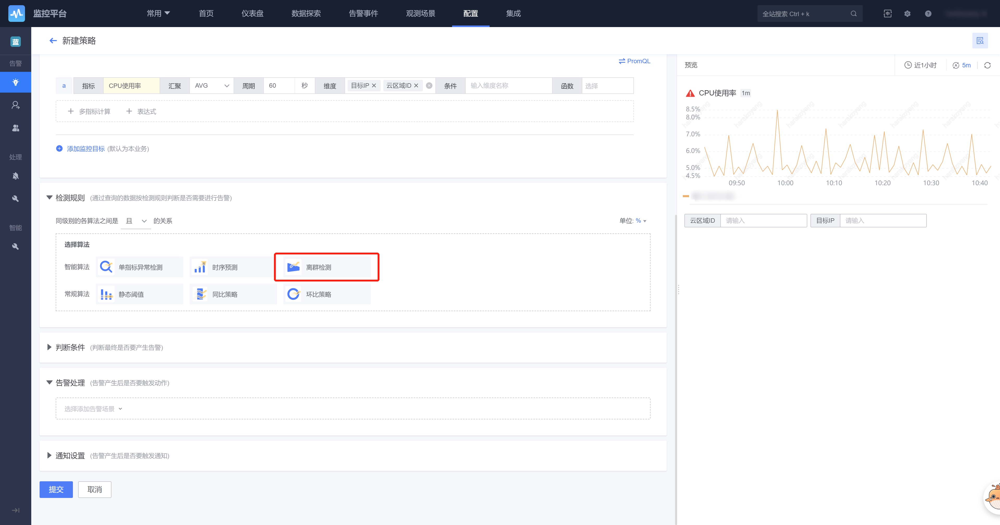

# 离群检测

## 概念介绍

离群检测是蓝鲸监控基于AIOps平台实现的一个动态可观测能力。其最显著的特点是，异常判定的原则不依赖任何人工经验或历史数据，而**根据实际的数据分布情况进行判定**，非常适合低门槛、冷启动、没有人工标注样本的使用场景。

传统的监控告警大多数基于一个静态阈值来对服务进行一个是否异常的判断，以CPU使用率为例，目前传统的方案存在以下的问题：

- 静态阈值没有办法将业务的高峰期和低峰期的分开，导致无法准确的设置告警的静态阈值。如果静态阈值设置的过高，在低峰期的时候会导致实际异常的场景无法通知到负责人，如果静态阈值设置的过低，在高峰期时会频繁产生错误的告警，影响对业务是否健康的判断。
- 阈值的设定往往已经对业务产生了实际的影响，在节点刚刚开始出现异常的很长一段时间内，由于没有达到阈值，无法产生对应的告警事件。例如在高峰期间，同一集群的各节点都处于一个稳定上升的阶段，但是有单个节点处于下降的趋势。
- 不同业务模块不同服务对于静态阈值的设定是不一样的，如果不同的服务需要不同的静态阈值，那针对同一类告警就会有非常多功能相似的策略。

离群检测可以很好解决上述问题：

- 离群检测的核心思路是通过计算整个集群里面每一个集群的所有节点的离散值，来进行是否符合预期的判断。离散值的计算不依赖于业务的高峰期或者低峰期，而是计算整个集群自身的实际情况。
- 离群检测能很好的发现趋势不一样的节点，假设某个节点的值在某个时间段的上升或者下降趋势与其他节点不同，则其离群值则会产生异常告警。

    同一业务不同IP的CPU使用率

如上图所示，红色曲线代表的CPU使用率在 区间1 和 区间2 发生了几乎同等幅度的波动。在区间1的波动是与其他IP同步的波动，而在区间2的波动偏离了其他IP，离群检测可以很方便地识别出这种异常波动。

## 适用的数据

1. 数据类型：指标数据，支持多维度的指标数据
2. 数据来源：监控采集，默认上报的，计算平台tspider的可以在监控查看到的数据。 自定义上报和日志的数据不包括在内。

### 场景一：指标呈现周期性波动

### 场景二：指标呈现趋势性增长或下降

注意：大幅突增突降型的曲线，不建议使用 离群检测 方案

## 配置方法

监控数据中选择添加监控指标，配置好维度信息

这里以【目标IP】【云区域ID】为例，对CPU使用率进行检测

检测规则选 离群检测

配置参数

- 分组字段
    
    非必填，可以从上面步骤指定的指标维度中选择一个或多个，注意不可全选（全选无法形成分群）

    默认为不选，即检测所有维度组合。这里以仅选择【云区域ID】为例，即“对每个云区域不同目标IP的CPU使用率，分别进行离群检测”

- 敏感度

    控制 离群检测 敏感程度的参数，会影响告警数，按需配置即可

触发的告警可以在 告警事件 tab中查看。如下图示例，可以发现某一个目标IP的CPU使用率超过了用户设置的敏感区间，因此触发了一个告警：

