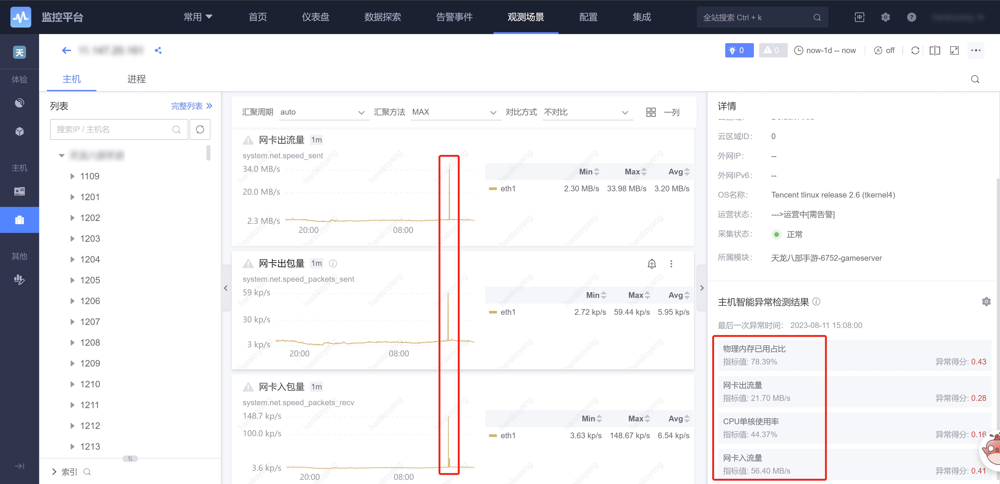

# 场景智能检测

## 工作原理

通过对一类特定的场景的所有的指标进行检测，不需要配置具体的指标列表就可以对这类场景提供检测后的结果。 

## 适用的数据

按观测场景进行分类，当前支持的是主机场景。

## 配置方法

当前仅支持主机场景的自动扫描，因此无需配置。只需查看扫描结果符合预期即可，如不符合预期请联系管理员。后续将提供手动配置策略功能。

### 主机场景智能检测的扫描结果（全局提示弹框）

### 主机场景智能检测的扫描结果（主机详情页）

- 异常分值范围从0到1，分值越大，说明该维度值的指标异常程度越高

