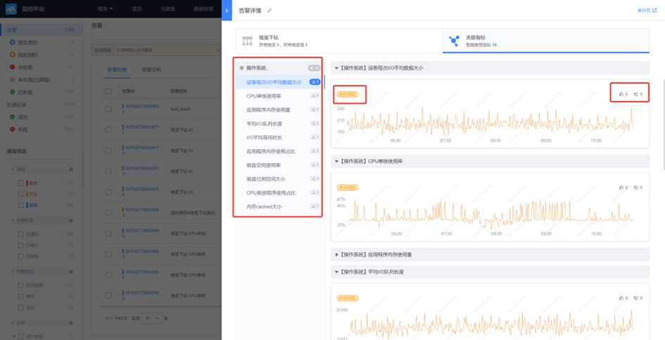

# 告警分析-指标推荐

## 使用场景

- 痛点：监控配置的单指标告警策略，只能对单个指标的异常进行告警，在排查问题时可能需要结合关联指标进行人工的根因定位。关联指标推荐功能会根据 是否同时异常、告警发生时的曲线形态 来推荐关联指标。
- 用法：系统将在当前业务的 组件、进程、操作系统、主机设备 四种类型的指标 和 已配置了告警策略 的所有指标 中，根据当前告警指标自动进行推荐，用户直接按类别查看推荐结果即可。

目前支持的监控对象分类

## 使用方法

在【告警详情】侧滑页的【关联指标】tab，与当前告警指标关联的指标将按照监控对象层级进行分类，直接查看即可

- 左侧按照监控对象层级进行分类，并提供锚点可以跳转
- 右侧可以查看指标明细，和推荐原因。可以对推荐结果进行“赞”“踩”的反馈

如下图所示，某服务的磁盘空间使用率检测到异常，通过关联指标推荐，发现了【操作系统】层级的其他7个关联指标，存在形状相似或同时异常。

