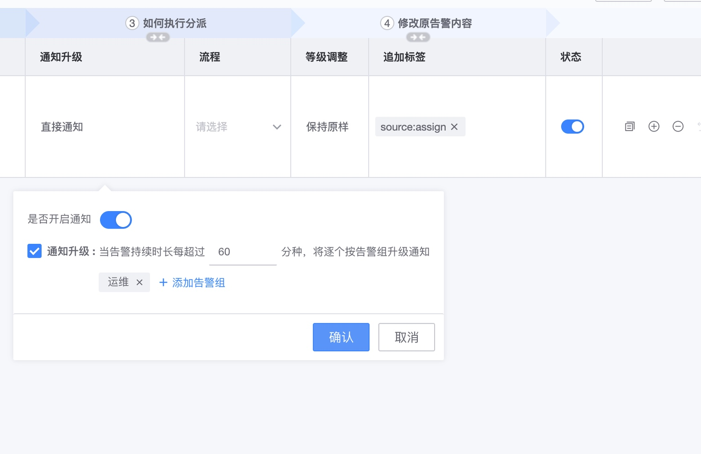

# 告警分派 

告警分派是基于告警产生后的数据维度进行的一个规则适配， 以便可以精准根据告警的信息以便分派给不同的处理人。

比如告警策略配置的判断逻辑都是一样的，但是平台内容需要平台管理员接收， 不同的集群负责人不一致，也需要根据产生告警的集群进行分派。 

## 基本逻辑

告警分派配置的组成由 **告警分派组** 和 **分派规则** 两个基本元素组成。

* **告警分派组**： 优先级决定了分派过程中命中规则的级别，优先级别数据越高，则优先适配。告警分派在适配过程中，一旦命中某个告警组，则会自动忽略优先级较低的规则组。 
* 告警组内的规则会根据用户设置的匹配规则进行适配并且进行对应的告警处理，在适配命中的组内所有规则优先级别一致，当同一个分派组内有多条规则命中， 涉及到通知部分都会同时生效，如告警组，告警升级等。调整告警级别部分，则用户设置级别 > 维持原告警级别， 用户设置的级别中，以告警级别最高那个为准。

## 告警分派配置

入口： 监控配置 ->告警分派

### 创建分派组

点击新建，创建分派组，第一次默认为100， 默认优先级会在已有最大优先级 +5， 最大不超过10000， 用户可自行调整。告警组名称，当前空间内不可重复。

### 新增规则配置

新建告警组之后，将进入到规则配置页面，常规配置如下

* 分派给谁：选择告警组，表示命中规则之后，将会根据告警组内的通知方式发送通知给对应的成员
* 匹配哪些告警：适配规则，即命中的规则，系统根据已有告警汇总了部分选项，大部分属性条件是可以通过手写输入完成， 如下tags标签的写入（输入完成之后，回车确认）如果没有选项，可以通过手动输入支持（key， value输入之后，需要回车确认， tags表示标签，要加前缀tags.，维度直接写对应key即可）
* 如何执行分派：可以设置相关的通知和流程，默认通知一定开启，不需要的话可以点几通知升级列进行配置
* 是否修改原告警内容：可以对原告警进行一些调整，如追加相应的标签或者调整告警级别。

### 通知升级配置

本次告警支持通知升级功能，也就是告警在产生之后没有任何处理（确认或者屏蔽）而一直在异常中，则可以通过通知升级的方式告诉给需要知会的人员，如下配置，在告警超过60分钟未做处理，将会发送通知给运维。知会通知每个告警组仅发送一次

### 告警分派调试

告警规则配置之后， 需要进行调试才能保存，通过调试并生效可以当前业务下的已有告警在新增或修改规则之后的适配情况， 如下，调试没有问题之后，点击生效，则可以直接保存

### 告警分派生效

当前配置告警分派规则之后，历史的策略告警默认都有支持分派， 如果不需要告警分派或者需要取消原来的告警通知功能，可在策略配置中设置，如下：

### 告警分派效果

在监控处理流程中，如果适配到了分派规则，流转记录中将会增加如下日志，并且会将分派的人员添加到告警的负责人里，后面周期任务会持续通知对应的负责人

