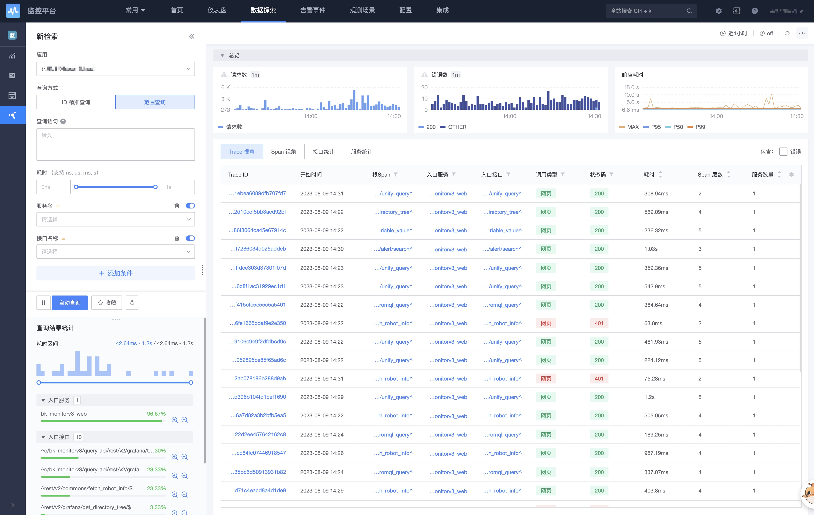
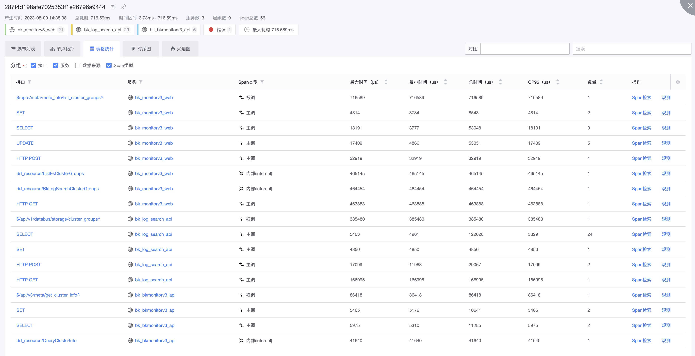
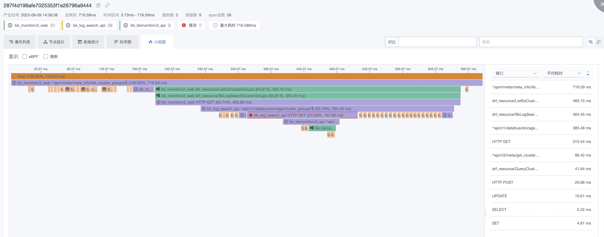
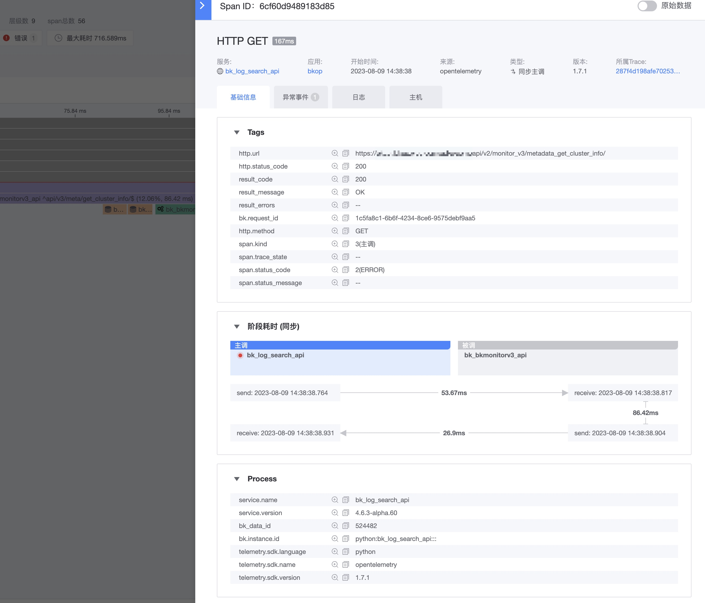
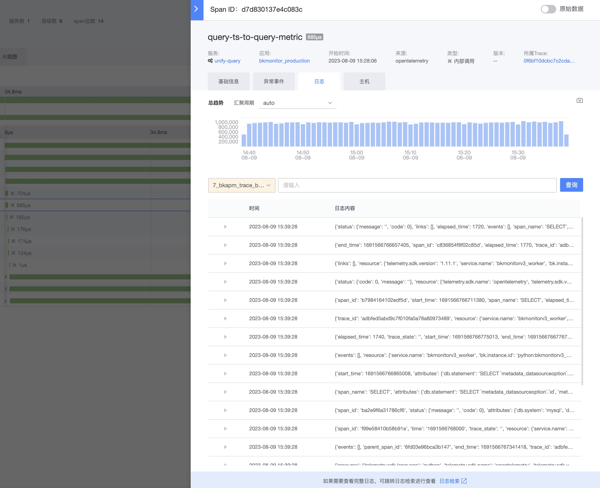

# Trace检索

Trace检索主要是满足通过APM上报上来的Trace进行快速的检索目的。查看基于该Trace调用链的所有相关的数据情况。 具体数据接入查看[开启APM](../scene-apm/apm_monitor_overview.md)

## ID精确检索和范围检索

- 第一种: 一般是有明确的ID,从浏览器或者日志中获取后直接进行ID精准查看

  如在http的Header里面可以获取相应的TraceID和SpanID`Traceparent:00-29a543417ecfe6b3c2939ccff4ee3eba-fb11889da130bf29-01`

- 第二种: 无明确的ID，有大致的时间范围，可以查看大致的一个情况

## 范围检索

1. 查询条件，有丰富的查询条件可以进行快速的查询相关的列表数据
2. 列表数据提供了四种视角： 
    - Trace视角：TraceID列表，不区分Span，相同TraceID都会聚成一行记录
    - Span视角：SpanID列表，最原始的数据列表，按SpanID一行记录呈现，不区分TraceID
    - 接口统计：按接口维度进行汇聚
    - 服务统计：按服务维度进行汇聚
3. 提供了一些快捷能力：
    - 错误：包含错误 OTel中status_code:2的情况
    - 入口服务 ： 服务端进程的第一个Service
    - 入口接口 ： 入口服务的第一个接口   
    - 根Span ：整个Trace的第一个Span    

## 单个Trace详情
    
四种数据查看能力：

1. 瀑布列表：有严格的父子上下级关系，可以根据上下游进行快速定位。
2. 节点拓扑：忽略时间关系，仅展示Span之间的层级和拓扑关系，整体性非常的直观。
3. 表格统计：以表格的方式呈现不同维度的数据，可以快速的对数值进行比对和查看，聚焦问题点。
4. 时序图：以程序实现的角度表现调用和被调的关系，快速查看是否与原设计相符。
5. 火焰图：以火焰图的方式呈现Span耗时占用大的情况，快速的进行重点Span的查看。并且解决了并发进程上面的呈现问题。

其他高级能力：

1. 来源： 默认OTel ， 支持eBPF（需要集成DeepFlow，待后续版本发布）
2. 跨应用：当一个TraceID跨应用的时候，会进行呈现，有权限的情况是可以进行相应的查看。
3. 推断：像DB、中间件、第三方这种都可以从主调的服务中推断出来
4. 折叠：为了更好的查看数据，不同的数据类型都有相应的折叠能力，减少相似数据的干扰。

### 瀑布列表

### 节点拓扑

### 表格统计

### 时序图

### 火焰图

## 对比功能

对比功能主要是解决两类问题：

1. 以完整的一个TraceID为参照，发现当前Trace是否有数据缺失
2. 调优后对比是否有变化

对比功能只支持节点拓扑和火焰图

## Span详情

### 基础信息

### 异常事件

### 日志和主机

日志和主机是通过服务的配置进行关联，并且会基于instance信息进行匹配。

