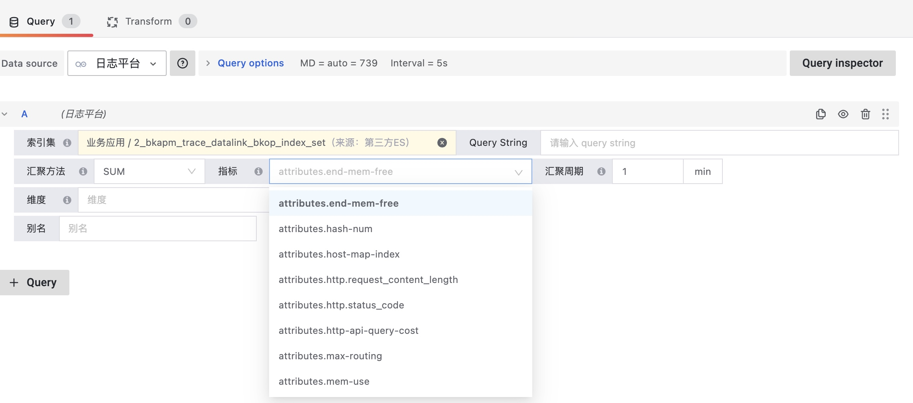

# APM相关的策略

## APM默认策略说明

默认在应用设置里面可以开启无数据告警

## 策略配置

### 方法一： 基于黄金指标

每个应用都会有相应的黄金指标，可以直接在指标选择器中使用，用于策略告警和绘图。

优点：

- 速度快，已经是汇聚后的数据
- 准确度高，是采样前的汇聚数据

缺点：

- 只适用于黄金指标和对应维度的内容，内置的

### 方法二： 直接使用原始数据

优点：

- 可以基于任意维度和指标

缺点：

- 原始数据量越大越慢
- 只能是统计采集后存储下来的数据

