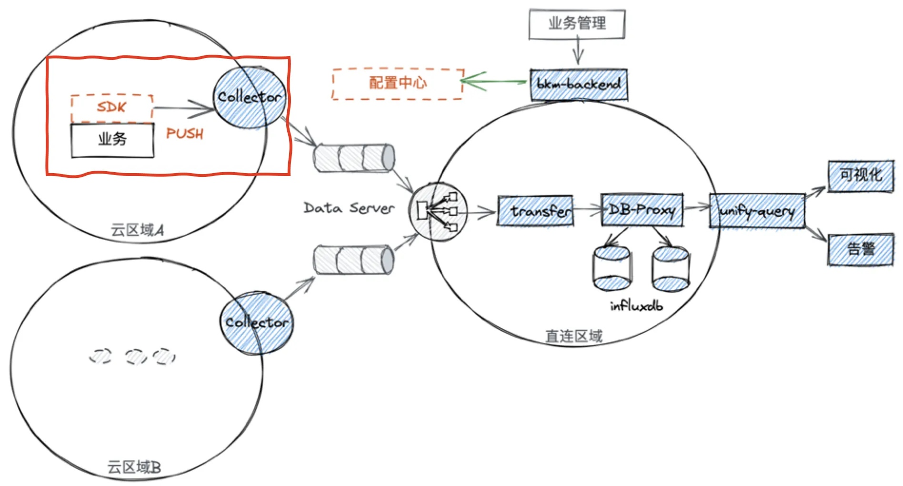
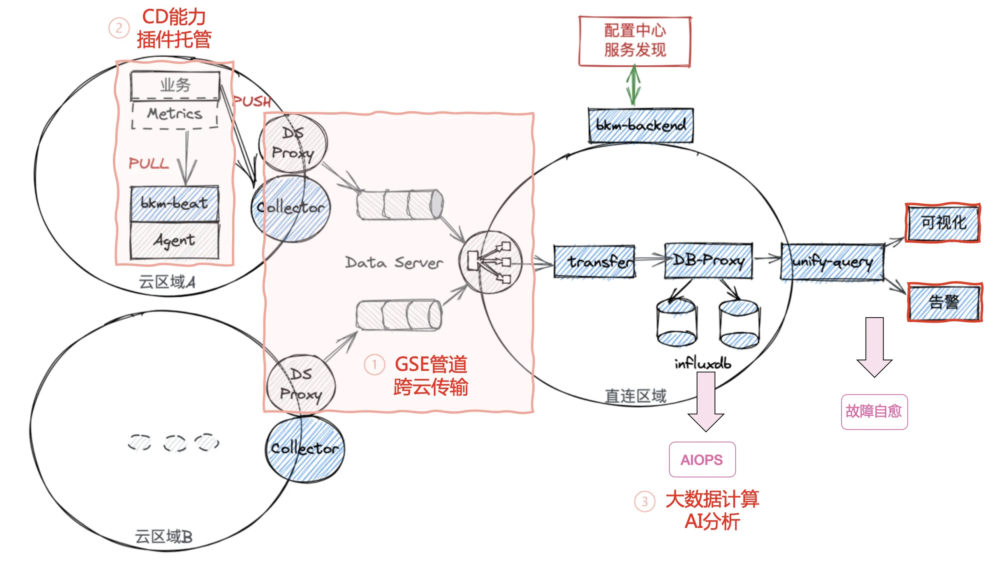

# 蓝鲸监控 VS Prometheus

在容器监控领域Prometheus是标配，也成为最流行的监控工具。但在复杂的企业环境下，Prometheus总是有很多的局限，所以社区也推出了很多的解决方案。 当前蓝鲸监控提供了一套完整的Kubernetes的解决方案，覆盖指标、事件、日志、Trace等。

## Prometheus的局限

### 功能局限

* Prometheus 是基于 Metric 的监控，不适用于日志（Logs）、事件（Event）、调用链（Tracing）。
* Prometheus 默认是 Pull 模型，没有跨云区域的解决方案
* 数据量过大时非常容易OOM，无法集群化和水平扩展，官方和社区都没有银弹，需要合理组合选择 Federate、Cortex、Thanos 等方案。虽然有这些高可用方案，但在数据量大的情况效率依然很慢，有遇到好多大的集群无法承接的情况 如Lgame 合金弹头等
本质原因是，Prometheus 的本地存储没有数据同步能力，要在保证可用性的前提下，再保持数据一致性是比较困难的。
* Prometheus，Alertmanager Grafana等多个系统较为割裂，缺乏统一视图，无法开箱即用
* 生产环境运行多套prometheus集群，管理和使用成本都非常的高
* Yaml很灵活，成本也比较高，UI太弱

### Prometheus 大内存问题

随着规模变大，Prometheus 需要的 CPU 和内存都会升高，内存一般先达到瓶颈，这个时候要么加内存，要么集群分片减少单机指标。这里我们先讨论单机版 Prometheus 的内存问题。

原因：

* Prometheus 的内存消耗主要是因为每隔 2 小时做一个 Block 数据落盘，落盘之前所有数据都在内存里面，因此和采集量有关。
* 加载历史数据时，是从磁盘到内存的，查询范围越大，内存越大。这里面有一定的优化空间。
* 一些不合理的查询条件也会加大内存，如 Group 或大范围 Rate。

### Prometheus 重启慢与热加载

Prometheus 重启的时候需要把 Wal 中的内容 Load 到内存里，保留时间越久、Wal 文件越大，重启的实际越长，这个是 Prometheus 的机制，没得办法，因此能 Reload 的就不要重启，重启一定会导致短时间的不可用，而这个时候Prometheus高可用就很重要了

## 为什么OpenTelemetry主推Push

Prometheus主推Pull方式，OpenTelemetry主推Push方式，到底哪种方式更好呢？

### Pull VS Push 的工作原理

|原理对比 |Pull|Push|
|---|---|---|
|配置管理 |中心化配置 |1. 端上静态配置    2. 通过配置中心获取配置 |
|监控对象发现 |1. 静态     2. 依赖服务发现机制 如k8s,CMDB等 |由应用自主上报，无需服务发现模块 |
|部署方式 |1. 应用直接暴露端口，接入服务发现    2. 服务不直接暴露端口的，如MYSQL依赖适配器（Exporter） |应用主动推送到监控系统 |
|可扩展性 |1. 依赖Pull端扩展；   2. 需要Pull Agent和存储解耦（原生Prometheus不支持） |简单，只需要中心接收端横向扩展 |

要想正确的选择，需要先了解Pull和Push的工作原理，这里的关键区别点就在于监控对象是如何来发现的，Pull就需要提前得到目标地址列表，为了能够基于业务的扩缩容自动的进行采集，就一定少不了服务发现的能力，比如K8s中天然就有这个服务发现的优势。 而Push就不需要提前知晓目标地址列表，相对来说就非常的简单了。

Pull方式

Push方式

### Pull VS Push 能力对比

|能力对比 |PULL |PUSH |
|---|---|---|
|监控对象存活性 |简单 |无法区分 |
|数据齐全度计算 |可行 |较困难 |
|短生命周期(Job,Serverles)实时性高 |难以适用 |适用 |
|指标获取灵活性 |固定，方便分享，可按需获取 |灵活， 被动接受链路中学习 |

正是因为两者的工作原理不一样所以也决定了两者能力的区别。 在监控领域监控对象的存活性是非常重要的，pull的时候有明确的目标，所以可以非常简单的判断是拉到空数据还是监控对象出问题了，而且也可以控制拉取的周期。而push的时候 不知道周期是多少，没有收到数据的时候也不知道是因为下线了，还是因为挂掉了。 所以这也是为什么Prom一直更倾向Pull的方式而不是Push。 

但是在一些短生命周期进程，或者trace这类场景，实时性要求很高，或者压根没有办法提前定义监控对象的如浏览器、移动端这种，就只能通过Push的方式进行上报。 所以这也是为什么Opentelemetry推出的架构是Push的方式。 

Pull方式

Push方式

### Pull VS Push 成本对比

|成本对比 |Pull |Push |
|---|---|---|
|资源消耗 |1. 应用暴露端口方式 低    2. Exporter方式 较高 3.占用端口资源 |1.应用推送 消耗低    2. Agent推送 消耗低 |
|安全性保证 |工作量大，暴露端口的安全性 |工作量低 |
|核心运维消耗 |1.平台维护的组件多，成本高   2.定位简单 |1.平台维护的组件少，成本低    2.定位难 |

最后一个就是成本的区别，现在服务器的性能已经非常高了，企业的安全保障也相对完善，所以资源消耗和安全性考虑相对可以忽略了。 而在实际的生产过程中，其实Push带来的不确定性和扯皮的情况更明显。 

### 选型基本原则

Pull or Push到底如何选型？

作为平台方同时具备Pull和Push的能力才是最优解：

- 主机、进程、中间件监控使用Agent Pull采集器模式
- Kubernetes等直接暴露Pull端口的使用Pull模式
- 应用与CMDB结合（服务发现）的选择Pull模式
- 应用无法部署Agent ， 无法服务发现， 生命周期短的使用Push

简单原则：

能用PULL尽量用PULL ( 能解决服务发现问题），其他使用PUSH。

## 蓝鲸监控解决方案

上方为蓝鲸监控基本工作示意图，里面有Pull和Push的两种方式。简单画了三个云区域来表示蓝鲸监控的跨云区域数据传输能力。

* 取长
	* 兼容Prom和OTel数据协议
	* 兼容PromQL和函数查询方式
	* 可以简单的封装exporter成蓝鲸监控插件
	* 完全兼容ServiceMonitor和PodMonitor
	
* 补短 （Prom只有Metric ，没有开箱即用能力等）
	- Prom仪表盘可一键导入
	- 支持更简易的UI配置
	- 支持便利的开箱即用的数据展示能力
	- 功能全复用，如故障自愈和AIOps能力

* 补短 (Prom没有跨云区域解决方案，单点、内存OOM，Otel的metric和log还不稳定）
 	- 支持跨云区域 跨集群传输 ，依托于蓝鲸GSE管道，已经承载过几十万服务器的数据传输就包括的JOB指令、日志传输、Metric采集等
	- 支持本地pull、远程pull、push；本地pull是有效的分散了集中pull的拉取压力，也加大了数据传输的并发能力，远程pull通过负载均衡优化了单点拉取等架构问题。
	- Metric支持TraceID的输出方式，在Prom的SDK上实现了带TraceID输出的能力。

另外蓝鲸监控还有一些独有的能力

* 整个蓝鲸是可以私有化独立部署，所有功能不受影响。
* 依托于蓝鲸的CD管控能力
	* 蓝鲸监控拥有了插件采集能力，只需要编写插件
	* 动态采集和插件进程托管都可以由监控完成
	* 拥有了故障处理甚至自愈的能力，可以联动周边的流程服务、标准运维、JOB作业
* 依托于计算平台和AIOps平台
	* 蓝鲸监控拥有了大数据计算和AI分析能力
	* 蓝鲸监控也可以消费计算平台的数据，为计算平台提供监控能力。

