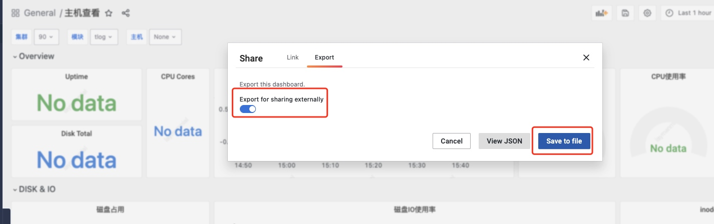
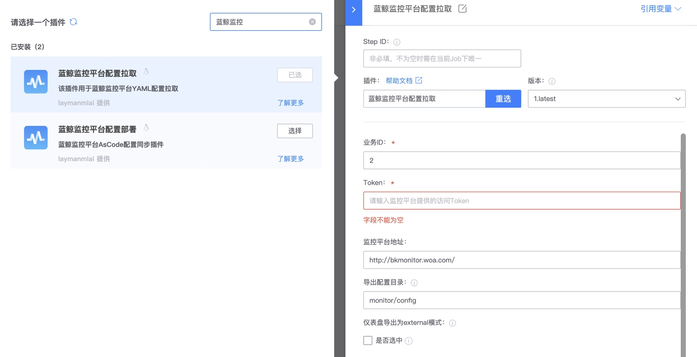

# 方案说明

蓝鲸监控平台为了便于用户对配置进行版本管理和快速复用，推出了Monitor As Code的能力。

简单来说，BKMonitor上面所有的监控配置都可以通过Yaml生成并通过提供了一套Git提交变更监控配置的管理能力。 

## 优势

1. Yaml配置简单
2. 可代码生成和批量管理
3. 利用代码仓库的版本控制
4. 对开发更友好
5. 可以与业务编码和版本结合
6. 方便复用和迁移

## 劣势

1. 需要熟悉Yaml语法
2. 复杂的功能流程无法通过As Code方式引导

这种就可以直接使用UI来解决弥补了。 

# 开始配置

## 配置目录

```
├── action
│   ├── job.yaml
│   ├── snippets
│   │   └── base.yaml
│   └── webhook.yaml
├── grafana
│   └── host.json
├── notice
│   ├── duty.yaml
│   ├── ops.yaml
│   └── snippets
│       └── base.yaml
└── rule
    ├── all.yaml
    ├── cpu_simple.yaml
    ├── cpu_simple_with_snippet.yaml
    └── snippets
        └── base.yaml
```

* action - 自愈套餐配置
* action/snippets - 自愈套餐片段
* notice - 告警组配置
* notice/snippets - 告警组片段
* rule - 告警策略配置
* rule/snippets - 告警策略片段
* grafana - Grafana Dashboard配置

## 配置片段(snippet)

许多的配置中可能存在相同的配置片段，为了方便配置能够复用，我们提供了配置片段(snippet)能力。

配置文件中可以通过snippet字段引用编写好的snippet配置。

比如说在配置多个通知组时，通知渠道的配置可能完全一样，此时我们就可以将其抽出作为配置片段，我们就可以在其他片段中引用。


### notice/snippets/base_notice_type.yaml

```yaml
alert:
  00:00--23:59:
    remind:
      type: [weixin, mail]
    warning:
      type: [weixin, mail]
    fatal:
      type: [weixin, mail]
action:
  00:00--23:59:
    execute:
      type: [weixin, mail, wxwork-bot]
      chatids: [xxxxxxxxxxx, yyyyyyyyyyy]
    execute_failed:
      type: [weixin, mail]
    execute_success:
      type: [weixin, mail]
```

### notice/ops.yaml

```yaml
name: Ops
description: ""
# reference sinnpet
snippet: base_notice_type.yaml

users: [user1, group#bk_operator]

alert:
  00:00--23:59:
    remind:
      type: [weixin]
```

### rendered notice/ops.yaml

```yaml
name: Ops
description: ""

users: [user1, group#bk_operator]

alert:
  00:00--23:59:
    remind:
      type: [weixin]
    warning:
      type: [weixin, mail]
    fatal:
      type: [weixin, mail]
action:
  00:00--23:59:
    execute:
      type: [weixin, mail, wxwork-bot]
      chatids: [xxxxxxxxxxx, yyyyyyyyyyy]
    execute_failed:
      type: [weixin, mail]
    execute_success:
      type: [weixin, mail]
```

## Alarm Rule

Here is a simple example，it show a minimum alarm rule.

```yaml
name: CPU sage is too high
query:
  data_source: bk_monitor
  data_type: time_series
  query_configs:
  - metric: system.cpu_summary.usage
    method: avg
    interval: 60
    group_by:
    - bk_target_ip
    - bk_target_cloud_id

detect:
  algorithm:
    fatal:
    - type: Threshold
      config: ">95"

  trigger: 5/10/6

notice:
  user_groups:
  - Ops
```

- query defines the source and type of alarm data, as well as how to query the data.  
- detect defines how to determine when abnormal situations occur.  
- notice defines how to notify when an alarm occurs.  
- action defines the configuration of self-healing packages.

## Base Config

```yaml
name: Test Rule
labels:
- label1
- label2
enabled: true
active_time: "00:00--23:59"
active_calendar: []
```

|  config item | required | default | enum | description |
| --- | --- | --- | --- | --- |
| name | true |  |  | Rule name |
| labels | false | [] |  | The labels of Rule |
| enabled | false | true | true/false | Rule is enabled |
| active_time | false | 00:00--23:59 | | Rule active time, support multiple config, split by comma. Multiple active time range can't overlap. |
| active_calendar | false | [] | | Active calendar ids |

## Query Section

```yaml
query:
  data_source: bk_monitor
  data_type: time_series
  expression: a + b
  query_configs:
  - metric: system.disk.free
    query_string: "*"
    method: avg
    interval: 60
    group_by: []
    functions:
    - delta(2m)
    - abs
    where: bk_target_ip="1" or bk_target_cloud_id!="2" or bk_target_ip=~"1" or bk_target_ip!~"111" or device_name="4"
    alias: a
  - metric: system.disk.free
    method: avg
    interval: 60
    group_by: []
    functions:
    - delta(2m)
    - abs
    where: bk_target_ip="1" or bk_target_cloud_id!="2" or bk_target_ip=~"1" or bk_target_ip!~"111" or device_name="4"
    alias: b
```

### Where

"where" define the filter of data.

### Format

Base item: `{dimension|}{method}"{value}"`

e.g. `bk_target_ip="1"`

The value can split by Comma.

e.g. `bk_target_ip="127.0.0.1,127.0.0.2"`

Multiple item can connect with and/or, the priority of and calculation is higher than that of or.

e.g. `bk_target_ip="127.0.0.1" and bk_target_cloud_id="0"`

### Method

| method | description |
| --- | --- |
| = | equal |
| != | not equal | 
| ~= | regex |
| ~! | not regex |
| =- | include substring |
| ~- | not include substring |

### data_source and data_type

| data_source       | data_type   | description  |
|--------------|--------------|----------------------------|
|  prometheus  | time_series   | use promql to query data in bk_monitor |
| bk_monitor   | time_series  | time seris data collect by bk_monitor |
| bk_monitor   | event        | system event               |
| bk_monitor   | log          |     log keyword collect    |
| bk_monitor   | alert        |                            |
| bk_data      | time_series  |     data from bk_data       |
| bk_fta       | event        |                            |
| bk_fta       | alert        |                            |
| bk_log_search | time_series | metric from bk_log_search  |
| bk_log_search | log         | log count from bk_log_search |
| custom       | time_series  |     custom metric     |
| custom       | event        |      custom event          |

### prometheus, time_series (Recommended)

> not support multiple query_configs calculate expression, but you can calculate by promql Directly.

It can cover all data of (bk_monitor/custom, time_series), support promql.

```yaml
metric: system:disk:usage{bk_target_ip="127.0.0.1"}
interval: 5m
```

### bk_monitor/custom, time_series

> support multiple query_configs calculate expression

## Metric

metric format is **result_table_id.metric_name**, e.g. system.disk.usage.
if the **result_table_id** is empty, just write **metric_name**.

### Functions

todo

### Config

```yaml
expression: a # use alias name of query_configs, like: a + b
query_configs:
- alias: a
  metric: system.disk.usage
  method: avg # avg/sum/min/max/count
  interval: 60
  group_by: [bk_target_ip]
  where: bk_target_ip="127.0.0.1,127.0.0.2"
  functions:
  - rate(1m)
  - abs
```

## bk_log_search, time_series

> not support multiple query_configs calculate expression

### Metric

metric format is  **"index_set_id.metric_name"**，e.g. 1000.online

### config

```yaml
metric: 1000.online
method: avg
interval: 60
group_by: [bk_target_ip]
where: bk_target_ip="127.0.0.1,127.0.0.2"
```

## bk_monitor, event

this is a special data_source, it do not require any detection algorithm because they are inherently abnormal. You should keep algoritm config empty.
```yaml
algorithm:
  fatal: {}
```

### Metric

metric format is **"system.event.{event_name}"**，如system.event.agent-gse

### Event

| event name | description |
| --- | --- |
|  agent-gse | gse Agent beat lost |
|  disk-readonly-gse | disk readonly |
|  disk-full-gse | disk full |
|  corefile-gse | corefile |
|  ping-gse | ping unreachable |
|  os_restart | host restart |
|  gse_custom_event | custom event report |
|  proc_port | process port alarm |
| gse_process_event | gse process event |

### Config

```yaml
metric: system.event.agent-gse
where: bk_target_ip="127.0.0.1,127.0.0.2"
```

## Detect Section

Here is the complete detect config.

```yaml
detect:
  algorithm:
    operator: and

    fatal:
    - type: Threshold
      config: ">1 or <2"
    warning:
    - type: SimpleRingRatio
      config:
        floor: 10
        ceil: 23
    remind:
    - type: AdvancedRingRatio
      config:
        floor: 10
        ceil: 15
        ceil_interval: 7
        floor_interval: 5

  trigger: 2/10/6

  nodata:
    continuous: 10
    dimensions: []
    level: fatal
```

### Description

|  config item | required | default | enum | description |
| --- | --- | --- | --- | --- |
| algorithm.operator | false | and | and/or | The relationship between detection algorithms at the same level. If it is "and", all detection algorithms must meet the conditions to trigger the alert. Otherwise, any detection algorithm that meets the conditions can trigger the alert. |
| algorithm.{level} | true | | fatal/warning/remind | At least one level needs to be configured, and multiple detection algorithms can be configured under each level. |
| algorithm.{level}.type | true | | | The type of detection algorithm. |
| algorithm.{level}.config | true | | | The configuration of the detection algorithm. The configuration structure of different detection algorithms is different. |
| trigger | true | | | The alert triggering condition. "x/y/z" means that if the detection algorithm is triggered x times within y cycles, an alert will be generated. After z consecutive cycles no longer meet the triggering condition, the alert will recover. |
| nodata | false | | | The type of detection algorithm for no data. |
| nodata.continuous | true | | | The number of cycles for no data detection. |
| nodata.dimensions | false | [] | | The dimensions for no data detection. |
| nodata.level | true | | | The alert level for no data. |


## Algorithm

BkMonitor supports multiple detection algorithms. The following are the parameters and meanings of the basic algorithms.

### Threshold

Threshold algorithm, supports `>/>=/</<=/=` operators and `and/or`
Does not support parentheses
The priority of and calculation is higher than that of or.

```yaml
type: Threshold
config: ">=1 or <1 and <0 or =-1"
```
### SimpleYearRound

The current value has increased by ceil% or decreased by floor% compared to the same time last week.
"ceil" or "floor" needs to be configured at least one.

```yaml
type: SimpleYearRound
config:
  ceil: 10
  floor: 10

type: SimpleYearRound
config:
  ceil: 10
```

### SimpleRingRatio

The current value has increased by ceil% compared to the previous moment, or decreased by floor% compared to the previous moment.

```yaml
type: SimpleRingRatio
config:
  ceil: 10
  floor: 10
```

### AdvancedYearRound

The average absolute value at the same time point ceil_interval days ago has increased by ceil%, or decreased by floor% at the same time point floor_interval days ago.
```yaml
type: AdvancedYearRound
config:
  ceil: 10
  ceil_interval: 1
  floor: 10
  floor_interval: 1
```

### AdvancedRingRatio

The current value has increased by ceil% compared to the previous moment, or decreased by floor% compared to the previous moment.

```yaml
type: AdvancedRingRatio
config:
  ceil: 10
  ceil_interval: 1
  floor: 10
  floor_interval: 1
```

### YearRoundAmplitude

```yaml
type: YearRoundAmplitude
config:
  ratio: 10
  shock: 1
  days: 10
  method: >=
```
method: `>/>=/</<=/=`

### RingRatioAmplitude

current value and previous value both `>=` threshold, and (current value - previous value) >= previous value × ratio + shock

```yaml
type: RingRatioAmplitude
config:
  ratio: 10
  shock: 1
  threshold: 10
```

### YearRoundRange

current value {method } absolute value of simultaneous moments within the past days × ratio + shock

```yaml
type: YearRoundRange
config:
  ratio: 10
  shock: 1
  days: 10
  method: >=
```
method: `>/>=/</<=/=`

## Notice Section

```yaml
notice:
  signal:
    - recovered
    - abnormal
  exclude_notice_ways:
  closed: [voice]
    recovered: [rtx, mail]  
  user_groups:
  - ops.yaml
  - Ops
  biz_converge: true
  interval: 120
  interval_mode: standard
  noise_reduce: # 降噪配置 
    enabled: false 
	dimensions: ["bk_target_ip", "bk_target_cloud_id"]
	abnormal_ratio: 10 # percent(1-100) 
  assign_mode: ["only_notice","by_rule"]
  template:
    abnormal:
      title: "aaa"
      content: "aaa"
    recovered:
      title: "aaa"
      content: "aaa"
    closed:
      title: "aaa"
      content: "aaa"
```

|  config item | required | default | enum | description |
| --- | --- | --- | --- | --- |
| signal | false | abnormal | abnormal/recovered/closed /execute/execute_success /execute_failed | Stages that require sending notice. |
| exclude_notice_ways | false |  | closed/recovered | disable some notice type in some stages |
| user_groups | true | | | notice target, use user group name or user group config yaml filename |
| biz_converge | false | true | false/true | alarm storm defense |
| interval | false | 120 | | notice interval (min) |
| interval_mode | false | standard | standard/increasing | increasing mode will auto increase interval if the alarm keeping abnormal |
| noise_reduce | false |  | |  noise reduction |
| noise_reduce.enabled | false |false/true | |  Is noise reduce enabled?  |
| noise_reduce.dimensions | true if enabled  | | |  Dimensions for noise reduction |
| noise_reduce.abnormal_ratio | true if enabled  | | |  Anomaly ratio of dimensions, notification will be triggered if this condition is met |
| assign_mode | false |[only_notice, by_rule]|only_notice/by_rule |how to dispatch alert to users |
| template | false | | | notice template |

## User Group

### Group from CMDB

* operator
* bk_bak_operator
* bk_biz_maintainer
* bk_biz_productor
* bk_biz_tester
* bk_biz_developer

### Simple User Group

```yaml
name: Name
description: ""
channels: [user, bkchat，wxwork-bot]
alert:
  00:00--23:59: 
    fatal:
      notice_ways:
      - name: bkchat
        receivers:
        - wxwork-bot|239
        - mail|238
        - QQ|237
        - WEWORK|236
        - DING_WEBHOOK|249
	   - name: weixin
	   - name: wxwork-bot
	       receivers:
        - xxxxxxxxxxx
		- yyyyyyyyyyy
    remind:
      notice_ways:
      - name: bkchat
        receivers:
        - wxwork-bot|239
        - mail|238
        - QQ|237
        - WEWORK|236
        - DING_WEBHOOK|249
    warning:
      notice_ways:
      - name: bkchat
        receivers:
        - wxwork-bot|239
        - mail|238
        - QQ|237
        - WEWORK|236
        - DING_WEBHOOK|249


action:
  00:00--23:59:
    execute:
      notice_ways:
      - name: bkchat
        receivers:
        - wxwork-bot|239
        - mail|238
        - QQ|237
        - WEWORK|236
        - DING_WEBHOOK|249
	   - name: weixin
	   - name: wxwork-bot
	       receivers:
        - xxxxxxxxxxx
		- yyyyyyyyyyy
    execute_failed:
      notice_ways:
      - name: bkchat
        receivers:
        - wxwork-bot|239
        - mail|238
        - QQ|237
        - WEWORK|236
        - DING_WEBHOOK|249
	   - name: weixin
	   - name: wxwork-bot
	       receivers:
        - xxxxxxxxxxx
		- yyyyyyyyyyy
    execute_success:
      notice_ways:
      - name: bkchat
        receivers:
        - wxwork-bot|239
        - mail|238
        - QQ|237
        - WEWORK|236
        - DING_WEBHOOK|249
	   - name: weixin
	   - name: wxwork-bot
	       receivers:
        - xxxxxxxxxxx
		- yyyyyyyyyyy
users: [user1, group#bk_biz_maintainer]
```

### Rotation User Group

```yaml
duties:
# not handover
- user_groups: [[group#bk_operator, xxx]] # only one group
  type: weekly # type weekly/daily/monthly
  work:
    days: [1, 2] # weekly: 1-7，monthly: 1-31
    time_range: 00:00--23:59
  effective_time: 2022-05-24 17:35:00 # start time

# handover
- user_groups: [[group#bk_operator, xxx], [yyy, zzz]] # handover in multiple group
  type: monthly
  handover:
    date: 3 # handover day，weekly: 1-7，monthly: 1-31
    time: 00:00 # handover time
  work:
    days: [1, 2]
    time_range: 00:00--23:59
  effective_time: 2022-05-24 17:35:00
```

## 仪表盘 Grafana

Grafana配置为json格式，完全使用Grafana的原始配置，也无法使用snippet。

我们不建议手动编辑grafana仪表盘配置，建议在Grafana上配好后导出配置。

如果仪表盘的uid或title与存量仪表盘配置相同，会将存量仪表盘覆盖





## 导入配置

我们提供了蓝盾流水线插件将配置同步到蓝鲸监控平台。默认需要使用公共构建机进行使用，如果使用私有构建机，需要在devcloud申请bkapps igate的访问权限。

> 配置同步是全量同步而不是增量同步，请确保每次提供的配置都是完整的，缺少的配置将会被同步删除。

Grafana仪表盘配置只能提供增量功能，而且配置分组无法生效，删除配置文件后无法同步删除已导入的Grafana仪表盘。


只有业务ID，Token，配置目录路径必须进行配置。

* 业务ID为想要将配置导入的目标业务。

* Token使用 https://bkm.xxx.com/rest/v2/commons/token_manager/get_api_token/?bk_biz_id=xxxxx 获取，业务下唯一，请勿外泄，只有拥有策略及仪表盘管理权限的人员才能获取。

* 配置目录路径需要配置为文档开头提到的配置目录的根路径下。

* 配置分组允许同业务下配置多份独立的AsCode配置，而不会出现相互覆盖的情况，默认为default。不同分组只是独立管理，但是还是不能出现同名配置。建议不同分组约定好配置命名规则避免重名。

* 监控平台地址确认与使用的监控地址一致即可。如无特殊需求不需要修改。

覆盖同名配置为了便于将存量策略导出后再导入，提供了允许跨分组同名配置覆盖的选项，请谨慎使用。

## 导出现有配置

为了方便使用AsCode功能管理存量配置，我们提供了配置导出功能。

https://bkmonitor.xxx.com/rest/v2/as_code/export_config/?bk_biz_id=xxxxx

填入对应的业务ID在浏览器打开即可。

导出的配置重新导入可能会因为重名而导入失败，此时需要开启覆盖同名配置选项

我们也提供了配置导出插件方便大家使用




