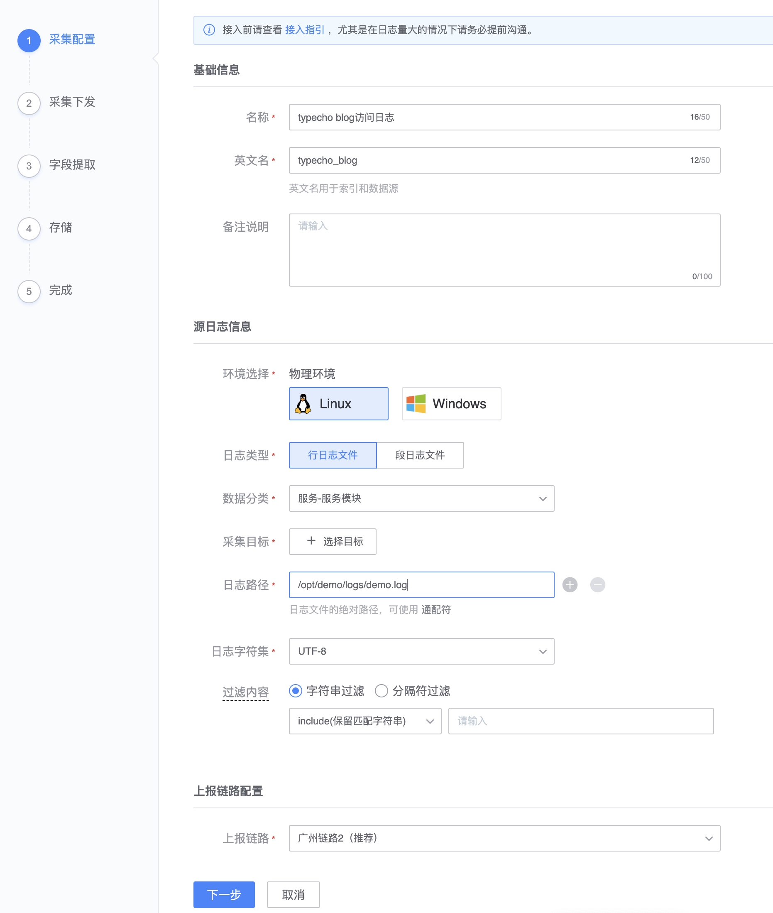

# 快速接入

快速接入以一个简单的网站做为参考例子，借此对监控平台的使用也会有一个基本的认识。

大致的步骤：

* DEMO站点： 了解网站架构及确定监控点
* 准备工作： CMDB 配置和准备工作
* 演示一： 快速接入主机和进程监控
* 演示二： 快速实现业务监控

## DEMO站点：了解网站架构及确定监控点

| 用途         | IP          | 进程              | 说明              |
| ------------ | ----------- | ----------------- | ----------------- |
| web1         | 10.0.15.239 | nginx php-fpm     | typecho blog 程序 |
| web2         | 10.0.15.155 | nginx php-fpm     | typecho blog 程序 |
| mysql master | 10.0.15.96  | mysql mysqld_safe | 数据库主          |
| mysql slave  | 10.0.15.138 | mysql mysqld_safe | 数据库从          |

为了保证该 BLOG 网站的稳定性，进行一个全方位的监控至少需要满足如下的监控需求：

1. 4 台主机的操作系统数据 -- 监控主机的稳定性
2. 4 台主机上的进程数据 -- 监控进程的运行数据和存活性
3. nginx，php-fpm，mysql 的组件运行数据 -- 监控组件的运行数据
4. blog 程序的日志数据  -- 采集日志定位和日志关键字告警
5. 网站的拨测数据 -- 远程监控网站可用率

> blog 程序选择了[typecho](http://typecho.org/)这个轻量的程序做为示例。

## 准备工作： CMDB 配置和准备工作

* [创建业务](../../../../CMDB/3.10/UserGuide/Feature/BusinessManagement.md)
* [创建集群](../../../../CMDB/3.10/UserGuide/Feature/SetTemp.md)
* [创建模块](../../../../CMDB/3.10/UserGuide/Feature/Model.md)

    > 如果进程配置在每台上面是一样的，是建议使用集群模版和服务模版的功能
    > 如果进程配置在每台上面不一样的，建议查看 [如何实现多实例监控](../ProductFeatures/integrations-metrics/multi_instance_monitor.md)

更多请查看 [准备工作](./prepare.md)

web 配置

mysql 配置

更多进程配置方法查看[进程配置种类](../scene-process/process_cases.md)

## 演示一： 快速接入主机和进程监控

当配置好了进程信息后，在“主机监控”将看到相应采集的数据。

平台自带默认的策略详细查看[内置策略](../ProductFeatures/scene-host/builtin_host_rules.md)，当内置策略不满足需求的时候可以增加监控策略。

配置进程端口监控：导航  →  监控配置  →  策略  →  新建
在事件中心查看告警信息：导航  →  事件中心

更多请查看场：

* [开启主机监控](../ProductFeatures/scene-host/host_monitor.md)
* [开启进程监控](../ProductFeatures/scene-process/process_monitor_overview.md)

## 演示二： 快速完成业务监控

业务监控常用的有两类：

1) 程序本身产生的日志，基于日志进行分析和告警
2） 程序产生的指标数据，了解业务功能的运行状态

### 配置服务-服务模块的日志监控

采集程序的访问日志

日志平台： 导航  →  管理  →  采集  →  日志采集  →  新建

- 字段提取-格式化数据

###  通过自定义上报补充业务监控

业务代码里面想直接将监控数据上报，有 SDK，命令行工具，HTTP 等方式。

1. HTTP JSON数据格式
2. Prometheus Metrics数据格式

导航： 集成 → 自定义指标 

具体查看[自定义上报功能](../ProductFeatures/integrations-metrics/custom_metrics_http.md)

