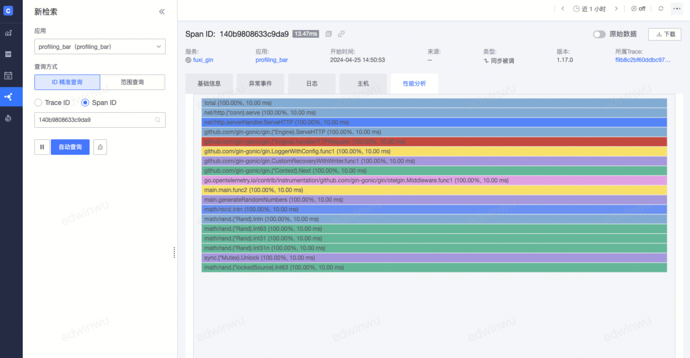

# Profiling 检索

Profiling 是指在程序的执行过程中，收集能反映程序执行状态的数据，例如程序执行所占用内存、特定指令的使用情况或函数调用的频率和持续时间，帮助应用程序定位和优化性能问题。

要实现 Profiling 的功能，需要在[新建 APM 应用的时候，将 Profiling 功能开启](../scene-apm/apm_monitor_overview.md)或者在对应的 APM 应用配置里，编辑开启Profiling。

## Profiling 检索

通过 pyroscope SDK 上报的数据，我们可以在 持续Profiling 下查看数据，也支持手动上传 perf、pprof 格式的文件。

Profiling 数据的可视化支持表格、火焰图、功能调用图等、使用 top N 打印出占用 CPU/ 内存最多的函数列表，数据类型支持CPU、ALLOC_SPACE、INUSE_SPACE从不同维度查看性能情况。

如果 Profile 数据中包含了 span_id，那么就可以和 Trace 数据进行关联。

在【Profiling 检索】的 Trace 数据柱状图中，可以看到当前时刻的 span_id 个数，点击可以会跳转到具体的 span 详情中。

同样，在 Span 详情中，如果此 Span 有 Profile 数据，也会展示处 Profile 标签页。

### 对比功能

对比模式下，可以对比基于不同 tag 的性能视图，比如对比同一个服务的不同版本、相似服务之间的性能情况。

