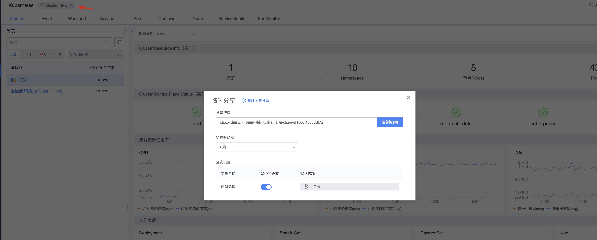
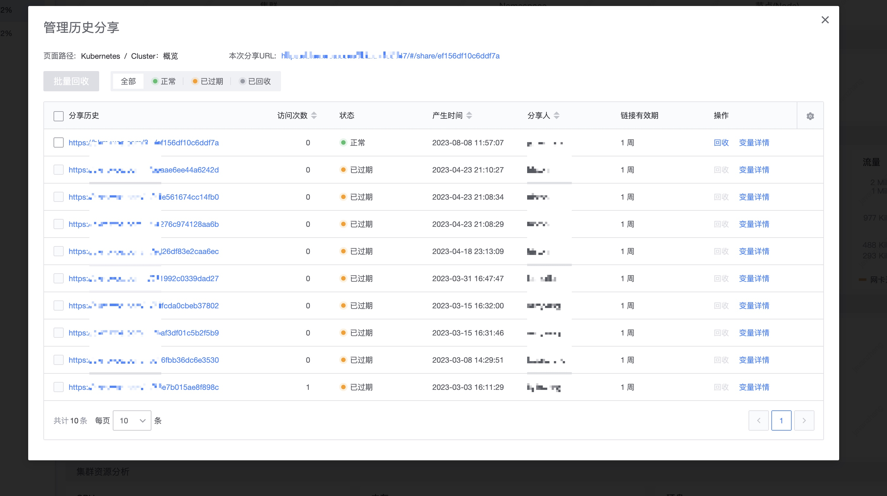

# 临时分享

临时分享主是解决不能给某用户进行权限的审批，又想让相关的人快速的进行一个定位的使用场景。

## 功能范围

观测场景的所有观测对象和集成的可视化数据都可以进行临时分享， 不包括仪表盘

## 临时分享的管理

1. 接收分享链接的人，如果有权限与普通的链接一样没有区别
2. 接收分享链接的人，没有权限，只会看到本次分享的主体实例，不涉及到列表页或业务拓扑树等。
3. 分享链接的可以控制有效时长和选择数据的时间范围，也可以取消快分分享的内容

