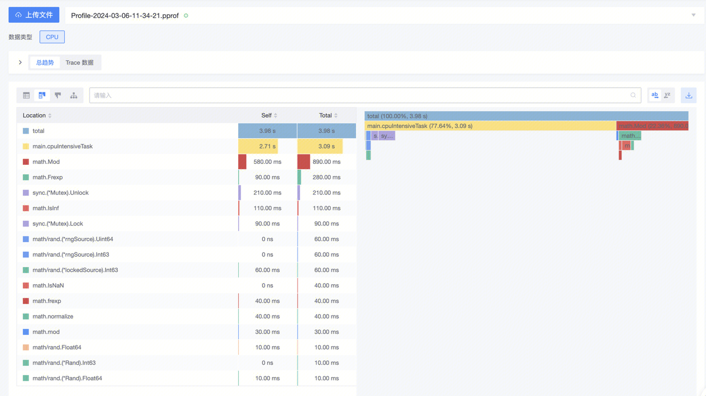

`perf` 是 Linux 下的一款性能分析工具，此工具生成的数据文件可以通过文件上传的方式接入到蓝鲸 Profiling 功能中查看。以下是具体的步骤：

>⚠️ `perf` 工具版本需要 >= 5.0，不符合要求的版本生成 Perf 数据会解析失败。本文所用的 `perf` 工具版本为：`5.4.241-1-tlinux4-0017.4`

1. 首先需要执行 `perf` 让其对项目生成二进制 perf 数据：

```bash
perf record ./your_proj
```

2. 接着将 perf 数据转为文本形式

```bash
perf script -i perf.data > perf_script.txt
```

3. 上传文件 & 查看 Profile


稍等片刻文件会完成解析并存储，此时就可以查询出对应的 Profile 数据了 🎉

