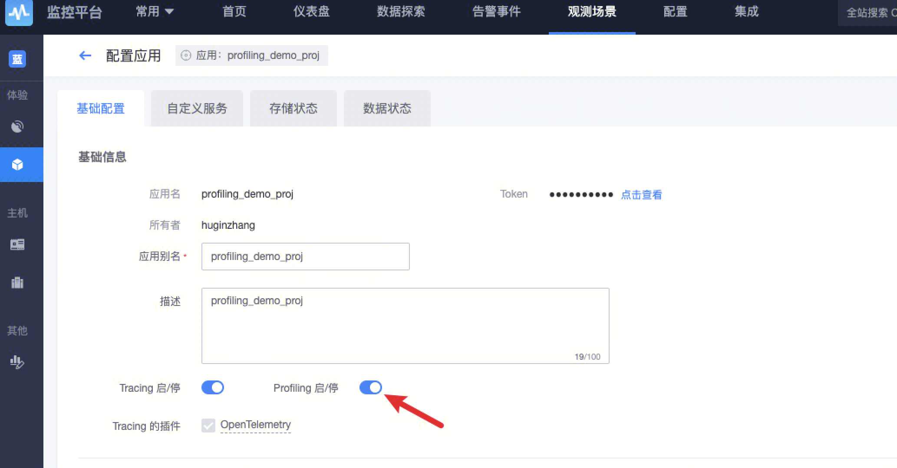
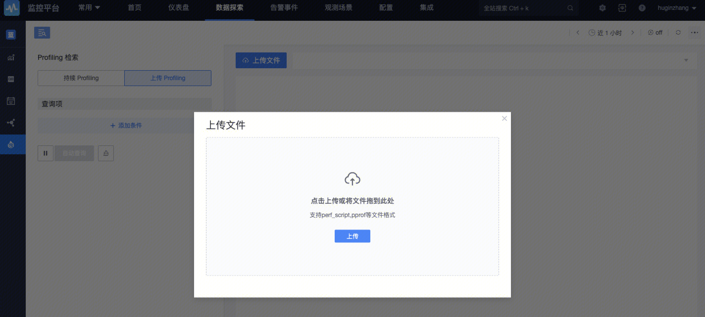

此文档会将 Profile 接入的完整流程和功能使用进行详细的介绍。
## 开启/接入 Profiling 功能

- profiling 功能需要依赖 APM 应用，如果还没有创建应用，需要在【观测场景 - APM】处创建应用，在创建时，将 Profiling 功能开关勾选上：

​		

- 如果应用已经存在，需要在【应用配置】页面将 Profiling 打s开：



## 上报 Profiling 数据

### 通过 SDK 上报数据

在代码中通过使用 pyroscope SDK 进行上报，通过此方法上报的 profiling 数据可以在【Profiling 检索 - 持续 Profiling 】中查看数据。


目前支持的语言接入文档如下：
1. [Java 语言接入文档](./java.md) 
2. [Go 语言接入文档](./go.md)

### 通过文件上报数据

文件上传支持 perf、pprof 格式的文件。

[Perf 接入 Profiling 文档](./perf.md)

在页面直接上传文件，稍等片刻即可查看 Profile 数据，期间会将文件存储至平台并进行异步分析。



解析成功后，即可在页面上查看 Profile 数据。
## 结合蓝鲸 APM

上述就是 Profiing 接入的基本流程，如果在 Profile 数据中包含了 `span_id`（这个过程为 pyroscope SDK 提供了现成的方法，详见接入文档），那么就可以和 Trace 数据进行关联。


**在观测场景处联动**

在 `pyroscope` 进行初始化的过程中，**推荐将 AppName 设置为和 Trace 中`Resource.service_name`相同的名称**，这样的话可以在观测场景处同时看到这个服务的 trace 数据和 profile 数据，例如：

```go
// 配置 profiling
_, err = pyroscope.Start(pyroscope.Config{
  ApplicationName: "my-service",
  // ... other config
})

// 配置 opentelemetry resource
resource := resource.NewWithAttributes(
    semconv.ServiceNameKey.String("my-service"),
  // ... other config
)
```

如果这种写法不符合你的习惯，也可以把 ServiceName 写在 Labels 中，例如：

```go
_, err = pyroscope.Start(pyroscope.Config{
  ApplicationName: "my-app",
  Tags: map[string]string{
    	// key 可以为 serviceName, service_name, SERVICE_NAME, service, SERVICE
			"serviceName": "my-service",
		},
  // ... other config
})
```

如果在 Tags 里面定义了 serviceName，那么 Profiling 会取出 Tags 里面的值作为服务名称而不是ApplicationName。

**在 Profling 检索处联动**

在【Profiling 检索】的 Trace 数据柱状图中，可以看到当前时刻的 span_id 个数，点击可以会跳转到具体的 span 详情中。


同样，在 Span 详情中，如果此 Span 有 Profile 数据，也会展示处 Profile 标签页：
