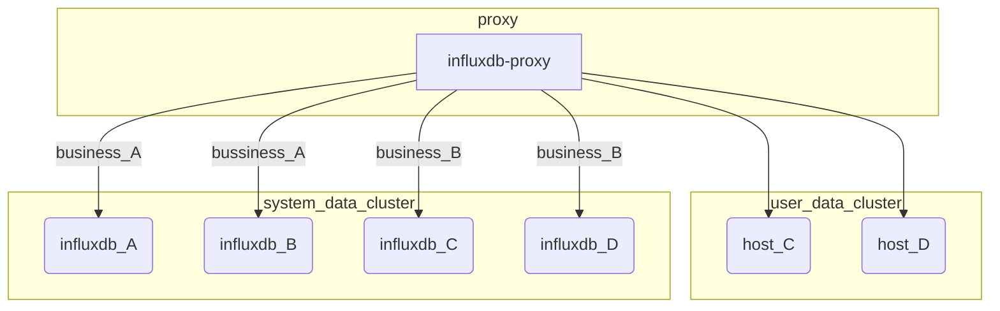

### 蓝鲸监控3.3版本influxdb-proxy变更手册

# 手册目录
1. [背景说明](#背景说明)
2. [基础架构说明](#基础架构说明)
3. [依赖蓝鲸监控后台变更方案详解](#依赖蓝鲸监控后台变更方案详解)
4. [原生consul配置方案](#原生consul配置方案)
5. [检查手段](#检查手段)
7. [日常巡检](#日常巡检)
6. [案例说明](#案例说明)


## 背景说明
监控进入3.3版本后，influxdb-proxy可以支持详细到维度的路由拆分配置，因此对于配置修改上提供了更灵活的配置方式。本文会分为两个部分进行说明配置路由的方式及手段，读者可以:
- 通过蓝鲸监控后台进行配置，将influxdb-proxy的路由配置由蓝鲸监控后台协助生成; 或
- 手动配置consul上的influxdb-proxy路由配置，只使用蓝鲸监控平台的influxdb-proxy能力
下面将会围绕这两种方式详细说明配置方式

## 基础架构说明
- host: 代表指一个influxdb实例；一个influxdb实例可以被配置多次，声明为不同的host，指需要确保host_name不重复即可
- cluster: 代表一个influxdb集群，由多个host组成
- table: 代表influxdb中的measurement。通过influxdb-proxy，可以配置一个measurement落地到哪个cluster上
- tag: 代表measurement中的一个或多个维度，通过influxdb-proxy，可以配置将一个measurement的数据落到一个cluster的多个不同机器上


## 依赖蓝鲸监控后台变更方案详解
0. 生成配置文件模板
    ```bash
    # 登录到蓝鲸监控平台后台机器
    workon bkmonitorv3-monitor
    bin/manage.sh update_influxdb_proxy_config -g true -t $tag -f /path/to/config.yaml
    ```
    其中的参数说明
    | 参数名 | 含义 | 可选值 |
    |---|---|---|
    | g | 是`产生`配置文件还是`应用`配置文件 | true(`产生`)\|false(`应用`)|
    | t | 需要生成的文件类型 | host_info\|cluster_info\|tag_info |
    | f | 应用文件路径或生成文件 | - |
1. 增加主机及集群配置
    下面将对通过`host_info`和`cluster_info`生成的配置文件字段进行详细介绍
    ```yaml
    # filename: /path/to/host.yaml
    host_info:  # 表示下面内容归属host_info更新
    - description: system auto add.  # host描述信息，用于后续维护使用，填写方便维护信息即可
      domain_name: 10.0.0.1  # 实例IP
      port: 80  # 实例端口
      host_name: INFLUXDB_IP0  # host代号，可以选择任何助记名
      password: your_password  # 实例密码
      username: your_username  # 实例用户名

    # filename: /path/to/cluster.yaml
    cluster_info:  # 表示以下的内容归属cluster_info更新
    - cluster_name: default  # 集群名
      host_name: INFLUXDB_IP0  # 集群中包含的host
      host_readable: true  # 该实例是否`可读`，该配置可以使得实例只接受数据，不提供数据，可以在机器迁移时使用
    - cluster_name: default
      host_name: INFLUXDB_IP1
      host_readable: true
    ```
    在生成配置文件后，我们可以按需增、减、改host和cluster对应的配置信息，然后就可以应用配置文件
    ```bash
    # 登录到蓝鲸监控平台后台机器
    workon bkmonitorv3-monitor
    bin/manage.sh update_influxdb_proxy_config -g false -t $tag -f /path/to/host.yaml
    bin/manage.sh update_influxdb_proxy_config -g false -t $tag -f /path/to/cluster_info.yaml
    ```
    刷入的信息将会打屏到标准输出上，可以通过标准输出进行判断刷新结果是否符合预期
    > 注意:  配置文件中的信息将会用`host_name`及`cluster_name`为`唯一键`的判断，`覆盖`数据库当中的数据

2. 调整结果表路由配置
    监控平台中，每一个结果表可以落到一个指定的集群当中，以便将不同的结果表分散到各个influxdb集群承载，分散压力。调整结果表的路由配置在监控平台admin页面进行即可。
    打开以下URL: `http://${pass}/o/bk_monitorv3/admin/metadata/influxdbstorage/${result_table}/change/`
    修改`实际存储集群名字`为目标集群名，点击`保存`即可
3. 调整维度路由配置
    下面将对通过`tag_info`生成的配置文件字段进行详细介绍
    ```yaml
    # filename: /path/to/tag.yaml
    tag_info:  # 表示以下内容归属tag_info更新
    # 注意：默认路由信息必须保留，否则会导致路由匹配失败的数据丢失！！！
    - cluster_name: cluster1  # 配置生效于哪个集群ID
      database: __default__  # DB名匹配规则，__default__表示这是一个默认路由信息，当数据未命中任何路由信息时，将会使用该规则
      force_overwrite: false  # 保留字段，保持为true即可
      host_list: INFLUXDB_IP0,INFLUXDB_IP1  # 该维度路由信息需要写入到cluster下的哪些host上
      manual_unreadable_host: ''  # 指定哪些host是不可读，用于机器迁移时使用
      measurement: __default__ # 结果表匹配规则，__default__表示这是一个默认路由信息，当数据未命中任何路由信息时，将会使用该规则
      tag_name: __default__  # 维度名匹配规则，__default__表示这是一个默认路由信息，当数据未命中任何路由信息时，将会使用该规则
      tag_value: __default__  # 维度值匹配规则，__default__表示这是一个默认路由信息，当数据未命中任何路由信息时，将会使用该规则
    - cluster_name: cluster1  # 以下是一个将bk_biz_id为3的数据进行路由的样例
      database: system
      force_overwrite: true
      host_list: INFLUXDB_IP0,INFLUXDB_IP1
      manual_unreadable_host: ''
      measurement: cpu_detail
      tag_name: bk_biz_id
      tag_value: '3'
    ```
    在生成配置文件后，我们可以按需增、减、改tag对应的配置信息，然后就可以应用配置文件
    ```bash
    # 登录到蓝鲸监控平台后台机器
    workon bkmonitorv3-monitor
    bin/manage.sh update_influxdb_proxy_config -g false -t $tag -f /path/to/tag.yaml
    ```
4. 手动刷新配置至influxdb-proxy生效
    可以考虑手动立马将配置刷新至influxdb-proxy生效，否则需要等最多10分钟的时间等待监控后台定时刷新配置
    ```bash
    workon bkmonitorv3-monitor
    bin/manage.sh refresh_influxdb_proxy_config
    ```

## 原生consul配置方案
1. 路径信息说明
    - 路径：bk_bkmonitorv3_enterprise_production/metadata/influxdb_info/router/\${database}/\${table_id}/
      含义：某个指定的结果表路由配置信息
      值：{"cluster":"\${cluster_name}", "partition_tag":["\${tag_name}"]}
    - 路径：bk_bkmonitorv3_enterprise_production/metadata/influxdb_info/host_info/${host_name}
      含义：host信息配置
      值：{"domain_name":"10.0.0.1","port":80,"username":"","password":""}
    - 路径：bk_bkmonitorv3_enterprise_production/metadata/influxdb_info/tag_info/\${cluster_name}/\${database}/\${table_id}/bk_biz_id==3
      含义：具体的tag路由信息
      值：{"host_list":["INFLUXDB_IP0","INFLUXDB_IP1"],"unreadable_host":[],"status":"ready"}
    - 路径：bk_bkmonitorv3_enterprise_production/metadata/influxdb_info/cluster_info/${cluster_name}
      含义：集群配置信息
      值：{"host_list":["INFLUXDB_IP0","INFLUXDB_IP1"],"unreadable_host_list":[]}
## 检查手段
可以通过influxdb-proxy的print接口，检查数据是否正确生效 
```bash
curl $INFLUXDB_PROXY_HOST:8080/print
# output:
# 主机信息
influxdb_backend[INFLUXDB_IP0:10.0.0.1:80]
influxdb_backend[INFLUXDB_IP1:10.0.0.2:80]
# 集群信息及维度路由信息
influxdb_cluster:[cluster1],backend_list:[influxdb_backend[INFLUXDB_IP0:10.0.0.1:80] influxdb_backend[INFLUXDB_IP1:10.0.0.2:80]],unreadable_host:map[],tags:
read tags:
    __default__/__default__/__default__==__default__
            influxdb_backend[INFLUXDB_IP0:10.0.0.1:80]
            influxdb_backend[INFLUXDB_IP1:10.0.0.2:80]
    system/cpu_detail/bk_biz_id==3
            influxdb_backend[INFLUXDB_IP0:10.0.0.1:80]
            influxdb_backend[INFLUXDB_IP1:10.0.0.2:80]
write tags:
    __default__/__default__/__default__==__default__
            influxdb_backend[INFLUXDB_IP0:10.0.0.1:80]
            influxdb_backend[INFLUXDB_IP1:10.0.0.2:80]
    system/cpu_detail/bk_biz_id==3
            influxdb_backend[INFLUXDB_IP0:10.0.0.1:80]
            influxdb_backend[INFLUXDB_IP1:10.0.0.2:80]
# 结果表的路由信息
route:system.cpu_summary,cluster:cluster_cpu_summary
```

## 日常巡检
1. influxdb抖动
- 情况
    可以通过观察influxdb-proxy的异常备份动作观察influxdb是否存在抖动的情况。实际观察，influxdb在大量写入量时，如果遇到耗时较长的查询时，会容易发生`timeout`的写入异常报错。
- 处理
    如果influxdb此时CPU的平均负载在50%以下时，可以认为只是偶现的抖动情况，并不需要接入处理。当然，如果在机器量级允许支持的情况下，可以考虑扩容拆分降低机器压力也是可以的。
    如果influxdb此时CPU负载持续飙高，需要考虑influxdb存在过载的风险，需要尽快扩容（拆分数据 或 增加机器承载读负载）。

## 案例说明
1. 主机故障替换
    环境中，原有两台influxdb，分别为`INFLUXDB_IP1(10.0.0.1)`与`INFLUXDB_IP2(10.0.0.2)`。此时收到通知，`10.0.0.1`机器发生磁盘故障，需要下架替换为`10.0.0.3`。以下是操作说明：
    - 更新host_info信息，将`INFLUXDB_IP1`的domain_name，由`10.0.0.1`更新为`10.0.0.3`。host_info.yaml样例配置如下:
    ```yaml
    # 更新前
    host_info:
    ....
      - description: INFLUXDB_IP1
        domain_name: 10.0.0.1
        host_name: INFLUXDB_IP1
        password: password
        port: 8080
        username: user
    # 更新后
    host_info:
    ....
      - description: INFLUXDB_IP1
        domain_name: 10.0.0.3
        host_name: INFLUXDB_IP1
        password: password
        port: 8080
        username: user
    ```
    - 更新cluster_info信息，将`INFLUXDB_IP1`的集群中的可读标志位改为false，此时可以让新机器开始沉淀数据，但由于数据并不完整，所以先不提供读服务。cluster_info.yaml样例配置如下:
    ```yaml
    cluster_info:
      - cluster_name: default
        host_name: INFLUXDB_IP1
        host_readable: false  # 注意此处为false
      - cluster_name: default
        host_name: INFLUXDB_IP2
        host_readable: true
    
    ```
    - 通过监控平台命令刷新配置并生效
    ```bash
    bin/manage.sh update_influxdb_proxy_config -g false -t $tag -f /path/to/host_info.yaml
    bin/manage.sh update_influxdb_proxy_config -g false -t $tag -f /path/to/cluster_info.yaml
    bin/manage.sh refresh_influxdb_proxy_config
    ```
    - 待新机器储备一定数量后，可以考虑将新机器改为可读模式。
    ```yaml
    cluster_info:
      - cluster_name: default
        host_name: INFLUXDB_IP1
        host_readable: true  # 注意此处为true
      - cluster_name: default
        host_name: INFLUXDB_IP2
        host_readable: true
    ```
    - 刷新配置
    ```bash
    bin/manage.sh update_influxdb_proxy_config -g false -t $tag -f /path/to/cluster_info.yaml
    bin/manage.sh refresh_influxdb_proxy_config
    ```
    > **注意**：新机器在积累半小时数据后，就可以考虑改为可读模式，通常不会对监控后台判断造成太大影响

1. 数据迁移替换
    环境中，原有一台influxdb承载结果表`system.cpu_summary`，机器实例为`INFLUXDB_IP1(10.0.0.1)`。此时发现，`10.0.0.1`机器承载达到上限，需要替换配置更优的`10.0.0.2`。以下是操作说明：
    - 增加host_info信息。host_info.yaml样例配置如下:
    ```yaml
    # 更新前
    host_info:
    ....
      - description: INFLUXDB_IP1
        domain_name: 10.0.0.1
        host_name: INFLUXDB_IP1
        password: password
        port: 8080
        username: user
    # 更新后
    host_info:
    ....
      - description: INFLUXDB_IP1
        domain_name: 10.0.0.1
        host_name: INFLUXDB_IP1
        password: password
        port: 8080
        username: user
      - description: INFLUXDB_IP1_NEW
        domain_name: 10.0.0.2
        host_name: INFLUXDB_IP1_NEW
        password: password
        port: 8080
        username: user
    ```
    - 更新cluster_info信息，将`INFLUXDB_IP1`和`INFLUXDB_IP1_NEW`组建一个新的集群中。同时，新集群中的新机器可读标志位改为false，此时可以让新机器开始沉淀数据，但由于数据并不完整，所以先不提供读服务。cluster_info.yaml样例配置如下:
    ```yaml
    # 更新前
    cluster_info:
      - cluster_name: default
        host_name: INFLUXDB_IP1
        host_readable: true  

    # 更新后
    cluster_info:
      - cluster_name: NEW_CLUSTER
        host_name: INFLUXDB_IP1_NEW
        host_readable: false  # 注意此处为false, 表示机器只能承受写，不可提供读服务
      - cluster_name: NEW_CLUSTER
        host_name: INFLUXDB_IP1
        host_readable: true
    
    ```
    - 通过监控平台命令刷新配置并生效
    ```bash
    bin/manage.sh update_influxdb_proxy_config -g false -f /path/to/host_info.yaml
    bin/manage.sh update_influxdb_proxy_config -g false -f /path/to/cluster_info.yaml
    bin/manage.sh refresh_influxdb_proxy_config
    ```
    - 登录到监控后台admin页面，修改`http://${pass}/o/bk_monitorv3/admin/metadata/influxdbstorage/system.cpu_summary/change/`结果表的集群配置，从`default`改为`NEW_CLUSTER`
    - 待新机器储备一定数量后，可以考虑将新机器改为可读模式，并将已有机器从集群中剔除
    ```yaml
    cluster_info:
      - cluster_name: NEW_CLUSTER
        host_name: INFLUXDB_IP1_NEW
        host_readable: true  # 注意此处为true
      # 此处剔除已有机器
      # - cluster_name: NEW_CLUSTER
      #   host_name: INFLUXDB_IP1
      #   host_readable: true
    ```
    - 刷新配置
    ```bash
    bin/manage.sh update_influxdb_proxy_config -g false -t $tag -f /path/to/cluster_info.yaml
    bin/manage.sh refresh_influxdb_proxy_config
    ```
    > **注意**：新机器在积累半小时数据后，就可以考虑改为可读模式，通常不会对监控后台判断造成太大影响