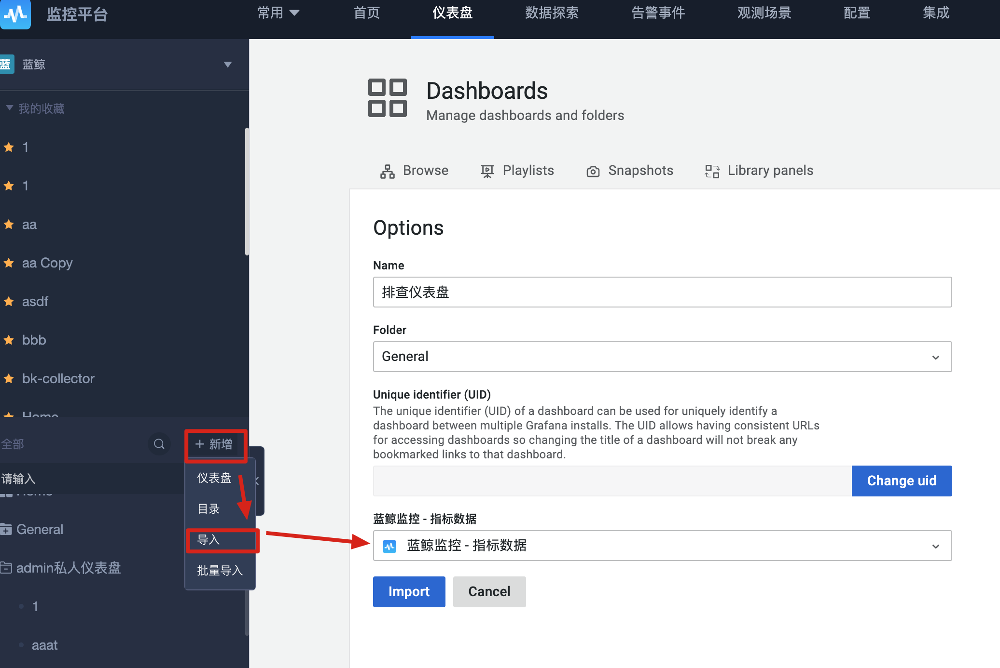
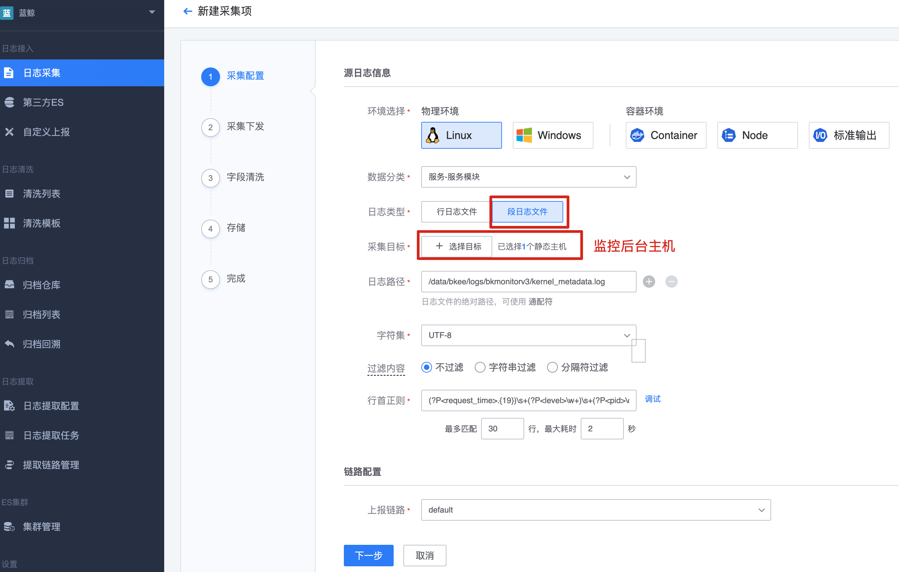
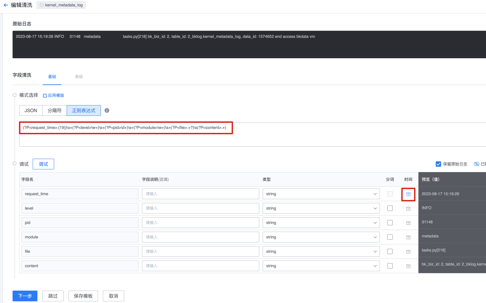

1. 配置**排查仪表盘**

   将下面的配置保存成功json格式，导入监控平台中

   

   ```json
   {
       "annotations":
       {
           "list":
           [
               {
                   "builtIn": 1,
                   "datasource":
                   {
                       "type": "grafana",
                       "uid": "-- Grafana --"
                   },
                   "enable": true,
                   "hide": true,
                   "iconColor": "rgba(0, 211, 255, 1)",
                   "name": "Annotations & Alerts",
                   "target":
                   {
                       "limit": 100,
                       "matchAny": false,
                       "tags":
                       [],
                       "type": "dashboard"
                   },
                   "type": "dashboard"
               }
           ]
       },
       "editable": true,
       "fiscalYearStartMonth": 0,
       "graphTooltip": 0,
       "links":
       [],
       "liveNow": false,
       "panels":
       [
           {
               "gridPos":
               {
                   "h": 1,
                   "w": 24,
                   "x": 0,
                   "y": 0
               },
               "id": 7,
               "title": "cron task",
               "type": "row"
           },
           {
               "datasource":
               {
                   "type": "bkmonitor-timeseries-datasource",
                   "uid": "${DS_蓝鲸监控_-_指标数据}"
               },
               "fieldConfig":
               {
                   "defaults":
                   {
                       "color":
                       {
                           "mode": "palette-classic"
                       },
                       "custom":
                       {
                           "axisCenteredZero": false,
                           "axisColorMode": "text",
                           "axisLabel": "",
                           "axisPlacement": "auto",
                           "barAlignment": 0,
                           "drawStyle": "line",
                           "fillOpacity": 0,
                           "gradientMode": "none",
                           "hideFrom":
                           {
                               "legend": false,
                               "tooltip": false,
                               "viz": false
                           },
                           "lineInterpolation": "linear",
                           "lineWidth": 1,
                           "pointSize": 5,
                           "scaleDistribution":
                           {
                               "type": "linear"
                           },
                           "showPoints": "auto",
                           "spanNulls": false,
                           "stacking":
                           {
                               "group": "A",
                               "mode": "none"
                           },
                           "thresholdsStyle":
                           {
                               "mode": "off"
                           }
                       },
                       "mappings":
                       [],
                       "thresholds":
                       {
                           "mode": "absolute",
                           "steps":
                           [
                               {
                                   "color": "green",
                                   "value": null
                               },
                               {
                                   "color": "red",
                                   "value": 80
                               }
                           ]
                       }
                   },
                   "overrides":
                   []
               },
               "gridPos":
               {
                   "h": 6,
                   "w": 22,
                   "x": 0,
                   "y": 1
               },
               "id": 9,
               "options":
               {
                   "legend":
                   {
                       "calcs":
                       [],
                       "displayMode": "table",
                       "placement": "right",
                       "showLegend": true
                   },
                   "tooltip":
                   {
                       "mode": "multi",
                       "sort": "desc"
                   }
               },
               "targets":
               [
                   {
                       "cluster":
                       [],
                       "datasource":
                       {
                           "type": "bkmonitor-timeseries-datasource",
                           "uid": "${DS_蓝鲸监控_-_指标数据}"
                       },
                       "expressionList":
                       [],
                       "format": "time_series",
                       "host":
                       [],
                       "mode": "ui",
                       "module":
                       [],
                       "promqlAlias": "",
                       "query_configs":
                       [
                           {
                               "alias": "$tag_task_name - $tag_queue - $tag_exception",
                               "data_source_label": "custom",
                               "data_type_label": "time_series",
                               "display": true,
                               "filter_dict":
                               {},
                               "functions":
                               [
                                   {
                                       "id": "increase",
                                       "params":
                                       [
                                           {
                                               "id": "window",
                                               "value": "2m"
                                           }
                                       ]
                                   }
                               ],
                               "group_by":
                               [
                                   "task_name",
                                   "exception",
                                   "queue"
                               ],
                               "interval": "auto",
                               "interval_unit": "s",
                               "method": "AVG",
                               "metric_field": "bkmonitor_cron_task_execute_count_total",
                               "refId": "a",
                               "result_table_id": "custom_report_aggate.base",
                               "result_table_label": "other_rt",
                               "time_field": "time",
                               "where":
                               [
                                   {
                                       "key": "status",
                                       "method": "eq",
                                       "value":
                                       [
                                           "failed"
                                       ]
                                   }
                               ]
                           }
                       ],
                       "refId": "A",
                       "source": "",
                       "step": "",
                       "type": "range"
                   }
               ],
               "title": "执行失败总览",
               "type": "timeseries"
           },
           {
               "datasource":
               {
                   "type": "bkmonitor-timeseries-datasource",
                   "uid": "${DS_蓝鲸监控_-_指标数据}"
               },
               "fieldConfig":
               {
                   "defaults":
                   {
                       "color":
                       {
                           "mode": "palette-classic"
                       },
                       "custom":
                       {
                           "axisCenteredZero": false,
                           "axisColorMode": "text",
                           "axisLabel": "",
                           "axisPlacement": "auto",
                           "barAlignment": 0,
                           "drawStyle": "line",
                           "fillOpacity": 0,
                           "gradientMode": "none",
                           "hideFrom":
                           {
                               "legend": false,
                               "tooltip": false,
                               "viz": false
                           },
                           "lineInterpolation": "linear",
                           "lineWidth": 1,
                           "pointSize": 5,
                           "scaleDistribution":
                           {
                               "type": "linear"
                           },
                           "showPoints": "auto",
                           "spanNulls": false,
                           "stacking":
                           {
                               "group": "A",
                               "mode": "none"
                           },
                           "thresholdsStyle":
                           {
                               "mode": "off"
                           }
                       },
                       "mappings":
                       [],
                       "thresholds":
                       {
                           "mode": "absolute",
                           "steps":
                           [
                               {
                                   "color": "green",
                                   "value": null
                               },
                               {
                                   "color": "red",
                                   "value": 80
                               }
                           ]
                       }
                   },
                   "overrides":
                   []
               },
               "gridPos":
               {
                   "h": 7,
                   "w": 22,
                   "x": 0,
                   "y": 7
               },
               "id": 11,
               "options":
               {
                   "legend":
                   {
                       "calcs":
                       [],
                       "displayMode": "table",
                       "placement": "right",
                       "showLegend": true
                   },
                   "tooltip":
                   {
                       "mode": "multi",
                       "sort": "desc"
                   }
               },
               "targets":
               [
                   {
                       "cluster":
                       [],
                       "datasource":
                       {
                           "type": "bkmonitor-timeseries-datasource",
                           "uid": "${DS_蓝鲸监控_-_指标数据}"
                       },
                       "expressionList":
                       [],
                       "format": "time_series",
                       "host":
                       [],
                       "mode": "ui",
                       "module":
                       [],
                       "promqlAlias": "",
                       "query_configs":
                       [
                           {
                               "alias": "$tag_task_name",
                               "data_source_label": "custom",
                               "data_type_label": "time_series",
                               "display": true,
                               "filter_dict":
                               {},
                               "functions":
                               [
                                   {
                                       "id": "increase",
                                       "params":
                                       [
                                           {
                                               "id": "window",
                                               "value": "1h"
                                           }
                                       ]
                                   }
                               ],
                               "group_by":
                               [
                                   "task_name"
                               ],
                               "interval": 60,
                               "interval_unit": "s",
                               "method": "SUM",
                               "metric_field": "bkmonitor_cron_task_execute_count_total",
                               "refId": "a",
                               "result_table_id": "custom_report_aggate.base",
                               "result_table_label": "other_rt",
                               "time_field": "time",
                               "where":
                               [
                                   {
                                       "key": "queue",
                                       "method": "eq",
                                       "value":
                                       [
                                           "celery_cron",
                                           "celery_long_task_cron",
                                           "None"
                                       ]
                                   }
                               ]
                           }
                       ],
                       "refId": "A",
                       "source": "",
                       "step": "",
                       "type": "range"
                   }
               ],
               "title": "1小时内各周期任务执行次数",
               "type": "timeseries"
           },
           {
               "datasource":
               {
                   "type": "bkmonitor-timeseries-datasource",
                   "uid": "${DS_蓝鲸监控_-_指标数据}"
               },
               "fieldConfig":
               {
                   "defaults":
                   {
                       "color":
                       {
                           "mode": "palette-classic"
                       },
                       "custom":
                       {
                           "axisCenteredZero": false,
                           "axisColorMode": "text",
                           "axisLabel": "",
                           "axisPlacement": "auto",
                           "barAlignment": 0,
                           "drawStyle": "line",
                           "fillOpacity": 0,
                           "gradientMode": "none",
                           "hideFrom":
                           {
                               "legend": false,
                               "tooltip": false,
                               "viz": false
                           },
                           "lineInterpolation": "linear",
                           "lineWidth": 1,
                           "pointSize": 5,
                           "scaleDistribution":
                           {
                               "type": "linear"
                           },
                           "showPoints": "auto",
                           "spanNulls": false,
                           "stacking":
                           {
                               "group": "A",
                               "mode": "none"
                           },
                           "thresholdsStyle":
                           {
                               "mode": "off"
                           }
                       },
                       "mappings":
                       [],
                       "thresholds":
                       {
                           "mode": "absolute",
                           "steps":
                           [
                               {
                                   "color": "green",
                                   "value": null
                               },
                               {
                                   "color": "red",
                                   "value": 80
                               }
                           ]
                       },
                       "unit": "s"
                   },
                   "overrides":
                   []
               },
               "gridPos":
               {
                   "h": 7,
                   "w": 22,
                   "x": 0,
                   "y": 14
               },
               "id": 12,
               "options":
               {
                   "legend":
                   {
                       "calcs":
                       [],
                       "displayMode": "table",
                       "placement": "right",
                       "showLegend": true
                   },
                   "tooltip":
                   {
                       "mode": "multi",
                       "sort": "desc"
                   }
               },
               "targets":
               [
                   {
                       "cluster":
                       [],
                       "datasource":
                       {
                           "type": "bkmonitor-timeseries-datasource",
                           "uid": "${DS_蓝鲸监控_-_指标数据}"
                       },
                       "expressionList":
                       [
                           {
                               "active": true,
                               "alias": "$tag_task_name",
                               "expression": "a/b",
                               "functions":
                               []
                           }
                       ],
                       "format": "time_series",
                       "host":
                       [],
                       "mode": "ui",
                       "module":
                       [],
                       "promqlAlias": "",
                       "query_configs":
                       [
                           {
                               "alias": "$tag_task_name",
                               "data_source_label": "custom",
                               "data_type_label": "time_series",
                               "display": true,
                               "filter_dict":
                               {},
                               "functions":
                               [
                                   {
                                       "id": "increase",
                                       "params":
                                       [
                                           {
                                               "id": "window",
                                               "value": "1h"
                                           }
                                       ]
                                   }
                               ],
                               "group_by":
                               [
                                   "task_name"
                               ],
                               "interval": 60,
                               "interval_unit": "s",
                               "method": "SUM",
                               "metric_field": "bkmonitor_cron_task_execute_time_sum",
                               "refId": "a",
                               "result_table_id": "custom_report_aggate.base",
                               "result_table_label": "other_rt",
                               "time_field": "time",
                               "where":
                               [
                                   {
                                       "key": "queue",
                                       "method": "eq",
                                       "value":
                                       [
                                           "celery_cron",
                                           "celery_long_task_cron",
                                           "None"
                                       ]
                                   }
                               ]
                           },
                           {
                               "alias": "$tag_task_name",
                               "data_source_label": "custom",
                               "data_type_label": "time_series",
                               "display": true,
                               "filter_dict":
                               {},
                               "functions":
                               [
                                   {
                                       "id": "increase",
                                       "params":
                                       [
                                           {
                                               "id": "window",
                                               "value": "1h"
                                           }
                                       ]
                                   }
                               ],
                               "group_by":
                               [
                                   "task_name"
                               ],
                               "interval": 60,
                               "interval_unit": "s",
                               "method": "AVG",
                               "metric_field": "bkmonitor_cron_task_execute_time_count",
                               "refId": "b",
                               "result_table_id": "custom_report_aggate.base",
                               "result_table_label": "other_rt",
                               "time_field": "time",
                               "where":
                               [
                                   {
                                       "key": "queue",
                                       "method": "eq",
                                       "value":
                                       [
                                           "celery_cron",
                                           "celery_long_task_cron",
                                           "None"
                                       ]
                                   }
                               ]
                           }
                       ],
                       "refId": "A",
                       "source": "",
                       "step": "",
                       "type": "range"
                   }
               ],
               "title": "周期任务平均执行耗时",
               "type": "timeseries"
           },
           {
               "collapsed": false,
               "gridPos":
               {
                   "h": 1,
                   "w": 24,
                   "x": 0,
                   "y": 21
               },
               "id": 5,
               "panels":
               [],
               "title": "transfer",
               "type": "row"
           },
           {
               "datasource":
               {
                   "type": "bkmonitor-timeseries-datasource",
                   "uid": "${DS_蓝鲸监控_-_指标数据}"
               },
               "fieldConfig":
               {
                   "defaults":
                   {
                       "color":
                       {
                           "mode": "palette-classic"
                       },
                       "custom":
                       {
                           "axisCenteredZero": false,
                           "axisColorMode": "text",
                           "axisLabel": "",
                           "axisPlacement": "auto",
                           "barAlignment": 0,
                           "drawStyle": "line",
                           "fillOpacity": 0,
                           "gradientMode": "none",
                           "hideFrom":
                           {
                               "legend": false,
                               "tooltip": false,
                               "viz": false
                           },
                           "lineInterpolation": "linear",
                           "lineWidth": 1,
                           "pointSize": 5,
                           "scaleDistribution":
                           {
                               "type": "linear"
                           },
                           "showPoints": "auto",
                           "spanNulls": false,
                           "stacking":
                           {
                               "group": "A",
                               "mode": "none"
                           },
                           "thresholdsStyle":
                           {
                               "mode": "off"
                           }
                       },
                       "mappings":
                       [],
                       "thresholds":
                       {
                           "mode": "absolute",
                           "steps":
                           [
                               {
                                   "color": "green",
                                   "value": null
                               },
                               {
                                   "color": "red",
                                   "value": 80
                               }
                           ]
                       }
                   },
                   "overrides":
                   []
               },
               "gridPos":
               {
                   "h": 10,
                   "w": 11,
                   "x": 0,
                   "y": 22
               },
               "id": 2,
               "options":
               {
                   "legend":
                   {
                       "calcs":
                       [],
                       "displayMode": "list",
                       "placement": "bottom",
                       "showLegend": true
                   },
                   "tooltip":
                   {
                       "mode": "multi",
                       "sort": "desc"
                   }
               },
               "targets":
               [
                   {
                       "cluster":
                       [],
                       "datasource":
                       {
                           "type": "bkmonitor-timeseries-datasource",
                           "uid": "${DS_蓝鲸监控_-_指标数据}"
                       },
                       "expressionList":
                       [],
                       "format": "time_series",
                       "host":
                       [],
                       "mode": "ui",
                       "module":
                       [],
                       "promqlAlias": "",
                       "query_configs":
                       [
                           {
                               "alias": "$data_id - $tag_target",
                               "data_source_label": "custom",
                               "data_type_label": "time_series",
                               "display": true,
                               "filter_dict":
                               {},
                               "functions":
                               [],
                               "group_by":
                               [
                                   "data_id",
                                   "pipeline",
                                   "target"
                               ],
                               "interval": "auto",
                               "interval_unit": "s",
                               "method": "AVG",
                               "metric_field": "transfer_pipeline_frontend_handled_total",
                               "refId": "a",
                               "result_table_id": "statistics_data_custom_series.base",
                               "result_table_label": "application_check",
                               "time_field": "time",
                               "where":
                               [
                                   {
                                       "key": "data_id",
                                       "method": "eq",
                                       "value":
                                       [
                                           "$data_id"
                                       ]
                                   }
                               ]
                           }
                       ],
                       "refId": "A",
                       "source": "",
                       "step": "",
                       "type": "range"
                   }
               ],
               "title": "前端消费数",
               "type": "timeseries"
           },
           {
               "datasource":
               {
                   "type": "bkmonitor-timeseries-datasource",
                   "uid": "${DS_蓝鲸监控_-_指标数据}"
               },
               "fieldConfig":
               {
                   "defaults":
                   {
                       "color":
                       {
                           "mode": "palette-classic"
                       },
                       "custom":
                       {
                           "axisCenteredZero": false,
                           "axisColorMode": "text",
                           "axisLabel": "",
                           "axisPlacement": "auto",
                           "barAlignment": 0,
                           "drawStyle": "line",
                           "fillOpacity": 0,
                           "gradientMode": "none",
                           "hideFrom":
                           {
                               "legend": false,
                               "tooltip": false,
                               "viz": false
                           },
                           "lineInterpolation": "linear",
                           "lineWidth": 1,
                           "pointSize": 5,
                           "scaleDistribution":
                           {
                               "type": "linear"
                           },
                           "showPoints": "auto",
                           "spanNulls": false,
                           "stacking":
                           {
                               "group": "A",
                               "mode": "none"
                           },
                           "thresholdsStyle":
                           {
                               "mode": "off"
                           }
                       },
                       "mappings":
                       [],
                       "thresholds":
                       {
                           "mode": "absolute",
                           "steps":
                           [
                               {
                                   "color": "green",
                                   "value": null
                               },
                               {
                                   "color": "red",
                                   "value": 80
                               }
                           ]
                       }
                   },
                   "overrides":
                   []
               },
               "gridPos":
               {
                   "h": 10,
                   "w": 11,
                   "x": 11,
                   "y": 22
               },
               "id": 3,
               "options":
               {
                   "legend":
                   {
                       "calcs":
                       [],
                       "displayMode": "list",
                       "placement": "bottom",
                       "showLegend": true
                   },
                   "tooltip":
                   {
                       "mode": "multi",
                       "sort": "desc"
                   }
               },
               "targets":
               [
                   {
                       "cluster":
                       [],
                       "datasource":
                       {
                           "type": "bkmonitor-timeseries-datasource",
                           "uid": "${DS_蓝鲸监控_-_指标数据}"
                       },
                       "expressionList":
                       [],
                       "format": "time_series",
                       "host":
                       [],
                       "mode": "ui",
                       "module":
                       [],
                       "promqlAlias": "",
                       "query_configs":
                       [
                           {
                               "alias": "$data_id - $tag_target",
                               "data_source_label": "custom",
                               "data_type_label": "time_series",
                               "display": true,
                               "filter_dict":
                               {},
                               "functions":
                               [],
                               "group_by":
                               [
                                   "data_id",
                                   "target"
                               ],
                               "interval": "auto",
                               "interval_unit": "s",
                               "method": "AVG",
                               "metric_field": "transfer_pipeline_backend_handled_total",
                               "refId": "a",
                               "result_table_id": "statistics_data_custom_series.base",
                               "result_table_label": "application_check",
                               "time_field": "time",
                               "where":
                               [
                                   {
                                       "key": "data_id",
                                       "method": "eq",
                                       "value":
                                       [
                                           "$data_id"
                                       ]
                                   }
                               ]
                           }
                       ],
                       "refId": "A",
                       "source": "",
                       "step": "",
                       "type": "range"
                   }
               ],
               "title": "后端写入数",
               "type": "timeseries"
           }
       ],
       "schemaVersion": 37,
       "style": "dark",
       "tags":
       [],
       "templating":
       {
           "list":
           [
               {
                   "current":
                   {},
                   "definition": "- Blueking Monitor - 维度",
                   "hide": 0,
                   "includeAll": true,
                   "label": "data_id",
                   "multi": true,
                   "name": "data_id",
                   "options":
                   [],
                   "query":
                   {
                       "metricConfig":
                       {
                           "data_source_label": "custom",
                           "data_type_label": "time_series",
                           "group_by": "data_id",
                           "metric_field": "transfer_pipeline_frontend_handled_total",
                           "result_table_id": "statistics_data_custom_series.base",
                           "result_table_label": "application_check",
                           "where":
                           []
                       },
                       "queryType": "dimension",
                       "variables": ""
                   },
                   "refresh": 1,
                   "regex": "",
                   "skipUrlSync": false,
                   "sort": 0,
                   "type": "query"
               },
               {
                   "current":
                   {},
                   "definition": "- Blueking Monitor - 主机",
                   "hide": 0,
                   "includeAll": true,
                   "label": "ip",
                   "multi": false,
                   "name": "ip",
                   "options":
                   [],
                   "query":
                   {
                       "queryType": "host",
                       "scenario": "os",
                       "showField": "bk_host_innerip",
                       "valueField": "bk_host_innerip",
                       "variables": "$module",
                       "where":
                       [
                           {
                               "key": "bk_module_ids",
                               "method": "include",
                               "value":
                               [
                                   "$module"
                               ]
                           }
                       ]
                   },
                   "refresh": 1,
                   "regex": "",
                   "skipUrlSync": false,
                   "sort": 0,
                   "type": "query"
               },
               {
                   "current":
                   {},
                   "definition": "- Blueking Monitor - 模块",
                   "hide": 0,
                   "includeAll": false,
                   "label": "module",
                   "multi": false,
                   "name": "module",
                   "options":
                   [],
                   "query":
                   {
                       "queryType": "module",
                       "scenario": "os",
                       "showField": "bk_module_name",
                       "valueField": "bk_module_id",
                       "variables": "",
                       "where":
                       [
                           {
                               "key": "bk_module_name",
                               "method": "include",
                               "value":
                               [
                                   "transfer"
                               ]
                           }
                       ]
                   },
                   "refresh": 1,
                   "regex": "",
                   "skipUrlSync": false,
                   "sort": 0,
                   "type": "query"
               }
           ]
       },
       "time":
       {
           "from": "now-6h",
           "to": "now"
       },
       "timepicker":
       {},
       "timezone": "default",
       "title": "排查仪表盘",
       "version": 5,
       "weekStart": "",
       "__inputs":
       [
           {
               "name": "DS_蓝鲸监控_-_指标数据",
               "label": "蓝鲸监控 - 指标数据",
               "description": "",
               "type": "datasource",
               "pluginId": "bkmonitor-timeseries-datasource",
               "pluginName": "Blueing Monitor TimeSeries"
           }
       ],
       "__requires":
       [
           {
               "type": "datasource",
               "id": "bkmonitor-timeseries-datasource",
               "name": "Blueing Monitor TimeSeries"
           }
       ]
   }
   ```

2. 在日志平台配置日志采集

   **metadata**

   日志路径：/data/bkee/logs/bkmonitorv3/kernel_metadata.log

   首行正则和清洗正则表达式：

   (?P<request_time>.{19})\s+(?P<level>\w+)\s+(?P<pid>\d+)\s+(?P<module>\w+)\s+(?P<file>.+?)\s(?P<content>.+)

   

   
