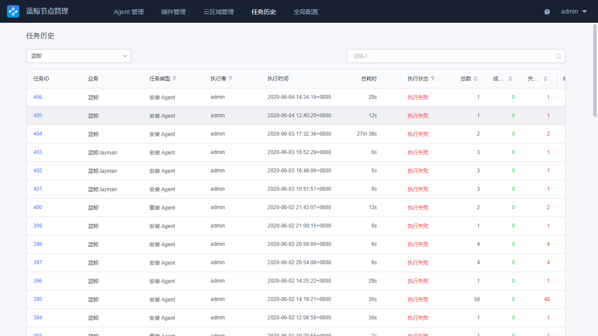
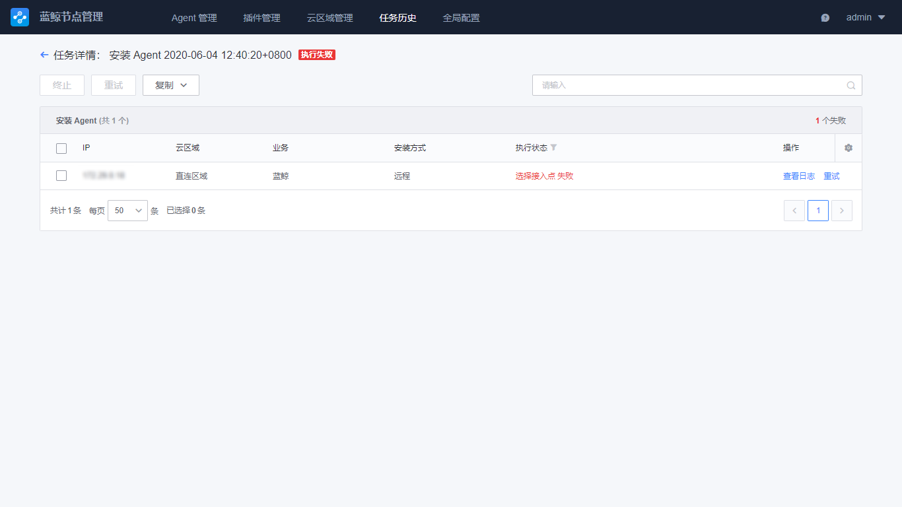

# 任务历史

由于节点管理大部分任务都是异步进行，耗时较长，此功能可以帮助查询节点管理曾经进行过的任务状态和任务日志。

## 查看任务历史列表

包含 Agent、Proxy、插件的操作任务列表。通常按照业务、执行人进行筛选出任务详情。

## 任务详情

点击单个任务，可以查看到任务详情，包含当前任务下执行的子任务状态，如批量给主机安装蓝鲸 Agent 可以查看到每个主机安装状态。

需要查询每个子任务的执行日志，可以再次点击进入到日志详情中查看。

