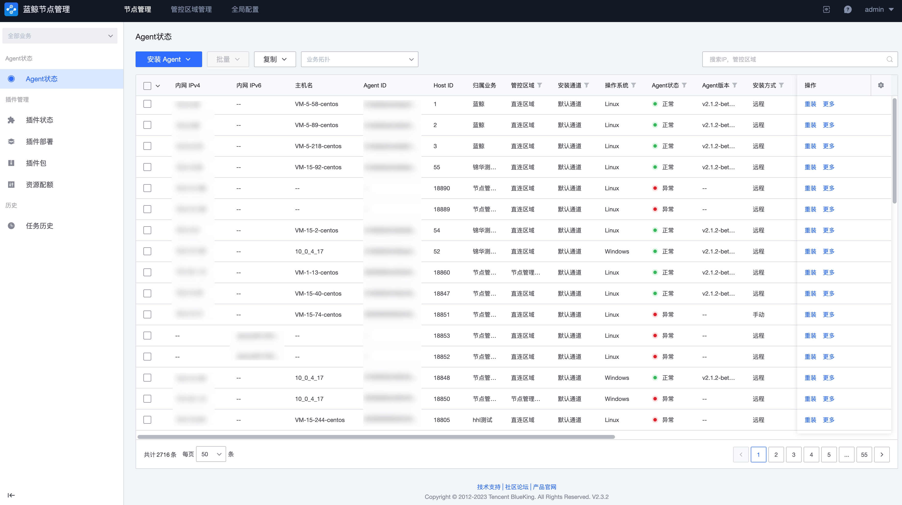
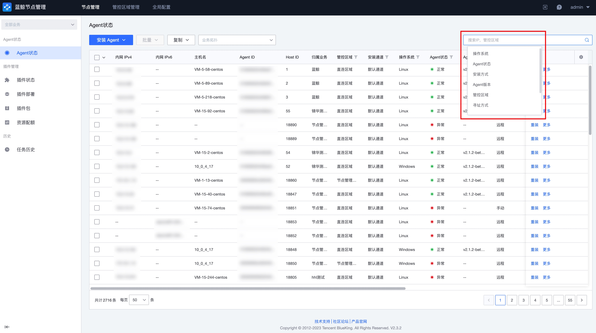
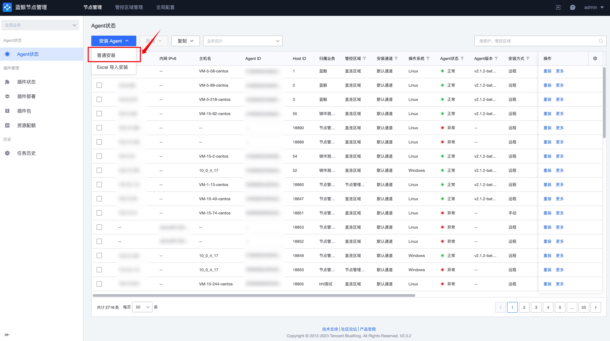
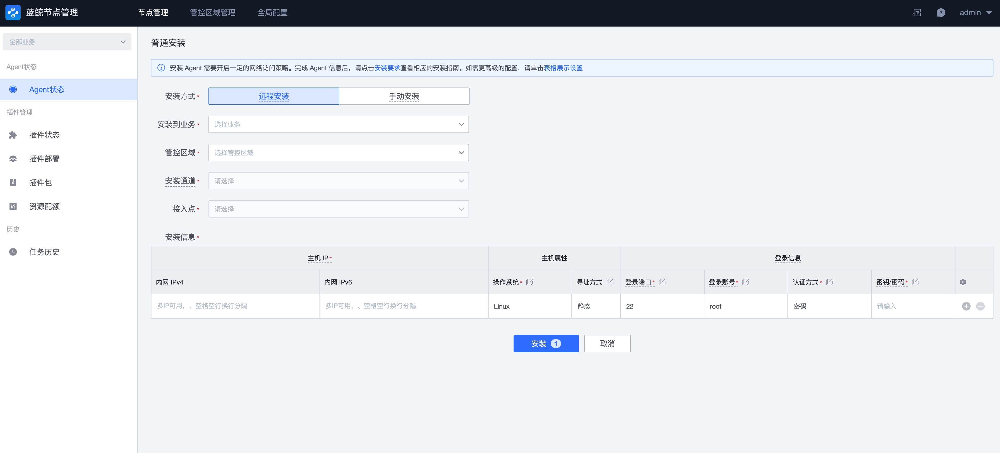
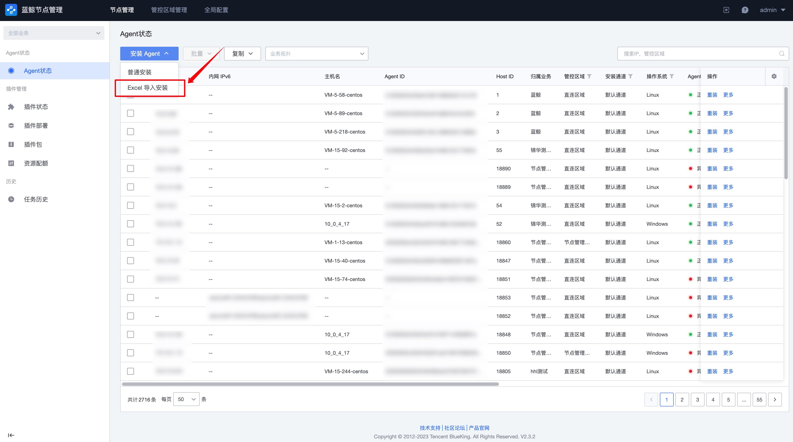
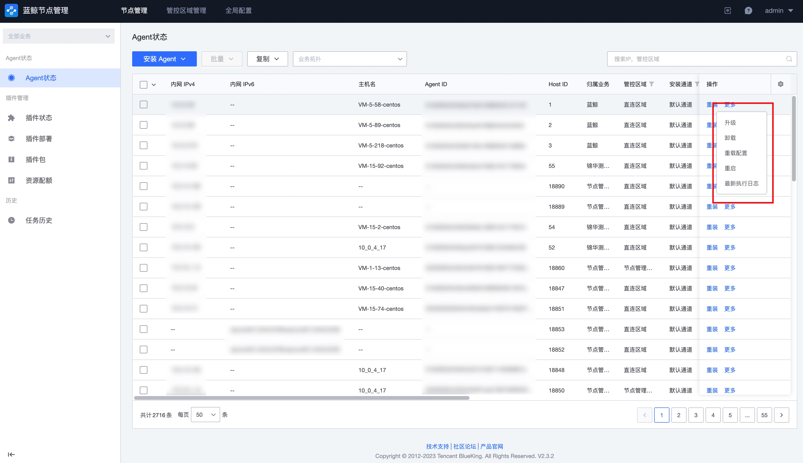

# Agent 管理

蓝鲸平台所在服务器和需要安装 Agent 的主机同属于一片网络区域时，填写/选择主机、端口、密码/密钥信息后可以直接安装蓝鲸 Agent，安装 Agent 需要保证目标机器的 SSH 通道是打开的。

## Agent 状态查询

进入到 节点管理->agent状态 页，会显示当前账户有查询权限的所有 Agent 状态。

当前支持按业务、管控区域、IP、操作系统、状态等属性进行筛选。

## 新主机安装 Agent

当需要在新主机上安装蓝鲸 Agent，并且已知主机的 SSH 登录账户密码，有可以参考以下步骤进行，此操作同时会把主机注册到蓝鲸配置平台中。

1. 点击安装 Agent 按钮，选择“普通安装”

2. 填写安装参数，参数说明如下：

- 安装到业务：主机安装 Agent 以后，需指定录入到蓝鲸配置平台的哪个业务，默认会放置到业务下的 “/空闲池/空闲机” 下
- 管控区域：主机需要被指定属于哪个管控区域，如果蓝鲸所部署的环境可以直接连接到此主机，没有网络隔离，选择“直连区域”。如果公司有复杂的网络划分，蓝鲸无法直接连接到此主机，需要先在“管控区域管理”做好网络规划，再进行 Agent 的安装
- 接入点：此配置一般在管控区域中默认指定，部分未指定接入点的管控区域需要用户手动选择
- 安装信息：
    - IP 地址：蓝鲸连接到此主机使用的 IP 地址
    - 登录 IP：蓝鲸安装 Agent 时，登录的 IP 地址。此参数可以为空，通常此地址与第一个参数“IP 地址”一致。如果存在不一致，才需要填写此参数
    - 操作系统：此主机安装的操作系统类型，由于不同操作系统登录的方式有所差异，请务必填写正确
    - 登录端口：通常 SSH 登录端口为 22，端口错误会导致无法正常登录安装
    - 登录账户：Linux 请使用 root 账户，Windows 请使用 Administrator
    - 认证方式：目前支持“密码”和“密钥”两种方式，选择密钥需要上传密钥文件。这些敏感信息，为了保证安全的同时避免用户重复输入，节点管理默认保存 24 小时，超时以后会删除登录账号信息

3. 完整配置以后，点击底部的“安装”按钮继续。

    此时节点管理会验证录入的“管控区域+IP 地址”组合，是否已经存在蓝鲸中，如果已经存在，安装程序将会忽略这批主机，并有对话框提示信息。

## 新主机通过导入安装 Agent

上个小节中，描述了一般情况下安装 Agent 的步骤，当您想要安装的 Agent 网络环境差异过大，数量较多，在节点管理的交互界面中比较难编辑，或者您已经有主机信息的表格，可以使用 Excel 导入的方式进行安装。

操作步骤如下：

1. 点击安装 Agent 按钮，选择“Excel 导入安装”。

2. 下载模版，根据模版的提示要求，补充主机的信息，然后上传。需要注意通过 Excel 导入的方式，“认证资料”只能够填写密码的方式，您如果使用密钥登录，可以先填写无效密码，到下个步骤中再修改为密钥方式。

3. 确认主机详情信息，节点管理会识别出当前 Excel 文件中的格式，确认无误点击安装即可。

## Agent 维护

当 Agent 安装以后，日常的维护包含重装、重启、卸载、移除等，可以在列表中选择目标主机，点击更多进行操作。

