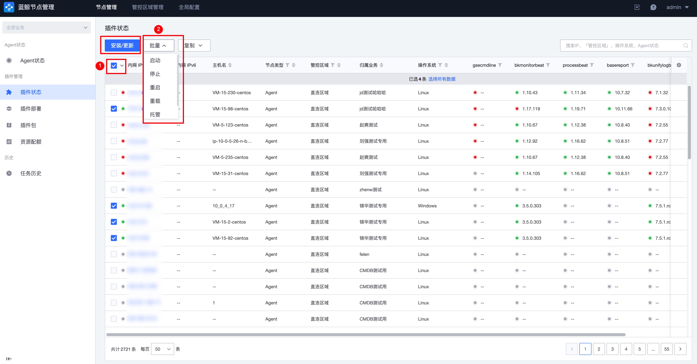

# 插件管理

插件是可由蓝鲸 Agent 调度的子程序或者脚本。蓝鲸 Agent 在安装到主机的时候会包含一些蓝鲸必备插件。

您可以通过插件管理功能部署并管理这些插件，或者导入更多第三方插件。

## 插件状态查询

点击主导航的 “插件管理” ，进入到节点列表页面。

在此页面中，您可以根据指定条件查询到当前主机上各个插件的运行状态和版本信息。

## 插件维护和安装

**第一步：选择操作目标**

选中需要管理的主机，点击 `安装/更新`或`批量`操作。

**第二步：选择操作**

在弹出的窗口中，选择需要进行的操作和插件。

对插件的维护包含以下操作：

- 安装/更新：安装或更新插件程序
- 启动：启动插件进程
- 停止：停止插件进程
- 重启：重启插件程序，需插件支持
- 重载：通常用于配置更新，需插件支持
- 托管：将插件注册至 GSE Agent 进行管理。若插件进程异常退出，GSE Agent 会尝试将插件自动拉起
- 取消托管：取消插件的 GSE Agent 管理，当插件异常退出时将不再被自动拉起

## 部署策略

除了可以用手动的方式进行插件的维护管理外，您还可以使用 `部署策略` 来实现插件的自动安装管理。

一条部署策略定义了一种插件安装的规则。部署策略包括 `目标范围`、`部署插件`、`插件版本`、`插件参数` 等属性。被 **目标范围** 覆盖的主机节点，将按照 **部署策略** 定义的规则，自动进行插件的部署安装。

> 注：若目标主机上安装的 **插件版本** 与 **策略版本** 不一致，部署策略会强制将目标主机覆盖更新为 **策略版本**

当多个部署策略命中同一目标范围时，将会产生 **策略抑制** 效果，主机上最终有且仅有一条部署策略将最终生效。具体生效的规则取决于部署策略的目标范围，目标范围越 **精细**， 则策略的生效优先级越 **高**。

> 策略抑制优先级：
>
> 主机 > 模块 > 集群 > 业务 

若同一主机被两个部署策略命中，策略的目标范围均为同一级别，此时最先建立的部署策略将会最终生效，后建立的策略将忽略此主机。

### 新建部署策略

点击主导航的 “插件管理” Tab，进入 **部署策略** 页面，点击 “新建策略” 按钮。

**第 1 步：选择需要部署的插件**

如选择的插件已存在部署策略，系统会列出已有的策略，可选择在已有策略的基础上进行修改。

如已有的部署策略不满足需求，也可以选择 **新建策略**

**第 2 步：选择需要部署的目标范围**

在目标选择器中，您可以选择对自己有权限的业务进行插件部署

> 注：在进行目标范围选择时，**动态拓扑** 和 **静态 IP** 不可以混用

**第 3 步：选择插件版本**

根据第 1 步中所选的主机范围，系统会根据操作系统、CPU 架构信息自动选择出对应的插件包。

如插件包有多个可用版本，可点击 **部署版本** 选择需要安装的插件包版本。

**第 4 步：参数配置**

部分插件包支持自定义参数配置。如需要对插件包参数进行调整，可在此设置自定义参数。

**第 5 步：执行预览**

待所有参数填写完毕，此步骤将按操作类型展示所有主机。确认无误后，即可点击 “下一步” 来保存部署策略。

> 注：若部署策略所覆盖的目标范围已通过手动方式安装插件，最终会以部署策略定义的插件 **版本** 和 **参数** 为准。目标主机被部署策略管控后，将无法通过手动方式进行插件管理

### 编辑部署策略

对于已有的部署策略，可以对以下属性进行调整

- 目标范围
- 部署的插件版本
- 插件包参数

### 停用部署策略

如上所述，部署策略定义了一种插件自动安装的规则，被策略目标范围覆盖到的主机，节点管理会自动进行插件的安装。如果想要暂停这一自动行为，可通过策略的 `停用` 功能来关闭这一特性。

在停用策略时，您可以选择是否保留已通过策略部署的插件：

- 仅停用策略，保留插件 **运行**

  部署策略将不会产生任何自动行为，已通过部署策略安装好的插件将继续运行，不会因策略的停用而产生影响

- 停用策略，同时 **停用** 插件

  停用部署策略的同时，将策略安装的插件也一并停用。此选项将会引导您进入 **停用预览** 以确认插件停用动作

在部署策略成功停用后，您仍然可以通过策略列表中的 **启用策略** 按钮来重新开启该策略。

## 添加新的插件包到节点管理

**第 1 步：获取插件包**

您可以通过以下途径获取到插件包：

1. 蓝鲸官网的[Smart 市场](https://bk.tencent.com/s-mart/)
2. 通过插件开发框架自定义开发的插件

**第 2 步：上传插件包**

点击导航栏 “插件管理” Tab，进入 “插件包” 页面，点击 “导入插件”，选择或拖入待导入的插件包。

待系统解析成功后，即可点击 “导入” 按钮完成插件包的上传。

**第 3 步：部署插件包**

只有被设置为 “正式” 版本的插件包，才可以被部署到主机上。

在插件包列表中，点击插件别名，在详情页面中可调整插件的版本状态。

