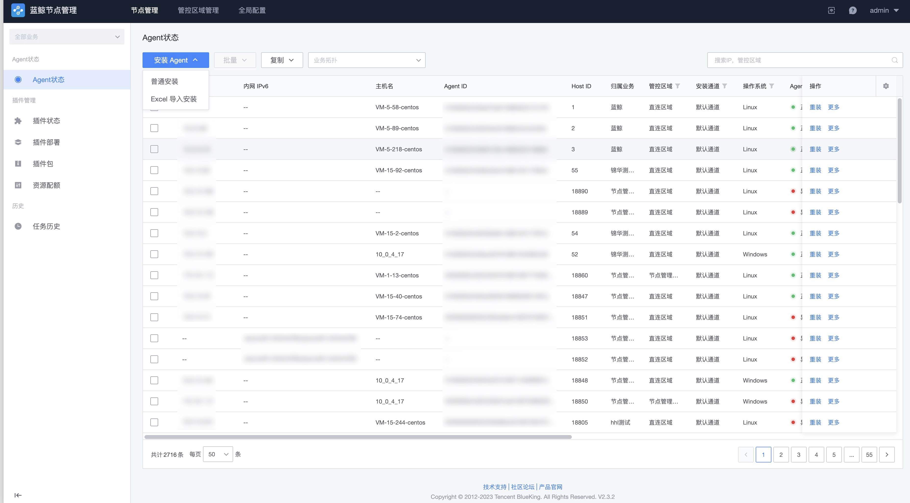

# 安装蓝鲸 Agent（自定义管控区域）

背景：当需要安装 Agent 的目标主机不可以被蓝鲸服务直接访问到，需要通过创建自定义管控区域的方式进行安装 Agent。

## 步骤一：确认接入点配置

点击“全局配置”，确认默认接入点的以下配置不为空，且将要安装蓝鲸 Agent 的目标主机可连接到这些配置的内网地址。

## 步骤二：创建管控区域

在管控区域管理页面，点击“新建”按钮开始创建一个新的管控区域。管控区域参数解释：

成功提交以后，系统会提示“安装 Proxy”。选择“安装 Proxy”配置 Proxy。

按照指引填写 Proxy 安装参数，点击安装进入到任务详情页，等待安装成功以后，进行下一步。

## 步骤三：安装 Agent

切换到 “节点管理->Agent状态” 页，点击“安装 Agent”按钮。

安装业务选择已经在配置平台创建的业务，如暂时无业务，可以选择“资源池”。

管控区域选择刚刚创建的管控区域，接入点使用默认接入点。

然后补全安装的目标主机详情配置。完成后点击“安装”开始执行安装任务。

## 步骤四：查看执行状态

步骤三完成后，会自动跳转到任务页面，等待 Agent 安装成功。如果任务失败，可以点击主机查看安装日志。

