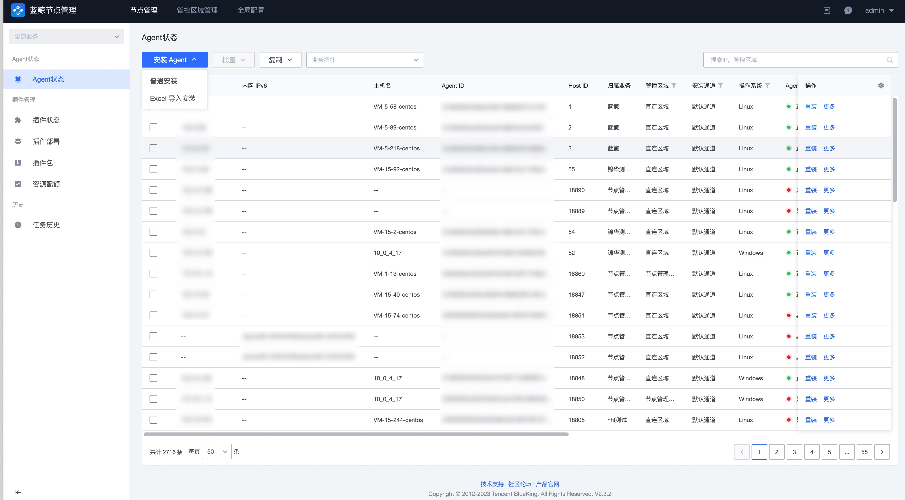

# 安装蓝鲸 Agent（直连区域）

## 步骤一：确认接入点配置

点击“全局配置”，确认默认接入点的以下配置不为空，且将要安装蓝鲸 Agent 的目标主机可连接到这些配置的内网地址。

## 步骤二：开始远程安装 Agent

切换到 “节点管理->Agent状态” 页，点击“安装 Agent”按钮。

安装业务选择已经在配置平台创建的业务，如暂时无业务，可以选择“资源池”。

管控区域选择“直连区域”，接入点使用默认接入点。

然后补全安装的目标主机详情配置。完成后点击“安装”开始执行安装任务。

## 步骤三：查看执行状态

步骤二完成后，会自动跳转到任务页面，等待 Agent 安装成功。如果任务失败，可以点击主机查看安装日志。

