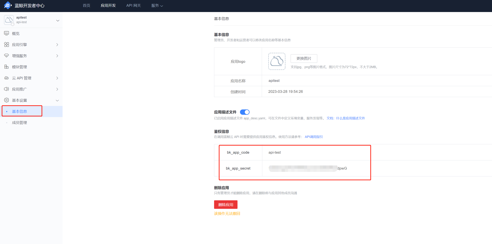
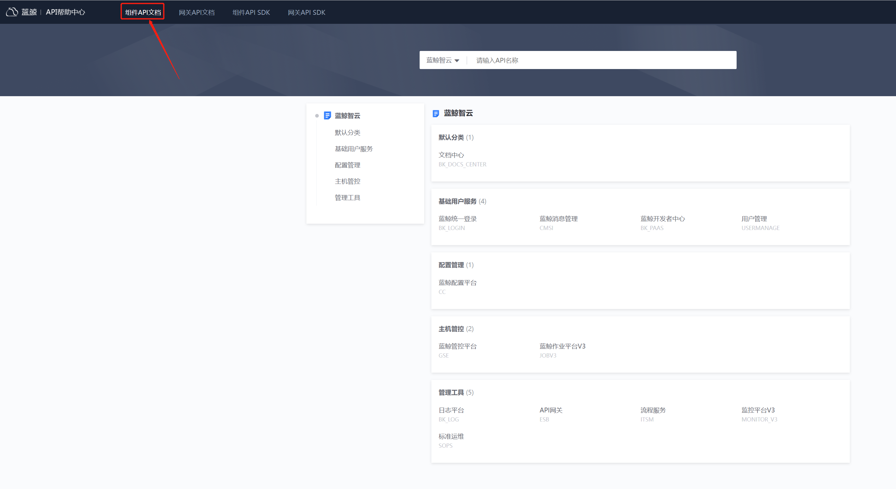

## 11、SaaS 开发（api 调用）

线上体验环境也开放了 api 调用的体验权限，可以本地使用 postman 等工具进行测试调用。

### 11.1 在开发者中心创建应用

如果只需要体验 api 的调用，可以不用填写真实的 git 地址。

这样就拿到了 app_code，也就是应用 ID，和 app_secret 也即应用的 TOKEN

### 11.2 查看 api 文档

### 11.2 本地测试，比如 postman 测试调用

https://ce.bktencent.com/esb/api_docs/system/CC/search_business/ 这个接口

更多关于线上体验环境的问题欢迎到[线上体验交流专区](https://bk.tencent.com/s-mart/community/question/5612)进行交流。

线上环境不定期的进行更新，可以查看[更新公告](./CHANGE_LOG.md)

---

- 您可能需要：

    1. [立即下载蓝鲸](https://bk.tencent.com/download/)
    2. 了解更多企业定制化服务：[点击咨询](https://bk.tencent.com/applyinfo/ee/)