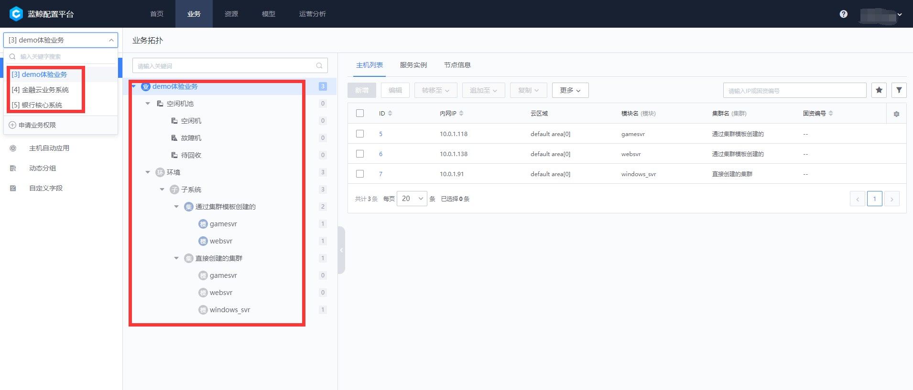

## 2、 配置平台(CMDB)

配置平台是构建其他所有流程的基石，业务是蓝鲸 CD 体系中比较重要的概念和维度，日常使用中主机、进程、业务拓扑的管理都需要依赖已经存在业务，其他蓝鲸体系产品也基本上都是围绕业务的维度来提供对应的服务和相关的鉴权；线上体验环境为了周边系统的数据稳定，只开放了查看权限（所有资源）。

### 2.1 内置了三个业务

### 2.2 自定义了丰富的模型

更多配置平台的产品功能，可见[配置平台白皮书](../../CMDB/3.10/UserGuide/Introduce/Overview.md)

---

- 您可能需要：

    1. [立即下载蓝鲸](https://bk.tencent.com/download/)
    2. 了解更多企业定制化服务：[点击咨询](https://bk.tencent.com/applyinfo/ee/)