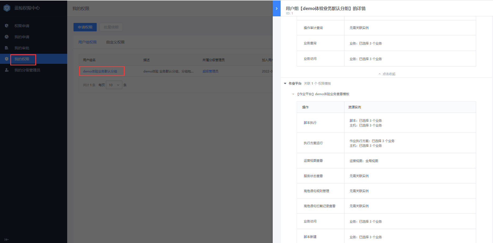

## 4、 权限中心

蓝鲸权限中心（BKIAM）是蓝鲸智云提供的集中权限管理服务，提供权限接入服务，细化到资源实例级别的访问权限控制。用户可以在权限中心通过自定义操作权限、用户组来实现人员权限的管理。线上体验环境默认没有开放管理的权限，可以查看当前内置的权限和申请更多权限（申请更多权限指引见[蓝鲸线上体验环境体验须知&FAQ](./FAQ.md#faq-q3)的 Q3）。

核心用户专用权限分配了更高级别的权限组，是核心用户专享权益，可以点击查看[如何成为蓝鲸社区核心用户](https://bk.tencent.com/s-mart/community/question/5570)

更多权限中心的的产品功能，可见[权限中心白皮书](../..//IAM/1.12/UserGuide/Introduce/README.md)

---

- 您可能需要：

    1. [立即下载蓝鲸](https://bk.tencent.com/download/)
    2. 了解更多企业定制化服务：[点击咨询](https://bk.tencent.com/applyinfo/ee/)