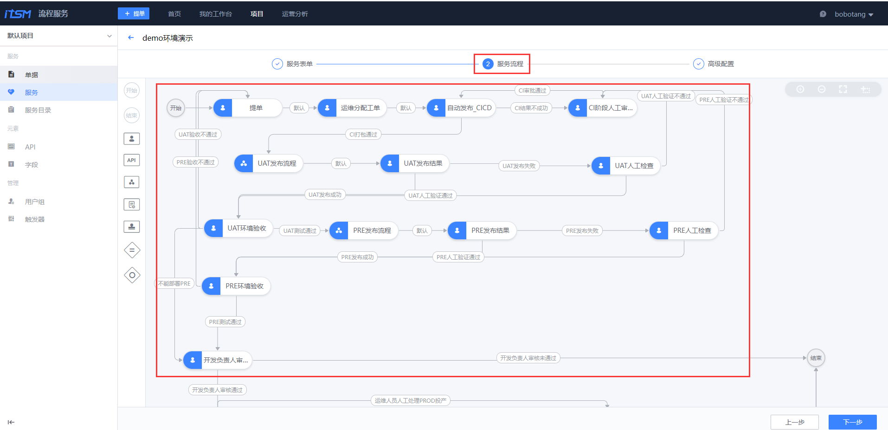

## 8、 流程服务

流程服务（ITSM）通过可自定义设计的流程模块，覆盖 IT 服务中的不同管理活动或应用场景，帮助企业用户规范内部管理流程，提升沟通及管理效率。

### 8.1 体验内置的服务流程（请勿修改）

目前线上体验环境的流程服务在默认项目里内置了多个不同场景的服务流程，也开放了服务流程新建等相关权限，可以直接体验。

### 8.2 新建项目、服务流程

也可以通过新建项目，在自己的项目下新建服务等操作。

对于一些复杂流程，可以参考配置，然后在自己私有化环境进行落地，比如：

更多流程服务的产品功能，可见[流程服务白皮书](../../ITSM/2.6/UserGuide/Introduce/README.md)

---

- 您可能需要：

    1. [立即下载蓝鲸](https://bk.tencent.com/download/)
    2. 了解更多企业定制化服务：[点击咨询](https://bk.tencent.com/applyinfo/ee/)